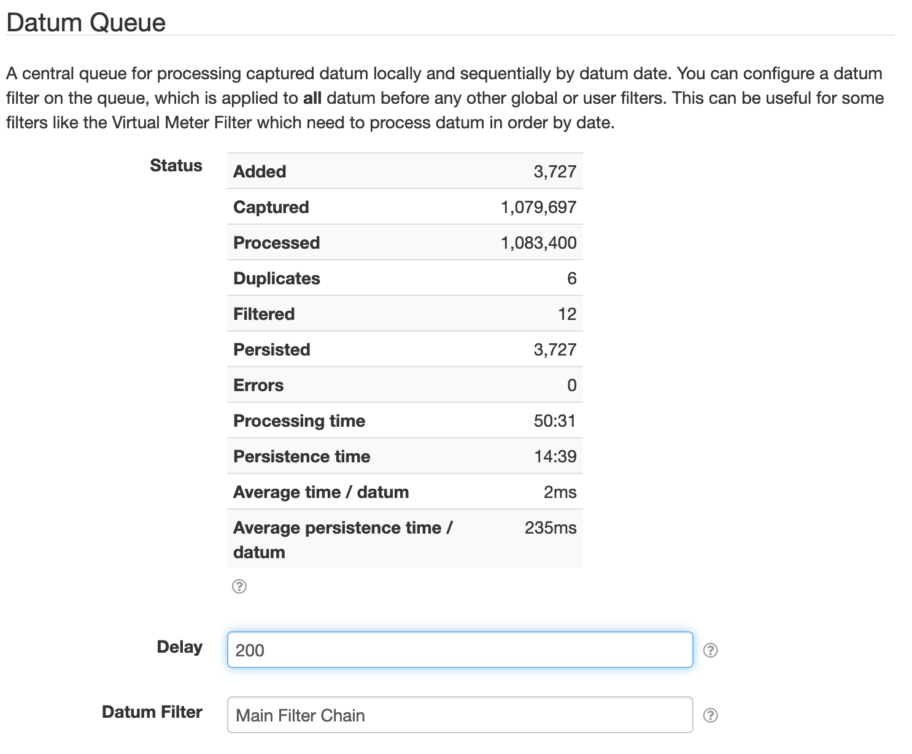

# Datum Queue

SolarNode has a [`DatumQueue`][DatumQueue] service that acts as a central facility for processing
all [`NodeDatum`][NodeDatum] captured by all data source plugins deployed in the SolarNode runtime.
The queue can be configured with various _filters_ that can augment, modify, or discard the datum.
The queue buffers the datum for a short amount of time and then processes them sequentially in order
of time, oldest to newest.

Datum data sources that use the [Datum Data Source Poll Job](datum-data-source-poll-job.md) are
_polled_ for datum on a recurring schedule and those datum are then posted to and stored in
SolarNetwork. Data sources can also offer datum directly to the `DatumQueue` if they _emit_ datum
based on external events. When offering datum directly, the datum can be tagged as _transient_ and
they will then still be processed by the queue but will **not** be posted/stored in SolarNetwork.

```java
/**
 * Offer a new datum to the queue, optionally persisting.
 *
 * @param datum
 *        the datum to offer
 * @param persist
 *        {@literal true} to persist, or {@literal false} to only pass to
 *        consumers
 * @return {@literal true} if the datum was accepted
 */
boolean offer(NodeDatum datum, boolean persist);
```

## Queue observer

Plugins can also register observers on the `DatumQueue` that are notified of each datum that gets
processed. The `addConsumer()` and `removeConsumer()` methods allow you to register/deregister
observers:

```java
/**
 * Register a consumer to receive processed datum.
 *
 * @param consumer
 *        the consumer to register
 */
void addConsumer(Consumer<NodeDatum> consumer);

/**
 * De-register a previously registered consumer.
 *
 * @param consumer
 *        the consumer to remove
 */
void removeConsumer(Consumer<NodeDatum> consumer);
```

Each observer will receive _all_ datum, including _transient_ datum. An example plugin that makes
use of this feature is the [SolarFlux Upload Service][solarflux-plugin], which posts a copy of each
datum to a MQTT server.

Here is a screen shot of the datum queue settings available in the SolarNode UI:

{width=743}

[DatumQueue]: https://javadoc.io/doc/net.solarnetwork.node/net.solarnetwork.node/latest/net/solarnetwork/node/service/DatumQueue.html
[NodeDatum]: https://javadoc.io/doc/net.solarnetwork.node/net.solarnetwork.node/latest/net/solarnetwork/node/domain/datum/NodeDatum.html
[solarflux-plugin]: https://github.com/SolarNetwork/solarnetwork-node/tree/develop/net.solarnetwork.node.upload.flux
