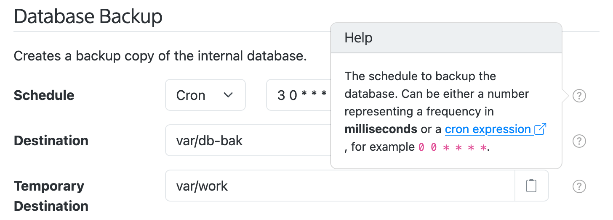

# Settings

SolarNode provides a way for plugin components to describe their user-configurable properties,
called _settings_, to the platform. SolarNode provides a web-based UI that makes it easy for users
to configure those components using a web browser. For example, here is a screen shot of the
SolarNode UI showing a form for the settings of a Database Backup component:

{width=728}

The mechanism for components to describe themselves in this way is called the **Settings API**.
Classes that wish to participate in this system publish metadata about their configurable properties
through the [Settings Provider](provider.md) API, and then SolarNode generates a UI form based on
that metadata. Each form field in the previous example image is a [Setting Specifier](specifier.md).

The process is similar to the built-in Settings app on iOS: iOS applications can publish
configurable property definitions and the Settings app displays a UI that allows users to modify
those properties.
