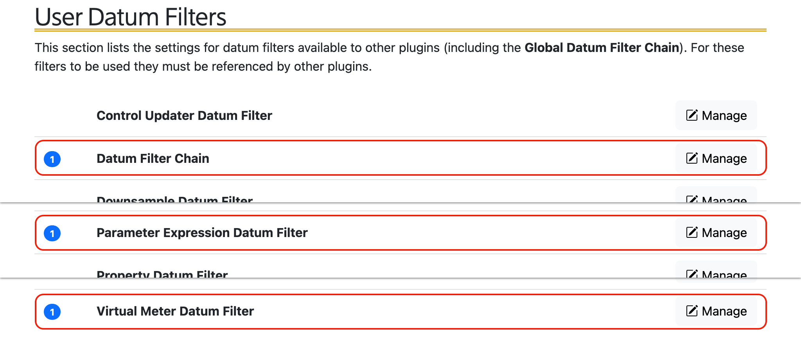
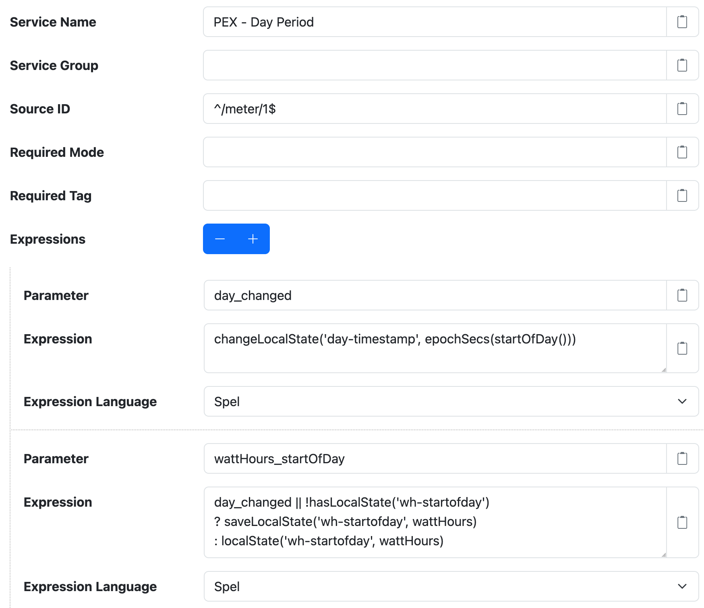
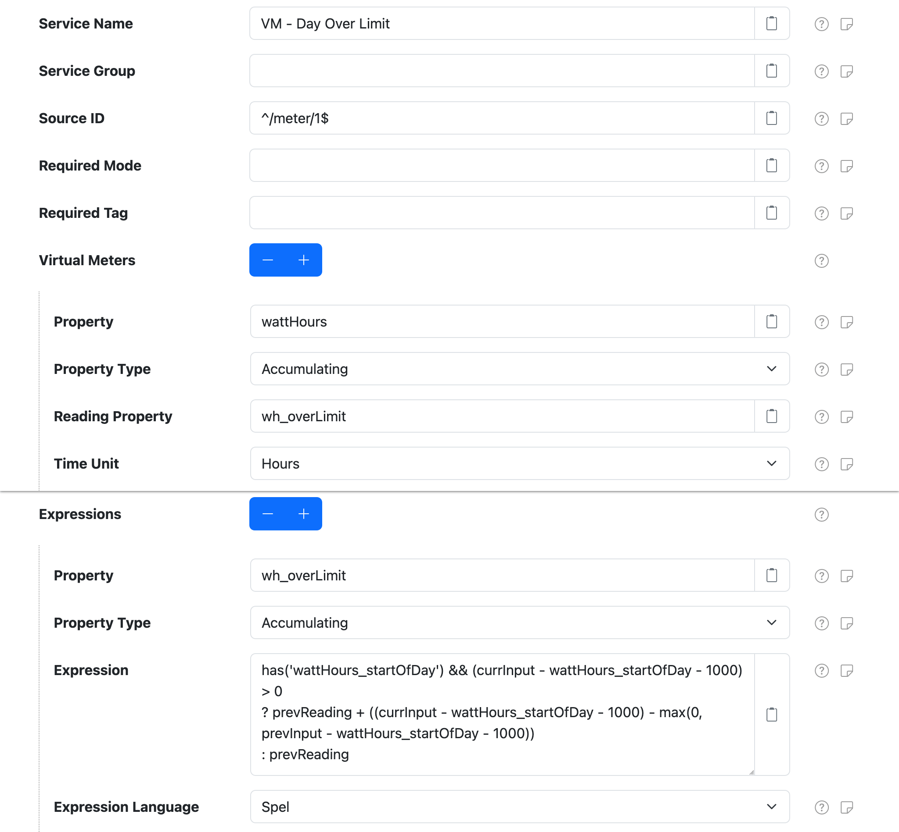
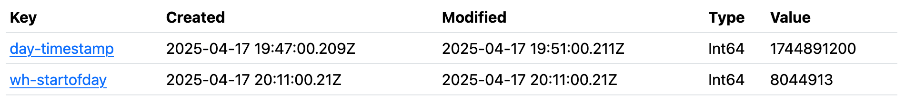

# Daily Limit Tracking

The goal of this recipe is to track the amount an accumulating property goes over a specific
threshold, or limit, on a daily basis. For example, imagine you have an energy meter and are
tracking the amount of energy consumed on a `wattHours` property. You need to be able to track the
amount of energy consumed on each day, but only after 1 kWh has been consumed. Put another way, you
want to track how much energy is consumed over a 1 kWh limit, each day.

Conceptually, let's say we want to add a `wh_overLimit` accumulating property to our meter datum
stream. The data looks like this (note the _Over Today_ column is just for display and not actually
included on the datum stream):

| Timestamp        | wattHours | wh_overLimit | _Over Today_ |
|------------------|----------:|-------------:|-------------:|
| 2025-04-01 00:00 |         0 |            0 |            0 |
| 2025-04-01 06:00 |       900 |            0 |            0 |
| 2025-04-01 12:00 |      1300 |          300 |          300 |
| 2025-04-01 18:00 |      1800 |          800 |          800 |
| 2025-04-02 00:00 |      1800 |          800 |            0 |
| 2025-04-02 06:00 |      2000 |          800 |            0 |
| 2025-04-02 12:00 |      3000 |         1000 |          200 |
| 2025-04-02 18:00 |      3500 |         1500 |          700 |
| 2025-04-03 00:00 |      3500 |         1500 |            0 |


!!! info "Accumulating values vs. Delta values"

	In SolarNetwork _accumulating_ properties are like meter readings: a value that increases over time
	and represents a **total** accumulation up to the time associated with the reading. That is why the
	`wh_overLimit` property does not reset back to `0` each day: instead it will just stop increasing
	until the daily limit is breached, and then start increasing again.

	When you query SolarNetwork for aggregate data, it returns _delta_ values that represent the change
	in the accumulated properties during the aggregate time period, similar to what is shown in the
	_Over Today_ column in the example table.

## Overview

To satisfy our goal, SolarNode must be able to "remember" the previous value seen on the `wattHours`
and `wh_overLimit` properties, as well as the value seen on the `wattHours` property at the start of the day.

With the help of [expresions](../../users/expressions.md) making use of [Local
State](../../users/local-state.md) entities, SolarNode can track when a datum is captured on a
new day, to facilitate resetting the "start of day" energy reading. Then a
[Virtual Meter](../../users/datum-filters/virtual-meter.md) can be used to track the "over limit" energy
accumulation.

For each datum that is evaluated, SolarNode will execute the following logic to maintain
the "start of day" energy reading:

 1. **if** the datum is starting a new day **or** there is no recorded "start of day" energy reading,
 2. **then** the "start of day" energy reading Local State should be set to this datum's `wattHours` value

Then a Virtual Meter will be used with an expression to track the amount of "daily over limit"
energy.

The overall steps of this recipe are:

 * add a [Parameter Expression](../../users/datum-filters/parameter-expression.md) filter `PEX -
   Day Period` to track day periods and "start of day" energy readings as parameters
 * add a [Virtual Meter](../../users/datum-filters/virtual-meter.md) filter `VM - Day Over Limit` to
   calculate the `wh_overLimit` property
 * add both of these added filters to the `Main` filter chain

<figure markdown>
  {width=1024 loading=lazy}
</figure>

!!! tip "Download recipe settings"

	You can download a complete [settings CSV](../../data/recipes/daily-limit-tracking-settings.csv){:download="solarnode-daily-limit-tracking-recipe-settings.csv"}
	file of this recipe, then [import](../../users/setup-app/settings/backups.md#settings-backup-restore) that
	into your own SolarNode.

## Parameter Expression

**Parameters** created by the [Parameter
Expression](../../users/datum-filters/parameter-expression.md) filter are variables available to
subsequent filters within the filter processing pipeline. They do not become datum properties, and
thus act like temporary variables. We will use a Parameter Expression to create a `day_changed`
parameter that will be `true` when a new day has started or `false` otherwise. Another expression
will be used to create a `wattHours_startOfDay` parameter that will be set to the `wattHours`
property value seen on the first datum seen on each day.

In order to know if the current day is _new_, we need to be able to compare it to the
day the _previous_ datum fell within. To do this, we'll calculate the start of the
current day as a Unix epoch seconds number, and save that on a `day-timestamp`
Local State entity. We can use the result of the [`changeLocalState()`
function](../../users/expressions.md#local-state-functions) to tell us when the `day-timestamp`
has changed, thus signaling that a new day has begun.

Then, using the `day_changed` parameter we can maintain a separate `wattHours_startOfDay`
parameter in a `wh-startofday` Local State entity.

Create a Parameter Expression filter component:

 1. Go to the **Settings > Datum Filters** page.
 2. Scroll down to the **User Datum Filters** section.
 3. Click the **Manage** button next to the **Parameter Expression Datum Filter** item.
 4. Click the **+ Add new Parameter Expression Datum Filter** button.

Configure the component with the following settings:

| Setting | Value | Description |
|:--------|:------|:------------|
| **Service Name** | `PEX - Day Period` | The name for this component. |
| **Source ID**    | `^/meter/1$` | This should be some regular expression that matches your **specific** meter's datum source. |

Add **two** new **Expression** settings by clicking on the **+** button next to **Expressions** twice, then configure these expression settings:

| Setting | Value | Description |
|:--------|:------|:------------|
| **Parameter 1** | `day_changed` | The name of the parameter that will hold our true/false "starting a new day" value. |
| **Expression 1** |  | See below. |
| **Expression Language 1** | `Spel` |  |
| **Parameter 2** | `wattHours_startOfDay` | The name of the parameter that will hold our "start of day" energy value. |
| **Expression 2** |  | See below. |
| **Expression Language 2** | `Spel` |  |

=== "day_changed parameter expression"

	```js
	changeLocalState('day-timestamp', epochSecs(startOfDay()))
	```

	!!! note

		Translated to English this expression reads as: _calculate a Unix epoch seconds value for the start
		of the current day, and save that as the `day-timestamp` Local State entity, returning `true`
		if the saved value differed from the perviously saved value._

=== "wattHours_startOfDay expression"

	```js linenums="1"
	day_changed || !hasLocalState('wh-startofday')
	? saveLocalState('wh-startofday', wattHours)
	: localState('wh-startofday', wattHours)
	```

	!!! note

		Translated to English the lines of this expression read as:

		1. **If** the `day_changed` parameter is `true` **or** a `wh-startofday` Local State entity does not exist,
		2. **then** a **new** day has started (or we have no start-of-day reading saved) so save the current
		   `wattHours` property value as the `wh-startofday` Local State entity and return that value.
		3. **Otherwise**, we are within the **same** day so return the current `wh-startofday` Local
		   State value.


The component settings should look like this:

<figure markdown>
  {width=874 loading=lazy}
</figure>

## Virtual Meter

Traditionally the [Virtual Meter](../../users/datum-filters/virtual-meter.md) filter is used to derive
an accumulating meter-style reading property from an instantaneous property. For example you could derive
an accumulating `wattHours` property from an instantaneous `watts` property. The filter allows you to
use expressions to calculate the accumulated output, however, so we can actually use this filter for
a variety of use cases. What makes it compelling to use for this recipe is that a Virtual Meter
automatically tracks the previous "input" value for you and provides that as a `previousInput`
variable, as well as the current accumulated output value as a `previousReading` variable.

!!! tip

	See the Virtual Meter [expression root object](../../users/datum-filters/virtual-meter.md#expression-root-object)
	section for more details on the variables provided by the filter.

We can use these features of a Virtual Meter to derive our accumulating `wh_overLimit`
property out of the accumulating `wattHours` property, along with the `wattHours_startOfDay`
parameter we set up in the previous section.

Create a Virtual Meter filter component:

 1. Go to the **Settings > Datum Filters** page.
 2. Scroll down to the **User Datum Filters** section.
 3. Click the **Manage** button next to the **Virtual Meter Datum Filter** item.
 4. Click the **+ Add new Virtual Meter Datum Filter** button.

Configure the component with the following settings:

| Setting | Value | Description |
|:--------|:------|:------------|
| **Service Name** | `VM - Day Over Limit` | The name for this component. |
| **Source ID**    | `^/meter/1$` | This should be some regular expression that matches your **specific** meter's datum source. |

Add a new **Virtual Meters** setting by clicking on the **+** button next to **Virtual Meters**, then configure these settings:

| Setting | Value | Description |
|:--------|:------|:------------|
| **Property** | `wattHours` | The "input" property to the virtual meter. |
| **Property Type** | `Accumulating` | The `wattHours` property is an accumulating property. |
| **Reading Property** | `wh_overLimit` | The "output" virtual meter reading property. |

Add a new **Expressions** setting by clicking on the **+** button next to **Expressions**, then configure these settings:

| Setting | Value | Description |
|:--------|:------|:------------|
| **Property** | `wh_overLimit` | The name of the virtual meter output property to use an expression for. |
| **Property Type** | `Accumulating` | The `wh_overLimit` property is an accumulating property. |
| **Expression** |  | See below. |
| **Expression Language** | `Spel` |  |

Here is the expression to configure:

```js title="wh_overLimit virtual meter expression" linenums="1"
has('wattHours_startOfDay') && (currInput - wattHours_startOfDay - 1000) > 0
? prevReading + ((currInput - wattHours_startOfDay - 1000)
                  - max(0, prevInput - wattHours_startOfDay - 1000))
: prevReading
```

!!! note

	Translated to English the lines of this expression read as:

	1. **If** the `wattHours_startOfDay` parameter exists and the energy accumulated today is more than 1 kW,
	2. **then** add the energy accumulated between this energy reading and the previous energy reading to `wh_overLimit`.
	3. _continues_
	4. **Otherwise**, leave `wh_overLimit` unchanged.

The component settings should look like this:

<figure markdown>
  {width=1204 loading=lazy}
</figure>

## Monitoring the Local State

Once you have this recipe deployed, you can use the [Local State
management](../../users/setup-app/settings/local-state.md) page to monitor their values. You should see
entities like the following:

<figure markdown>
  {width=950 loading=lazy}
</figure>

The values will change over time, as datum are processed and the expressions configured for this
recipe perform their work.

## Parting thoughts

This recipe can easily be adapted to handle other time periods like 15 minutes, 4 hours, 1 month, and so on.
The time period just needs to evenly multiply into its next-higher time period, like minutes into hours, hours
into days, and so on.

To do this you would adjust the expressions in this recipe to use the desired time periods, and
adjust the names used appropriately. For example to use a 4-hour period, this configuraiton
would be used:

=== "reportPeriod_changed"

	The "time period has changed" parameter is renamed to the more generic `reportPeriod_changed`,
	and this expression would be used:

	```js
	changeLocalState('report-period-timestamp', epochSecs(dateFloor(nowTz(), 'PT4H')))
	```

=== "wattHours_startOfReportPeriod"

	Similary the "start of time period" reading parameter name could be changed to
	`wattHours_startOfReportPeriod` and its expression changed to:

	```js
	reportPeriod_changed || !hasLocalState('wh-startof-report-period')
	? saveLocalState('wh-startof-report-period', wattHours)
	: localState('wh-startof-report-period', wattHours)
	```

=== "wh_overLimit"

	The Virtual Meter expression would then change to make use of the updated parameter names:

	```js
	has('reportPeriod_changed') && (currInput - wattHours_startOfReportPeriod - 1000) > 0
	? prevReading + ((currInput - wattHours_startOfReportPeriod - 1000)
					- max(0, prevInput - wattHours_startOfReportPeriod - 1000))
	: prevReading
	```
