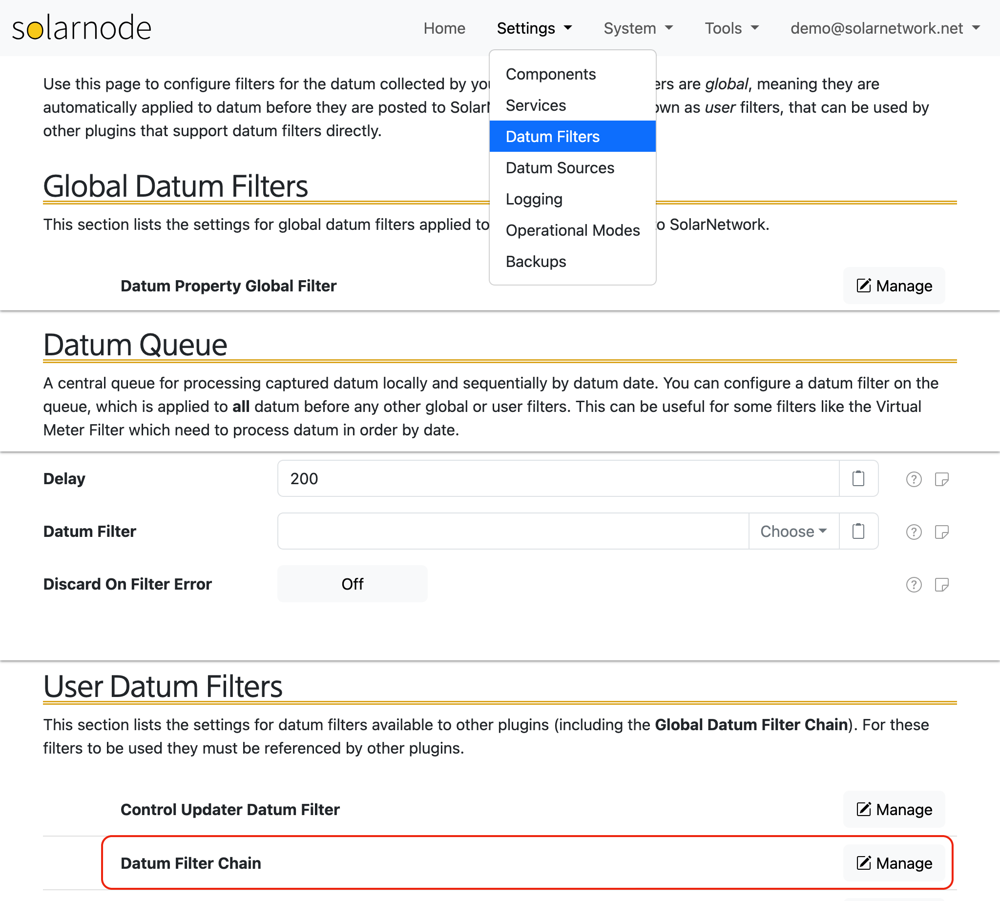
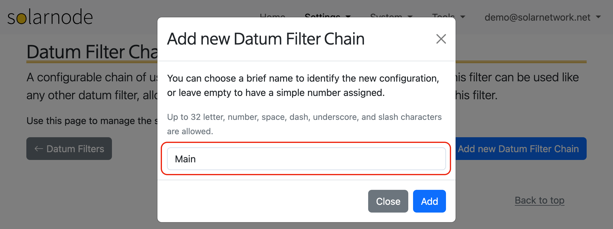
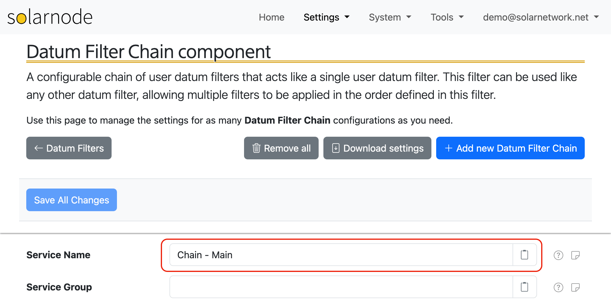
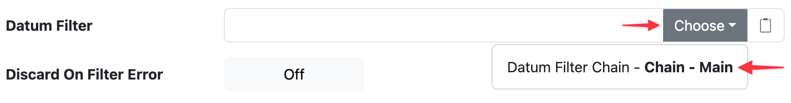
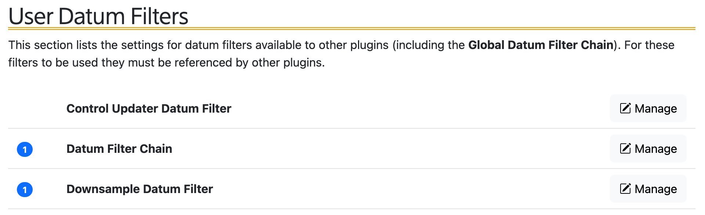
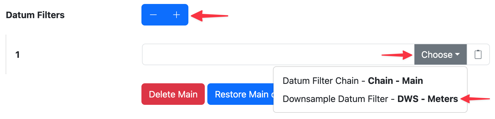

# Main Filter Chain

When you are first getting started with filters in SolarNode there are several different approaches
you can take to get the filters "wired up" and actively processing datum. This recipe outlines one
specific approach: configuring a [Datum Filter Chain](../../users/datum-filters/chain.md) on the
[Datum Queue](../../users/datum-filters/index.md#datum-queue).

This approach supports the following objectives:

 * configure any number of filters
 * configure [Virtual Meter](../../users/datum-filters/virtual-meter.md) filters (which most often
   _need_ to be processed on the Datum Queue)
 * specify the precise order that filters are applied
 * easily add/remove/reorder filters in the future

A **Datum Filter Chain** is just a configurable list of _other_ filters, grouped together. When a
Datum Filter Chain processes a datum (executes), it executes all the _other_ filters that are
configured on the chain, in the order you configure them. They provide a convenient way to organise
filters into logical groups, which turns out to be super convenient when designing a complex filter
processing pipeline in SolarNode.

!!! tip

	Check out the [Datum Filters](../../users/datum-filters/index.md) page for general information
	about filters, the Datum Queue, and how datum are processed in SolarNode.

## Overview

The overall steps of this recipe are:

 * configure a [Datum Filter Chain](../../users/datum-filters/chain.md) named `Chain - Main`
 * configure the [Datum Queue](../../users/datum-filters/index.md#datum-queue) to use the `Chain - Main` filter
 * add a filter to the Main filter chain

!!! tip "Download recipe settings"

	You can download a complete [settings CSV](../../data/recipes/main-filter-chain-settings.csv){:download="solarnode-main-filter-chain-recipe-settings.csv"}
	file of this recipe, then [import](../../users/setup-app/settings/backups.md#settings-backup-restore) that
	into your own SolarNode.

## Create a Datum Filter Chain component

The first step is to create a Datum Filter Chain.

 1. Start by navigating to the **Settings > Datum Filters** page.
 2. Scroll down to the **User Datum Filters** section.
 3. Click on the **Manage** button next to the **Datum Filter Chain** item.

<figure markdown>
  {width=1024 loading=lazy}
</figure>

This will take you to the management page for Datum Filter Chain components. Click the **+ Add new Datum Filter Chain** button
to create a new filter chain. Give the component a simple name like `Main`:

<figure markdown>
  {width=1024 loading=lazy}
</figure>

Now configure a **Service Name**. This can be anything you like, but using a pattern of _FilterType - Name_ can make
the maintenance of filter comopnents easier in the future. For this guide we use `Chain - Main`:

<figure markdown>
  {width=1024 loading=lazy}
</figure>

!!! warning

	Be sure to click the **Save All Changes** button at the top of the page after configuring the
	**Service Name** setting. You may need to hit ++tab++ or click outside the form field for the
	button to become enabled.

## Configure the Datum Queue filter

The [Datum Queue](../../users/datum-filters/index.md#datum-queue) supports configuring just **one** filter.
Using a filter chain makes perfect sense in this situation, so you can actually configure any number of filters
to execute on the queue.

 1. Navigate back to the **Settings > Datum Filters** page (click the **← Datum Filters** button at the top).
 2. Scroll down to the **Datum Queue** section.
 3. In the **Datum Filter** setting, use the **Choose** button to select the `Chain - Main` filter.

<figure markdown>
  {width=869 loading=lazy}
</figure>

!!! warning

	Be sure to click the **Save All Changes** button at the top of the page after configuring the
	**Datum Filter** setting.

Congratulations! At this point, the `Chain - Main` filter chain, which we might simply refer to as
the "Main filter chain", is integrated with the Datum Queue and ready to be configured with other
filters.

## Add a filter to the Main filter chain

The Datum Filter Chain does not actually do anything itself to the datum it processes. You must
configure other filters to perform useful functions, then you can _add_ those filters to a chain.
For this guide, let's say you have some meter datum sources configured that take readings every 10s
but you want to use the [Downsample Filter](../../users/datum-filters/downsample.md) to reduce the
amount of data going up to SolarNetwork to 60s.

Configure a Downsample Filter component. For this guide let's say you named it `DWS - Meters` so you
end up with the `Main` chain and the `Meters` downsample filters.

<figure markdown>
  {width=960 loading=lazy}
</figure>

 1. Click on the **Manage** button for **Datum Filter Chain**.
 2. Click the **+** button for the **Datum Filters** setting to add a new filter reference.
 3. Click the **Choose** button for the first (and only) filter reference and select the
    `DWS - Meters` filter.
 4. Click the **Save All Changes** button at the top of the page.

<figure markdown>
  {width=875 loading=lazy}
</figure>

## Parting thoughts

If you need to add more filters in the future, repeat the steps from the previous section: configure
the new filter and then add it to the `Main` filter chain. Keep in mind that the filters you
configure will execute in the same order as you define them in the chain. This becomes important
when one filter makes a change that another filter depends on.

!!! tip "Nesting filter chains"

	You can create multiple Datum Filter Chain components and add _those_ to the `Main` chain as
	well! The "nested" chains function as just another grouping of _other_ filters, and can be
	useful when designing complex datum processing pipelines.
