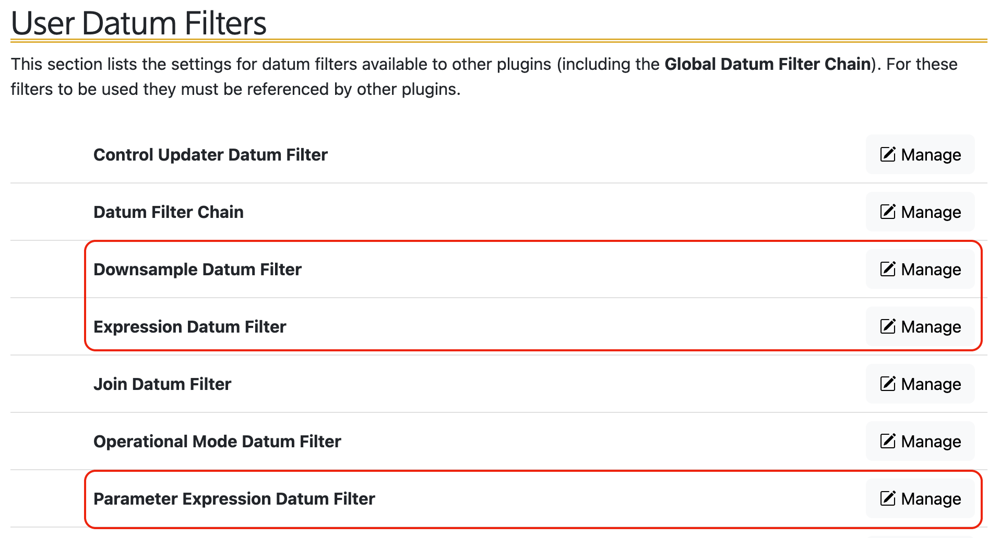
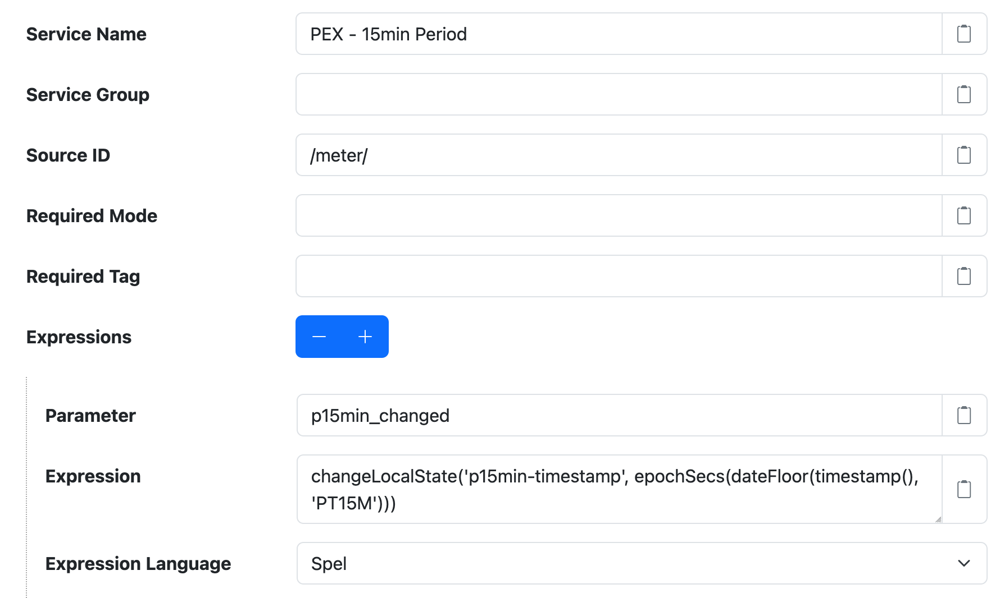
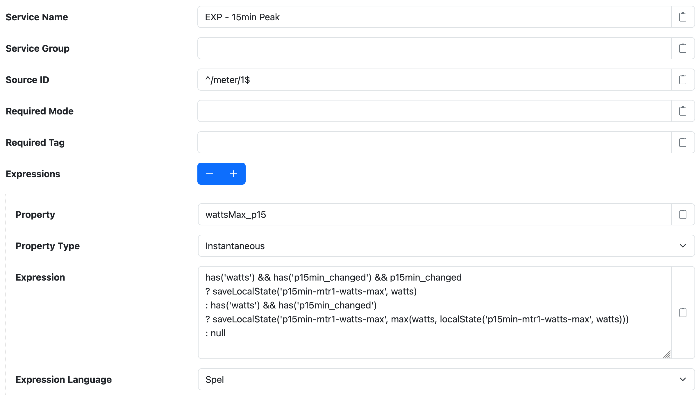
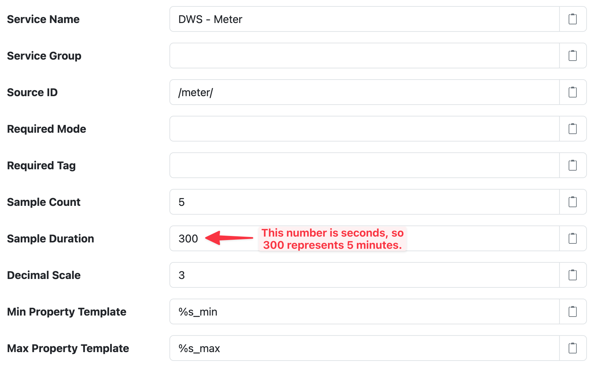
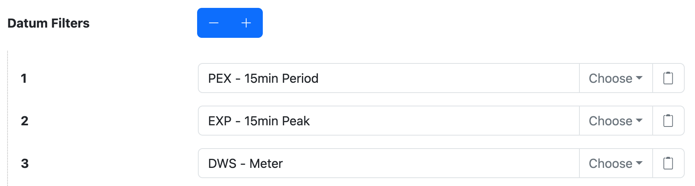
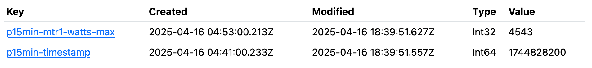
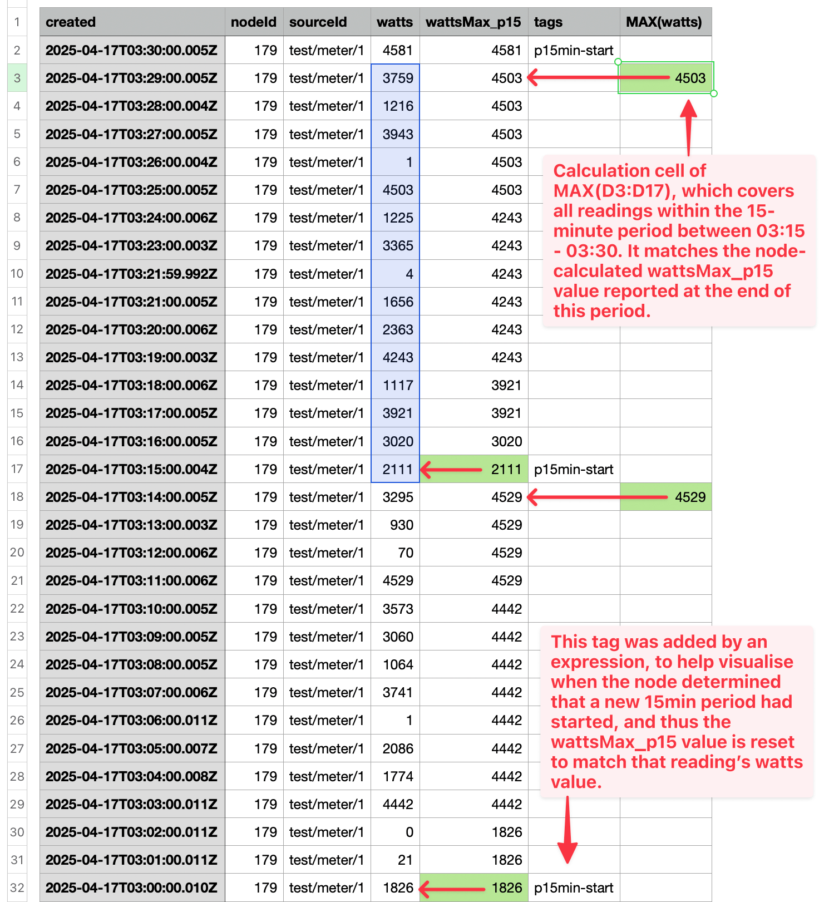

# Peak tracking

The goal of this recipe is to track the _peak_ (maximum) value of a property within a moving bounded
time period, such as every 15 minutes. We want to monitor the property at a higher frequency than
uploading to SolarNetwork, however, taking a reading every **second** but reporting the data only
every **5 minutes**. Some meter devices can do this sort of tracking for you, but this recipe can
work with any device supported by SolarNode.

To illustrate the goal, imagine SolarNode is reading a `watts` property from a meter, and we'd like
to track its maximum value in 15-minute periods on a `wattsMax_p15` property. Here is a simplified
table of example datum we would _like_ to see uploaded to SolarNetwork over the course of an hour.
The **Timestamp** values in bold denote the **first** reading in each 15-minute period. The
**wattsMax_p15** values in bold denote the **last** reading in each 15-minute period, and correspond
to the **peak value** within that period:

| Timestamp | watts | wattsMax_p15 |
|:----------|------:|-------------:|
| **09:00** | 1250  | 1250 |
| 09:05     | 3020  | 3020 |
| 09:10     |  200  | **3020** |
| **09:15** |   10  |   10 |
| 09:20     |   10  |   10 |
| 09:25     | 7070  | **7070** |
| **09:30** | 6900  | 6900 |
| 09:35     | 6888  | 6900 |
| 09:40     | 5852  | **6900** |
| **09:45** | 4124  | 4124 |
| 09:50     | 4433  | 4433 |
| 09:55     | 2091  | 4433 |

!!! info

	This recipe assumes you have already followed the [Main Filter Chain](./main-filter-chain.md)
	recipe, and have a Main filter chain configured.

## Overview

To satisfy our goal, SolarNode must be able to "remember" the maximum value seen on the `watts` property.
It must also know when a datum falls within a new 15-minute period, as compared to the 15-minute
period associated with the last "seen" datum, so it can reset the "remembered" peak value and start
the tracking cycle over again.

With the help of [expresions](../../users/expressions.md) making use of [Local
State](../../users/local-state.md) entities, SolarNode can track when a datum is captured on a
new 15-minute period, to facilitate resetting the "remembered" peak value. The peak value is itself
stored as a Local State entity, so it is "remembered" and can be compared with `watts` property
values over time to track its peak value.

For each datum that is evaluated, SolarNode will execute the following logic:

 1. **if** the datum is starting a new 15-minute period, **then** the maximum value Local State
    should be set to this datum's `watts` value
 2. **else** the maximum value Local State should be updated to the larger of this datum's `watts`
    value and the Local State's value

 The final `wattsMax_p15` property value then becomes the Local State's final value.

The overall steps of this recipe are:

 * add a [Parameter Expression](../../users/datum-filters/parameter-expression.md) filter `PEX -
   15min Period` to track 15-minute periods as a parameter value.
 * add an [Expression](../../users/datum-filters/expression.md) filter `EXP - 15min Peak` to
   calculate the `wattsMax_p15` property
 * add a [Downsample](../../users/datum-filters/downsample.md) tiler `DWS - Meter` to downsample
   the 1-second resolution meter data down to 5-minute resolution
 * add all three of these added filters to the `Main` filter chain

<figure markdown>
  {width=958 loading=lazy}
</figure>

## Parameter Expression

**Parameters** created by the [Parameter
Expression](../../users/datum-filters/parameter-expression.md) filter are variables available to
subsequent filters within the filter processing pipeline. They do not become datum properties, and
thus act like temporary variables. We will use a Parameter Expression to create a `p15min_changed`
parameter that will be `true` when a new 15-minute period has started or `false` otherwise.

In order to know if the current 15-minute period is _new_, we need to be able to compare it to the
15-minute period the _previous_ datum fell within. To do this, we'll calculate the start of the
current 15-minute period as a Unix epoch seconds number, and save that on a `p15min-timestamp`
Local State entity. We can use the result of the [`changeLocalState()`
function](../../users/expressions.md#local-state-functions) to tell us when the `p15min-timestamp`
has changed, thus signaling that a new 15-minute period has begun.

Create a Parameter Expression filter component:

 1. Go to the **Settings > Datum Filters** page.
 2. Scroll down to the **User Datum Filters** section.
 3. Click the **Manage** button next to the **Parameter Expression Datum Filter** item.
 4. Click the **+ Add new Parameter Expression Datum Filter** button.

Configure the component with the following settings:

| Setting | Value | Description |
|:--------|:------|:------------|
| **Service Name** | `PEX - 15min Period` | The name for this component. |
| **Source ID**    | `^/meter/1$` | This should be some regular expression that matches your **specific** meter's datum source. |

Add a new **Expression** by clicking on the **+** button next to **Expressions**, then configure these expression settings:

| Setting | Value | Description |
|:--------|:------|:------------|
| **Parameter** | `p15min_changed` | The name of the parameter that will hold our true/false "starting a new 15-minute period" value. |
| **Expression** |  | See below. |
| **Expression Language** | `Spel` |  |

The expression is this:

```javascript
changeLocalState('p15min-timestamp', epochSecs(dateFloor(timestamp(), 'PT15M')))
```

!!! note

	Translated to English this expression reads as: _calculate a Unix epoch seconds value for the current
	15-minute time period, and save that as the `p15min-timestamp` Local State entity, returning `true`
	if the saved value differed from the perviously saved value._

The component settings should look like this:

<figure markdown>
  {width=890 loading=lazy}
</figure>

# Expression

The next step is to configure an [Expression](../../users/datum-filters/expression.md) filter to
calculate our desired `wattsMax_p15` datum property. It will make use of the `p15min_changed`
parameter provided by the `PEX - 15min Period` Parameter Expression filter configured in the
previous section, as well a `p15min-mtr1-watts-max` Local State entity to track the maximum
`watts` value.

Create an Expression filter component:

 1. Go to the **Settings > Datum Filters** page.
 2. Scroll down to the **User Datum Filters** section.
 3. Click the **Manage** button next to the **Expression Datum Filter** item.
 4. Click the **+ Add new Expression Datum Filter** button.

Configure the component with the following settings:

| Setting | Value | Description |
|:--------|:------|:------------|
| **Service Name** | `EXP - 15min Peak` | The name for this component. |
| **Source ID**    | `^/meter/1$` | This should be some regular expression that matches your **specific** meter's datum source. |

Add a new **Expression** by clicking on the **+** button next to **Expressions**, then configure these expression settings:

| Setting | Value | Description |
|:--------|:------|:------------|
| **Property** | `wattsMax_p15` | The datum property to save the maximum `watts` value to. |
| **Property Type** | `Instantaneous` | This is an instantaneous value. |
| **Expression** |  | See below. |
| **Expression Language** | `Spel` |  |

The expression is this:

```javascript
has('watts') && has('p15min_changed') && p15min_changed
? saveLocalState('p15min-mtr1-watts-max', watts)
: has('watts') && has('p15min_changed')
? saveLocalState('p15min-mtr1-watts-max', max(watts, localState('p15min-mtr1-watts-max', watts)))
: null
```

!!! note

	Translated to English the lines of this expression read as:

	1. **If** a `watts` property exists **and** the `p15min_changed` parameter exists **and** the
	   `p15min_changed` parameter is `true`,
	2. **then** a **new** 15-minute period has started so save the current `watts` property value as the
	   `p15min-mtr1-watts-max` Local State entity and return that value.
	3. **Otherwise, if** a `watts` properties exists **and** the `p15min_changed` parameter exists,
	4. **then** we are within the **same** 15-minute period so update the `p15min-mtr1-watts-max` Local
	   State value to the **larger** of the `watts` property value and the current
	   `p15min-mtr1-watts-max` Local State value, returning that result.
	5. **Otherwise** do nothing.

The component settings should look like this:

<figure markdown>
  {width=1204 loading=lazy}
</figure>

# Downsample

The next step is to configure an [Downsample](../../users/datum-filters/downsample.md) filter to
aggregate our 1-second resolution meter readings down to 5-minute readings. This allows us to
track the maximum `watts` values at a much higher frequency that we post up to SolarNetwork.

Create a Downsample filter component:

 1. Go to the **Settings > Datum Filters** page.
 2. Scroll down to the **User Datum Filters** section.
 3. Click the **Manage** button next to the **Downsample Datum Filter** item.
 4. Click the **+ Add new Downsample Datum Filter** button.

Configure the component with the following settings:

| Setting | Value | Description |
|:--------|:------|:------------|
| **Service Name** | `DWS - Meter` | The name for this component. |
| **Source ID**    | `^/meter/1$` | This should be some regular expression that matches your **specific** meter's datum source. |
| **Sample Duration**    | `300` | The frequency of seconds to downsample at; 300 represents 5 minutes. |

The component settings should look like this:

<figure markdown>
  {width=872 loading=lazy}
</figure>

!!! tip

	The **Sample Count** setting is ignored when **Sample Duration** is configured.

## Configure Main filter chain

Now all that remains is to add our 3 newly configured filters to the `Main` filter chain.

 1. Go to the **Settings > Datum Filters** page.
 2. Scroll down to the **User Datum Filters** section.
 3. Click the **Manage** button next to the **Datum Filter Chain** item.
 4. Click the **+** button next to **Datum Filters** 3 times to add 3 new references.
 5. Click the **Choose** button in each of the 3 reference settings to select the appropiate filters.

The order we configure the filters is important here:

 1. First `PEX - 15min Period` because `EXP - 15min Peak` depends on its output
 2. Next `EXP - 15min Peak` because it must execute on the 1-second resolution data, before the `DWS - Meter`
    filter aggregates it down to 5-minute resolution
 3. Finally the `DWS - Meter` to downsample the 1-second resolution data down to 5-minute resolution

The component settings should look like this:

<figure markdown>
  {width=878 loading=lazy}
</figure>

Congratulations! That completes this recipe.

## Monitoring the Local State

Once you have this recipe deployed, you can use the [Local State
management](../../users/setup-app/settings/local-state.md) page to monitor their values. You should see
entities like the following:

<figure markdown>
  {width=954 loading=lazy}
</figure>

The values will change over time, as datum are processed and the expressions configured for this
recipe perform their work.

## Validating the results

If you export this datum stream as CSV from SolarNetwork, you can open it in a spreadsheet
application like Excel to vaildate the calculations are working as expected. In the following screen
shot, the **MAX(watts)** column is a `MAX()` calculation on the `watts` values collected during
15-minute time periods.

!!! warning

	Note that this example spreadsheet is showing a datum stream where no Downsample filter was configured.
	With the Downsample filter included, it will generate `watts_max` and `wattsMax_p15_max` properties
	that you would have to compare instead.

<figure markdown>
  {width=745 loading=lazy}
</figure>
