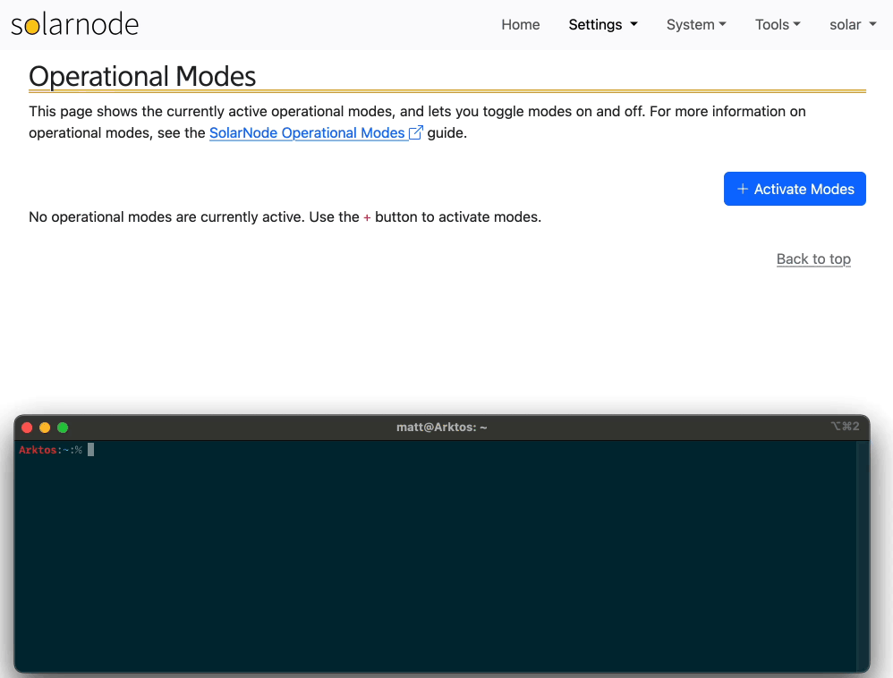

# Command Line Tool

The [s10k][s10k] command line tool can be used to perform a variety of tasks, including:

 * discover the [datum](./datum.md) streams published by a node
 * query for the datum published by a node
 * live-stream node datum published to SolarFlux
 * view and update control values on a node
 * view and update metadata associated with a node
 * toggle [operating modes](./op-modes.md) on a node

Below is an example of using the [instructions toggle-op-mode][toggle-opmode] command to enable and
disable [operating modes](./op-modes.md) on a SolarNode. The affected node UI is shown in the
background, where you can see it respond to the commands run in `s10k`.

{width=998}

[s10k]: https://solarnetwork.github.io/sn-cli/
[toggle-opmode]: https://solarnetwork.github.io/sn-cli/commands/instructions/toggle-op-mode/
