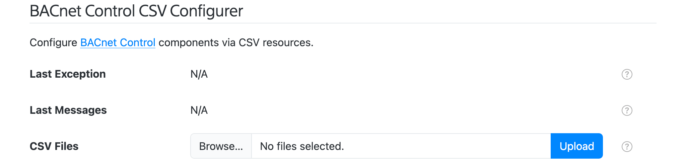
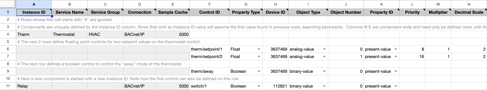
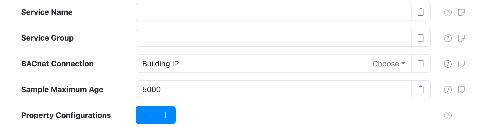
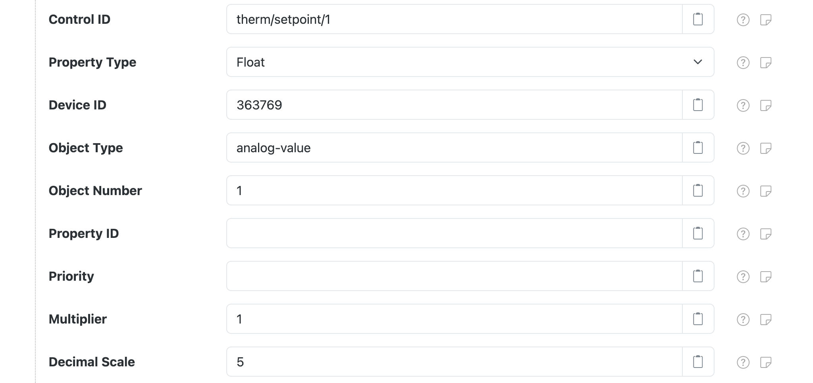

# BACnet Control

SolarNode can update arbitrary BACnet object property values, such
as numbers or strings, via the SolarNode Control API. This is an advanced plugin that requires
knowledge of BACnet and the BACnet configuration of the devices you want to control.

This component is included in the [solarnode-app-bacnet][pkg] package in SolarNodeOS.
You can install this package on the [System > Packages][packages] page in SolarNode.

## Use

Once installed, a new **BACnet Control** component will appear on the [Settings >
Components][components] page on your SolarNode. Click on the **Manage** button to configure controls.

<figure markdown>
  {width=1024 loading=lazy}
</figure>

Each component can be configured with any number of updatable _controls_, each with a unique
_control ID_.  Each control is configured to write to a specific BACnet object property on a BACnet
device.

For example, you might define a `therm/setpoint/1` control that writes a temperature value as a
floating point value to a BACnet object property.

A status indicator will appear at the top of the component settings, which will display the latest
readings obtained from the configured BACnet device.


## CSV Configurer

SolarNode supports configuring BACnet Control components using a simple comma-separated-values (CSV)
file, which spreadsheet applications can easily generate. A **BACnet Control CSV Configurer** form
will appear on the [Settings > Services][services] page. This form lets you upload a BACnet Control CSV
Configuration file to configure all BACnet Control components at once, without having to use the
[settings](#settings) form.

<figure markdown>
  {width=1024 loading=lazy}
</figure>

!!! tip "Spreadsheet jumpstart"

    You can copy the [BACNet Control Configuration Example][sheet-example] sheet as a
    starting point. This sheet has drop-down menu validation to make it super easy to configure your
    BACnet integration. Download your completed Sheet as a CSV file, then use the **BACnet Control CSV Configurer**
    form to upload the CSV file and configure SolarNode.

### BACnet Control CSV Configuration Format

The BACnet Control CSV Configuration uses the column structure detailed
[below](#csv-column-definition), with each row representing an individual control to write to the
BACnet device. A header row is required. Comment lines are allowed, just start the line with a `#`
character (i.e. the first cell value). The entire comment line will be ignored.

Here's an example screen shot of a configuration in a spreadsheet application. It is for two components:

 1. Component `Therm` with 3 controls: `term/setpoint/1`, `term/setpoint/1`, `term/away`
 2. Component `Relay` with 1 control: `switch/1`

Spreadsheet applications generally allows you to export the sheet in the CSV format, which can
then be loaded into SolarNode via the CSV Configurer.

<figure markdown>
  {width=1377 loading=lazy}
</figure>

#### Instance identifiers

Individual BACnet Control components are defined by the first column (**Instance ID**). You can
assign any identifier you like (such as `Relay`, `PLC`, and so on) or configure as a single
dash character `-` to have SolarNode assign a simple number identifier. Once an Instance ID has been
assigned on a given row, subsequent rows will use that value if the corresponding cell value is left
empty.

Here is an example of how 2 custom instance IDs `Relay` and `Term` appear in the SolarNode UI:

<figure markdown>
  {width=1024 loading=lazy}
</figure>

#### CSV column definition

The following table defines all the CSV columns used by BACnet Control CSV Configuration. Columns
**A - E** apply to the **entire BACnet Control configuration**, and only the values from the row that
defines a new Instance ID will be used to configure the device. Thus you can omit the values from
these columns when defining more than one property for a given device.

Columns **I - Q** define the mapping of BACnet registers to datum properties: each row defines an
individual datum property.


| Col | Name | Type | Default | Description |
|:----|:-----|:-----|:--------|:------------|
| `A` | **Instance ID** | string |  | The unique identifier for a single BACnet Control component. Can specify `-` to automatically assign a simple number value, which will start at `1`. |
| `B` | **Service Name** | string |  | An optional service name to assign to the component. |
| `C` | **Service Group** | string |  | An optional service group to assign to the component. |
| `D` | **Connection** | string | `BACnet Port` | The **service name** of the BACnet connection to use. |
| `E` | **Sample Cache** | integer | `5000` | A minimum time to cache captured BACnet data, in milliseconds. |
| `F` | **Control ID** | string |  | The node-unique identifier for the control. |
| `G` | **Property Type** | enum | `Boolean` |  The type of control property to use. Must be one of `Boolean`, `Float`, `Integer`, `Percent`, or `String`, and can be shortened to just `b`, `f`, `i`, `p`, or `s`. |
| `H` | **Device ID** | integer |  | The BACnet device ID to update. |
| `I` | **Object Type** | string |  | The BACnet object type to update. Can be specified as a name, like `analog-value` or `AnalogValue`, or the associated integer code, like `2`. |
| `J` | **Object Number** | integer |  | The BACnet object type instance number to update. |
| `K` | **Property ID** | string | `present-value` |The BACnet object property identifier to update. Can be specified as a name, like `present-value` or `PresentValue`, or the associated integer code, like `85`. |
| `L` | **Priority** | integer |  | The BACnet write operation priority. Can be any value between `1` and `16`, with `1` being the highest priority. If not specified `16` will be assumed. |
| `M` | **Multiplier** | decimal | `1` | For numeric data types, a multiplier to apply to the BACnet value to normalize it into a standard unit. |
| `N` | **Decimal Scale** | integer | `0` | For numeric data types, a maximum number of decimal places to round decimal numbers to, or `-1` to not do any rounding. |

### Example CSV

Here is the CSV as shown in the example configuration screen shot above (comments have been
removed for brevity):

```csv
Instance ID,Service Name,Service Group,Connection,Sample Cache,Control ID,Property Type,Device ID,Object Type,Object Number,Property ID,Multiplier,Decimal Scale
Therm,Thermostat,HVAC,BACnet/IP,5000,therm/setpoint/1,Float,3637469,analog-value,0,present-value,8,1,2
,,,,,therm/setpoint/2,Float,3637469,analog-value,1,present-value,16,1,2
,,,,,therm/away,Boolean,3637469,binary-value,0,present-value,,,
Relay,,,BACnet/IP,5000,switch/1,Boolean,112821,binary-value,0,present-value,,,
```

## Settings

<figure markdown>
  {width=1024 loading=lazy}
</figure>

Each component configuration contains the following settings:

| Setting                 | Description |
|:------------------------|:------------|
| Service Name            | An optional unique name to identify this component with. |
| Service Group           | An optional group name to associate this component with. |
| BACnet Connection       | The **Service Name** of the [BACnet Connection][backnet-conn] to use. |
| Sample Maximum Age      | A maximum time to cache captured BACnet data, in milliseconds. SolarNode will cache the data collected from the BACnet device for at most this amount of time before refreshing data from the device again. Some devices do not refresh their values more than a fixed interval, so this setting can be used to avoid reading data unnecessarily. This setting also helps in highly dynamic configurations where other plugins request the current values from this component frequently. |
| Property Configurations | A list of BACnet object property-specific settings. Any number of property configurations can be added, to update any number of BACnet device object properties. |


## Property settings

You must configure settings for each BACnet object property you want to expose as an updatable
control. You can configure as many property settings as you like, using the ++plus++ and
++minus++ buttons to add/remove configurations.

<figure markdown>
  {width=1024 loading=lazy}
</figure>

Each property configuration contains the following settings:

| Setting         | Default | Description |
|:----------------|:--------|:------------|
| Control ID      |  | A unique name to associate this control configuration with. This should be unique amongst all control IDs deployed on the SolarNode. By convention, control IDs are grouped into a hierarchy via slash characters, for example `therm/setpoint/1`. This ID will also be used as the datum source ID if the control value is posted to SolarNetwork. |
| Property Type   | `Boolean` | The SolarNode control property type. Must be one of `Boolean` (on/off), `Float` (decimal number), `Integer` (whole number), `Percent` (decimal number between 0 and 1), or `String` (text). |
| Object Type     |  | The BACnet object type to update. Can be specified as a name, like `analog-value` or `AnalogValue`, or the associated integer code, like `2`. |
| Object Number   |  | The BACnet object type instance number to update. |
| Property ID     | `present-value` | The BACnet object property identifier to update. Can be specified as a name, like `present-value` or `PresentValue`, or the associated integer code, like `85`. |
| Priority        | `priority` | The BACnet write operation priority. Can be any value between `1` and `16`, with `1` being the highest priority. If not specified `16` will be assumed. |
| Multiplier      | `1` | For numeric data types, a multiplier to apply to the BACnet property value to normalize it into a standard unit. The property values stored in SolarNetwork should be normalized into standard base units if possible. For example if a power meter reports power in kilowattts then a unit multiplier of `1000` can be used to convert the values into watts. When **writing** values to BACnet devices, the value will be **divided** by this amount first. |
| Decimal Scale   | `5` | For numeric data types, a maximum number of decimal places to round decimal numbers to, or `-1` to not do any rounding. Setting to `0` rounds decimals to whole numbers. |

!!! tip "BACnet object and property types"

	BACnet defines a comprehensive enumeration of possible **Object Type** and **Property ID** values.
	See the Lookup tab on the [example CSV configurer sheet][sheet-example] for a complete listing.

## Control manipulation

Once configured each control can be changed on the node itself or via the SolarNetwork API.

### Local SolarNode control

You can set a control value using the SolarNode GUI once the component is configured. Visit the
[Tools > Controls](../setup-app/tools/controls.md) page to manage the available controls.

### SolarNetwork control

The [SolarUser Instruction API][instr-api] can be used to change the control from anywhere in the
world, by requesting the SolarNode to perform a [`SetControlParameter`][SetControlParameter]
instruction and passing a single instruction parameter named the **Control ID** you configured for
the control and the desired value as the parameter value.

For example, to set the `therm/setpoint/1` control to `29.0` an HTTP `POST` like this would update
the value:

```
POST /solaruser/api/v1/sec/instr/add/SetControlParameter

{"nodeId":123,"params":{"therm/setpoint/1":"29.0"}}
```

[components]: ../setup-app/settings/components.md
[instr-api]: https://github.com/SolarNetwork/solarnetwork/wiki/SolarUser-API#queue-instruction
[backnet-conn]: ../io/bacnet.md
[packages]: ../setup-app/system/packages.md
[pkg]: https://github.com/SolarNetwork/solarnode-os-packages/tree/develop/solarnode-app-bacnet/debian
[services]: ../setup-app/settings/services.md
[SetControlParameter]: https://github.com/SolarNetwork/solarnetwork/wiki/SolarUser-API-enumerated-types#setcontrolparameter
[sheet-example]: https://docs.google.com/spreadsheets/d/1sjNqdxng73DcjwBaLX1PI_ejURirv4ChvjdbykvXmdg
