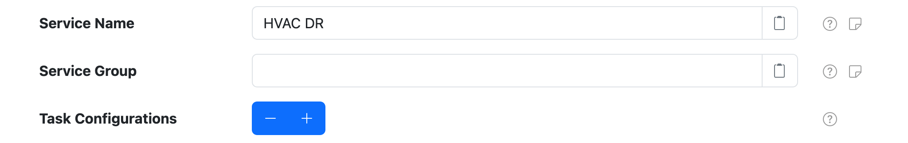
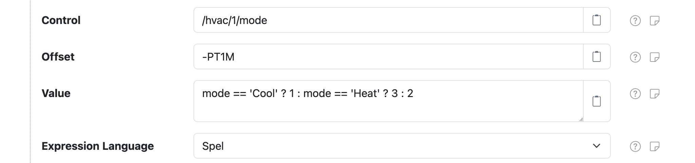
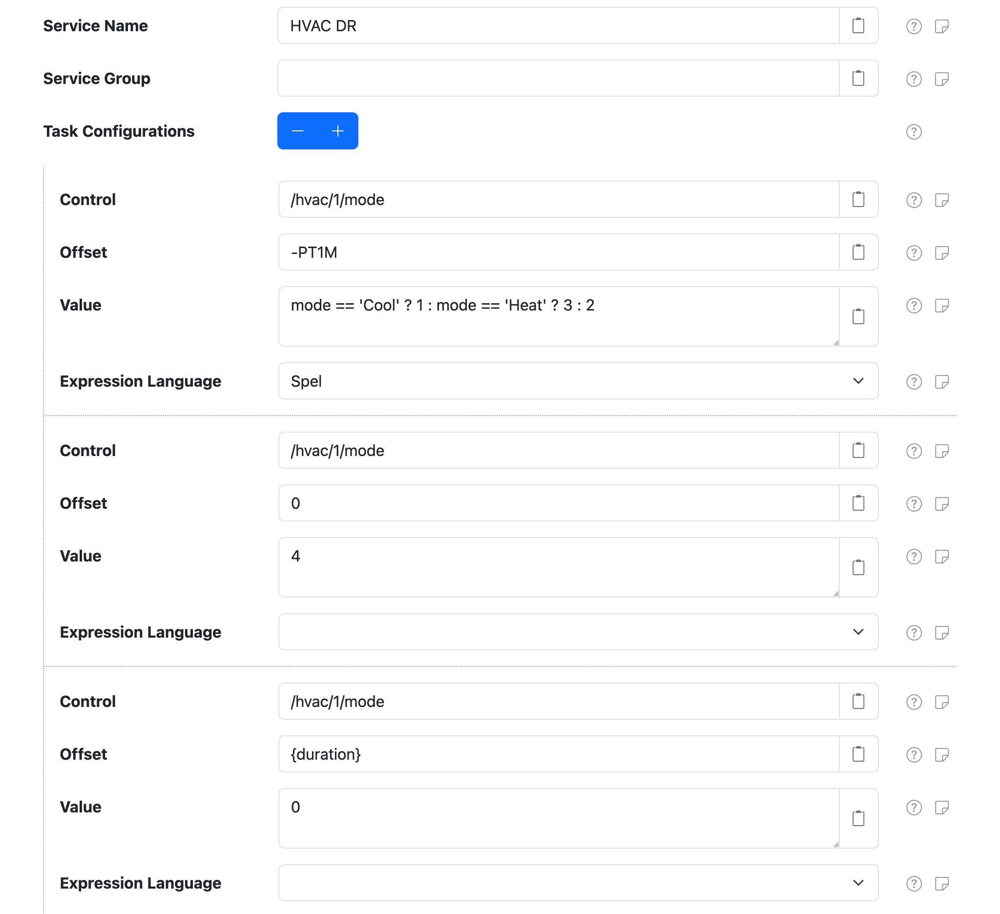

# Control Conductor

The Control Conductor component can schedule a set of control changes in response to an
[`OrchestrateControls`](../instructions/topics/orchestrate-controls.md) instruction. For example,
this could be used to execute a hot-water load shift scenario like:

!!! note ""

	* _in 1 hour turn the hot water thermostat up by 10℃_
	* _in 2 hours turn the hot water cylinder off_
	* _in 4 hours turn the hot water thermostat down by 10℃ and turn the hot water cylinder on_

At a high level, the Control Conductor is configured with a set of _tasks_ that each specify a
control to update and when to update it, relative to an _orchestration date_.  The
`OrchestrateControls` instruction specifies which Control Conductor component to execute and the
orchestration date to execute at.

This component is included in the [solarnode-app-control-core][pkg] package in SolarNodeOS.
You can install this package on the [System > Packages][packages] page in SolarNode.

## Use

Once installed, a new **Control Conductor** component will appear on the [Settings >
Components][components] page on your SolarNode. Click on the **Manage** button to configure components.

<figure markdown>
  {width=1024 loading=lazy}
</figure>


## Settings

Each component configuration is specific to a single GPIO device. You can configure SolarNode controls
for any of the GPIO lines supported by the device.

<figure markdown>
  {width=1024 loading=lazy}
</figure>

The configuration contains the following overall settings:

| Setting             | Description |
|:--------------------|:------------|
| Service Name        | A **required** unique name to identify this component with. |
| Service Group       | An optional group name to associate this component with. |
| Task Configurations | A list of control task-specific settings. Any number of task configurations can be added. |

### Task settings

You must configure task settings for each control you want to change when the `OrchestrateControls`
instruction is handled. You can configure as many property settings as you like, using the
<kbd>+</kbd> and <kbd>-</kbd> buttons to add/remove configurations.

<figure markdown>
  {width=1024 loading=lazy}
</figure>

Each task configuration contains the following settings:

| Setting         | Description |
|:----------------|:------------|
| Control         | The ID of the control to change. Parameters provided by the `OrchestrateControls` instruction can be used as placeholders. |
| Offset          | The [time offset](#task-settings-offset-syntax), relative to the _orchestration date_, to change the control value at. Negative values are supported and represent an offset _before_ the orchestration date. Parameters provided by the `OrchestrateControls` instruction can be used as placeholders. |
| Value           | The control value to set. Parameters are supported. If **Expression Language** is configured then treat as an [expression](#expressions) to evaluate. Parameters provided by the `OrchestrateControls` instruction can be used as placeholders, as normal placeholders or if an expression is used then in the expression directly as variables. |
| Expression Language | The expression language to write **Value** in. If not configured then **Value** will not be treated as an expression. |

### Task settings Offset syntax

The **Offset** setting accepts duration values that can be specified in a couple of different ways:

 * an integer millisecond value, for example `60000` for 1 minute after or `-10000` for 10 seconds
   before
 * an ISO 8601 duration value in the form `PnDTnHnMn.nS`, where `n` is a number, for example
   `PT1H30M` for 90 minutes after or `-PT0.5S` for 0.5 seconds before

## OrchestrateControls instruction

The `OrchestrateControls` instruction is used to execute the task schedule defined in a Control
Conductor component. It requires the following parameters:

| Parameter | Description |
|:----------|:------------|
| `service` | The **Service Name** of the Control Conductor to execute. |
| `date`    | The _orchestration date_ to execute the task schedule at. |

The `date` parameter can be specified as an Unix millisecond epoch integer like `1680664200000` or
an ISO 8601 instant like `2023-04-05T03:10:00`.

### OrchestrateControls instruction extra parameters

Any parameter included in the  `OrchestrateControls` instruction will then be available as a
placeholder for use in any configured task **Control**, **Offset**, and **Value** settings. If
**Value** is configured as an expression, then the parameters will be available directly within the
expression.

### CancelInstruction support

The [`CancelInstruction`](../instructions/topics/cancel-instruction.md) instruction can be used
to cancel a previously executed `OrchestrateControls` instruction. All the scheduled "child"
task instructions issued by the "parent" `OrchestrateControls` instruction will be cancelled
if the "parent" instruction ID is provided in the `CancelInstruction` instruction.

## Expressions

The task **Value** can be defined as an [expressions][expr] if the **Expression Language** setting
is also configured. The expression will have access to all the parameters provided by the
`OrchestrateControls` instruction.

## Example: HVAC Demand Response

This section shows an example use case of the `OrchestrateControls` instruction that is supported by
the Control Conductor component. At a high level, the goal of this example is to schedule a "demand
response event" where a "mode" is adjusted on some device, several times over a fixed duration. You
can think of this as a sequence of "mode" changes, where the mode changes from `0` → `3` → `4` → `0`
over time.

A Control Conductor component named **HVAC DR** is configured with 3 tasks that execute at an
**orchestration date** specified in the `OrchestrateControls` instruction:

 1. **1 minute before** the orchestration date, set `/hvac/1/mode` to `1`, `2`, or `3` based on an
    expression using the `mode` parameter in the `OrchestrateControls` instruction
 2. **at** the orchestration date, set `/hvac/1/mode` to `4`
 3. **X minutes after** the orchestration date, as defined by a `duration` parameter in the
    `OrchestrateControls` instruction, set the `/hvac/1/mode` to `0`

<figure markdown>
  {width=1024 loading=lazy}
</figure>

The following sections detail a concrete example of issuing an `OrchestrateControls` instruction
using this configuration.

### Post `OrchestrateControls` instruction

First a `OrchestrateControls` instruction is issued using the `/instr/add` SolarNetwork API, passing
in the following parameters:

| Parameter | Value | Description |
|:----------|:------|:------------|
| `service`  | `HVAC DR` | The **Service Name** of the Control Conductor to trigger. |
| `date`     | `2023-04-05T03:10:00Z` | The **orchestration date** to use; essentially some date in the future. |
| `mode`     | `Heat` | This is provided so task 1's **Value** expression can decide what value to set on the `/hvac/1/mode` control. |
| `duration` | `PT1M` | The desired duration used by task 3's **Offset** parameterized value. |

```json title="Initial OrchestrateControls instruction"
{"nodeId":123, "topic":"OrchestrateControls", "params":{
  "service"  : "HVAC DR", // (1)!
  "date"     : "2023-04-05T03:10:00Z", // (2)!
  "mode"     : "Heat", // (3)!
  "duration" : "PT1M" // (4)!
}}
```

1. This is the **Service Name** of the Control Conductor component to trigger.
2. The **orchestration date** to use.
3. An extra parameter to pass to the tasks. In this case the `mode` variable is used in task #1's **Value** expression `#!java mode == "Cool" ? 1 : mode == "Heat" ? 3 : 2`.
4. An extra parameter to pass to the tasks. In this case the `{duration}` placeholder is used in task #3's **Offset** setting.

### SolarNode receives the `OrchestrateControls` instruction

Here are logs from SolarNode, after receiving the  `OrchestrateControls` instruction:

```
15:07:17 INFO  Instruction 11537521 OrchestrateControls received with parameters: {service=HVAC DR, mode=Heat, date=2023-04-05T03:10:00Z, duration=PT1M}
15:07:17 INFO  Posted Instruction 11537521 [OrchestrateControls] acknowledgement status: Executing
15:07:17 INFO  Scheduling Signal instruction on behalf of OrchestrateControls instruction [11537521] task [HVAC DR.1] @ 2023-04-05T03:09:00Z
15:07:17 INFO  Scheduling Signal instruction on behalf of OrchestrateControls instruction [11537521] task [HVAC DR.2] @ 2023-04-05T03:10:00Z
15:07:17 INFO  Scheduling Signal instruction on behalf of OrchestrateControls instruction [11537521] task [HVAC DR.3] @ 2023-04-05T03:11:00Z
15:07:17 INFO  Posted Instruction 11537521 [OrchestrateControls] acknowledgement status: Completed
```

These logs show that SolarNode received the `OrchestrateControls` instruction and then **scheduled**
3 future-dated `Signal` instructions, one for each task configured on the Control Conductor. The
Control Conductor knows how to handle these particular `Signal` instructions. Notice the dates of
each of the `Signal` instructions:

```
...task [HVAC DR.1] @ 2023-04-05T03:09:00Z
...task [HVAC DR.2] @ 2023-04-05T03:10:00Z
...task [HVAC DR.3] @ 2023-04-05T03:11:00Z
```

Those dates are based on the **orchestration date** and `{duration}` parameter provided in the
`OrchestrateControls` instruction:

| Task | Time | Description |
|:-----|:-----|:------------|
| `HVAC DR.1` | `03:09:00Z` | This is 1 minute **before** the orchestration date, because the task's **Offset** was configured as `-PT1M` (minus 1 minute). |
| `HVAC DR.2` | `03:10:00Z` | This is **on** the orchestration date, because the **Offset** was configured as `0` (0 milliseconds). |
| `HVAC DR.3` | `03:11:00Z` | This is 1 minute **after** the orchestration date, because the task's **Offset** was configured as `{duration}` and the `duration` parameter value was specified as `PT1M` (plus 1 minute) in the original `OrchestrateControls` instruction. |

### Orchestration date T-1 minute

`15:09` local time, which is `03:09Z`, is 1 minute before the orchestration date. SolarNode executes
task 1, evaluating the **Value** expression and setting the `/hvac/1/mode` control to `3`. In the
following logs we can see SolarNode write `3` to a Modbus holding register `2`:

```
15:09:49 INFO  Executing SetControlParameter instruction for orchestrated task [HVAC DR.1] to set control [/hvac/1/mode] to [3]
15:09:49 INFO  Setting /hvac/1/mode value to 3
15:09:49 TRACE Wrote 1 Holding values to 2 @ localhost:5552#1: 00 03
15:09:49 INFO  Instruction 1680664015581 [SetControlParameter] state changed to Completed
15:09:49 INFO  Instruction 1680664015578 Signal status changed to Completed
```

### Orchestration date

At `15:10` local time, which is `03:10Z`, SolarNode executes task 2, setting `/hvac/1/mode` to `4`.
In the following logs we can see SolarNode write `4` to Modbus holding register `2`:

```
15:10:49 INFO  Executing SetControlParameter instruction for orchestrated task [HVAC DR.2] to set control [/hvac/1/mode] to [4]
15:10:49 INFO  ModbusControl - Setting /hvac/1/mode value to 4
15:10:49 TRACE Wrote 1 Holding values to 2 @ localhost:5552#1: 00 04
15:10:49 INFO  Instruction 1680664015582 [SetControlParameter] state changed to Completed
15:10:49 INFO  Instruction 1680664015579 Signal status changed to Completed
```

### Orchestration date T+1 minute

At `15:11` local time, which is `03:11Z`, SolarNode executes task 3, setting `/hvac/1/mode` to `0`.
In the following logs we can see SolarNode write `0` to Modbus holding register `2`::

```
15:11:49 INFO  Executing SetControlParameter instruction for orchestrated task [HVAC DR.3] to set control [/hvac/1/mode] to [0]
15:11:49 INFO  Setting /hvac/1/mode value to 0
15:11:49 TRACE Wrote 1 Holding values to 2 @ localhost:5552#1: 00 00
15:11:49 INFO  Instruction 1680664015583 [SetControlParameter] state changed to Completed
15:11:49 INFO  Instruction 1680664015580 Signal status changed to Completed
```

[components]: ../setup-app/settings/components.md
[datum-stream-fn]: ../expressions.md#datum-stream-functions
[expr]: ../expressions.md
[packages]: ../setup-app/system/packages.md
[pkg]: https://github.com/SolarNetwork/solarnode-os-packages/tree/develop/solarnode-app-control-core/debian
[placeholders]: ../placeholders.md
