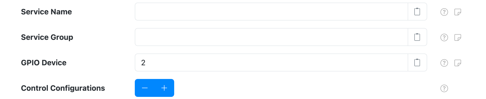
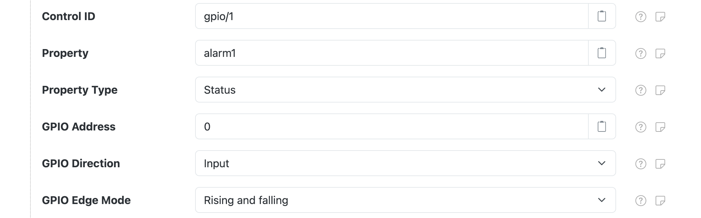

# GPIO Control

SolarNode can read and write to **digital** general purpose input/output (GPIO) lines widely
available on SolarNode devices like the Raspberry Pi.

To turn the GPIO lines into a datum stream you can use the [Controls Datum
Source](../datum-sources/controls.md) plugin.

This component is included in the [solarnode-app-control-gpiod][pkg] package in SolarNodeOS.
You can install this package on the [System > Packages][packages] page in SolarNode.

## Use

Once installed, a new **GPIO Control** component will appear on the [Settings >
Components][components] page on your SolarNode. Click on the **Manage** button to configure controls.

<figure markdown>
  {width=1024 loading=lazy}
</figure>

## Settings

Each component configuration is specific to a single GPIO device. You can configure SolarNode controls
for any of the GPIO lines supported by the device.

<figure markdown>
  {width=1024 loading=lazy}
</figure>

The configuration contains the following overall settings:

| Setting                | Description  |
|:-----------------------|:-------------|
| Service Name           | A unique name to identify this data source with. |
| Service Group          | A group name to associate this data source with. |
| GPIO Device            | The GPIO device. Can be specified as a number, starting at `0`, or a full system device path. :warning: On some systems only a full system device path can be used, for example `/dev/gpiochip0`. |
| Control Configurations | A list of [Control Settings](#control-settings). |

### Control Settings

A control configuration maps a GPIO line to a SolarNode control. The control will be a **Boolean**
type, where the value is either `true` or `false`, encoded as `1` and `0`.

<figure markdown>
  {width=1024 loading=lazy}
</figure>

Each control configuration contains the following settings:

| Setting                | Description  |
|:-----------------------|:-------------|
| Control ID            | The ID to use for the SolarNode control. This should be unique amongst all control IDs configured on a single node. [Placeholders][placeholders] are supported. |
| Property              | The name of the control property to save the GPIO line value to. |
| Property Type         | The [property type][prop-types] to use. |
| GPIO Address          | The GPIO line address, starting from `0`. |
| GPIO Direction        | The I/O direction of the GPIO address. |
| GPIO Edge Mode        | When to report changes in digital IO lines. See [GPIO Edge Mode](#gpio-edge-mode). |

!!! warning "GPIO Address and Control ID must be unique"

	A **GPIO Address** can only be configured on a **single** control configuration. An
	`ERROR` log will be generated if you configure more than one control configuration with the same
	GPIO Address value.

	Similarly, a **Control ID** can only be configured on a **single** control configuration. An
	`ERROR` log will be generated if you configure more than one control configuration with the same
	Control ID value.

### GPIO Edge Mode

The **GPIO Edge Mode** setting allows you to configure _when_ to capture changes in digital **input**
lines. The default mode is **Rising and falling** so the control will capture both when the line
turns "on" (the control value will be `1`) and when the line turns "off" (the control value will be
`0`).

| Mode | Description |
|:-----|:------------|
| Rising             | When voltage changes from low to high (turns "on"). |
| Falling            | When voltage changes from high to low (turns "off"). |
| Rising and falling | Capture both Rising and Falling events. |

[components]: ../setup-app/settings/components.md
[packages]: ../setup-app/system/packages.md
[pkg]: https://github.com/SolarNetwork/solarnode-os-packages/tree/develop/solarnode-app-control-gpiod/debian
[placeholders]: https://github.com/SolarNetwork/solarnetwork/wiki/SolarNode-Placeholders
[prop-types]: https://github.com/SolarNetwork/solarnetwork/wiki/SolarNet-API-global-objects#datum-property-classifications
