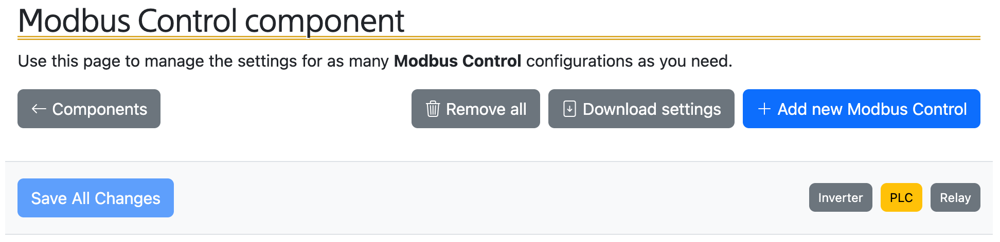
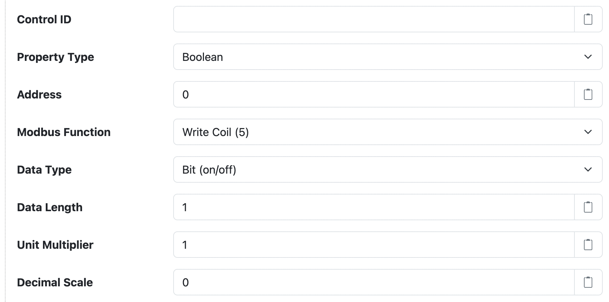

# Modbus Control

This project provides SolarNode plugin that can be used to set arbitrary Modbus register values,
such as numbers or strings.

This datum source is provided by the [Modbus Control][src] plugin, which is included in the
[solarnode-app-modbus][pkg] package in SolarNodeOS.

## Use

Once installed, a new **Modbus Control** component will appear on the [Settings >
Components][components] page on your SolarNode. Click on the **Manage** button to configure devices.
You'll need to add one configuration for each Modbus device you want to control.

Using this plugin you'll define one SolarNode control per Modbus register
(or registers, for data types that require more than one). For example you
might define a `/thermostat/temp/comfort` control that writes a temperature
value as a 32-bit floating point value to two Modbus registers.

A status indicator will appear at the top of the device settings, which will
display the latest readings obtained from the configured Modbus registers.

Each Modbus Control component is specific to one Modbus device. You can add
as many components as you like, if you want to control multiple devices.


## CSV Configurer

This plugin also provides a **Modbus Control CSV Configurer** component will appear on the
[Settings > Services][services] page. This component lets you upload a Modbus Control CSV Configuration file
to configure all Modbus Control components, without having to use the [settings](#settings) form.

<figure markdown>
  {width=872 loading=lazy}
</figure>

### Modbus Control CSV Configuration Format

The Modbus Control CSV Configuration uses the column structure detailed [below](#csv-column-definition),
with each row representing an individual control to write to the Modbus device. A header row
is required. Comment lines are allowed, just start the line with a `#` character (i.e. the first
cell value). The entire comment line will be ignored.

Here's an example screen shot of a configuration in a spreadsheet application. It is for two devices:

 1. Device `P1` with 5 controls: `msg/1`, `analog/1`, `analog/2`, `meter/1`, and `switch/1`
 2. Device `P2` with 2 controls: `power/1` and `power/2`

Spreadsheet applications generally allows you to export the sheet in the CSV format, which can
then be loaded into SolarNode via the CSV Configurer.

<figure markdown>
  {width=1295 loading=lazy}
</figure>

!!! tip Example Sheet

	You can copy this [example sheet][sheet-example] to get started.

#### Instance identifiers

Individual Modbus Control components are defined by the first column (**Instance ID**). You can
assign any identifier you like (such as `Relay`, `PLC`, and so on) or configure as a single
dash character `-` to have SolarNode assign a simple number identifier. Once an Instance ID has been
assigned on a given row, subsequent rows will use that value if the corresponding cell value is left
empty.

Here's an example of how 3 custom instance IDs `Relay`, `PLC`, and `Inverter` appear in the
SolarNode UI:

<figure markdown>
  {width=972 loading=lazy}
</figure>

#### CSV column definition

The following table defines all the CSV columns used by Modbus Device CSV Configuration. Columns
**A - H** apply to the **entire Modbus Device configuration**, and only the values from the row that
defines a new Instance ID will be used to configure the device. Thus you can omit the values from
these columns when defining more than one property for a given device.

Columns **I - Q** define the mapping of Modbus registers to datum properties: each row defines an
individual datum property.


| Col | Name | Type | Default | Description |
|:----|:-----|:-----|:--------|:------------|
| `A` | **Instance ID** | string |  | The unique identifier for a single Modbus Device component. Can specify `-` to automatically assign a simple number value, which will start at `1`. |
| `B` | **Connection** | string | `Modbus Port` | The **service name** of the [Modbus connection][modbus-conn] to use. |
| `C` | **Unit ID** | integer | `1` | The Modbus unit ID of the device to collect data from (1 - 255). |
| `D` | **Sample Cache** | integer | `5000` | A minimum time to cache captured Modbus data, in milliseconds. |
| `E` | **Word Order** | enum | `Most to least` |  For multi-register data types, the ordering to use when combining them. Must be either `Most to least` or `Least to most`, and can be shortened to just `m` or `l`. |
| `F` | **Control ID** | string |  | The node-unique identifier for the control. |
| `G` | **Property Type** | enum | `Boolean` |  The type of control property to use. Must be one of `Boolean`, `Float`, `Integer`, `Percent`, or `String`, and can be shortened to just `b`, `f`, `i`, `p`, or `s`. |
| `H` | **Register** | integer |  | The register address to read Modbus data from (zero-based). For multi-register data types this is the _first_ register to read from. |
| `I` | **Register Type** | enum | `Coil` | The Modbus write function to execute. Must be one of `Coil` or `Holding`. |
| `J` | **Data Type** | enum | `Boolean` | The type of data to expect from the read Modbus register(s). Must be one of `Boolean` or `bit`, `16-bit float` or `f16`, `32-bit float` or `f32`, `16-bit signed int` or `i16`, `16-bit unsigned int` or `u16`, `32-bit signed int` or `i32`, `32-bit unsigned int` or `u32`, `64-bit signed int` or `i64`, `64-bit unsigned int` or `u16`, `Bytes` or `b`, `String UTF-8` or `s`, `String ASCII` or `a`. |
| `K` | **Data Length** | integer |  | For variable length data types such as strings, the number of Modbus registers to read. |
| `L` | **Multiplier** | decimal | `1` | For numeric data types, a multiplier to apply to the Modbus value to normalize it into a standard unit. |
| `M` | **Decimal Scale** | integer | `0` | For numeric data types, a maximum number of decimal places to round decimal numbers to, or `-1` to not do any rounding. |

### Example CSV

Here is the CSV as shown in the example configuration screen shot above (comments have been removed
for brevity):

```csv
Instance ID,Connection,Unit ID,Sample Cache,Word Order,Control ID,Property Type,Register,Register Type,Data Type,Data Length,Multiplier,Decimal Scale
P1,Modbus Port,1,5000,Most to least,,,,,,,,
,,,,,msg/1,String,1000,Holding,String ASCII,16,,
,,,,,analog/1,Float,0,Holding,32-bit float,,1,-1
,,,,,analog/2,Float,2,Holding,32-bit float,,1,1
,,,,,meter/1,Integer,70,Holding,64-bit unsigned int,,,
,,,,,switch/1,Boolean,100,Coil,Boolean,,,
P2,Modbus Port,2,5000,Most to least,power/1,Integer,10,Holding,16-bit unsigned int,,0.01,
,,,,,power/2,Integer,11,Holding,32-bit unsigned int,,,
```

## Settings

<figure markdown>
  {width=872 loading=lazy}
</figure>

Each configuration contains the following overall settings:

| Setting            | Description                                                                      |
|--------------------|----------------------------------------------------------------------------------|
| Service Name       | A name to associate this control configuration with.                             |
| Service Group      | A group name to associate this control Configuration with.                       |
| Modbus Connection  | The service name of the [Modbus connection][modbus-conn] to use. You must configure that component with the proper connection settings for your Modbus network, configure a unique service name on that component, and then enter that same service name here. |
| Modbus Unit ID     | The ID of the Modbus device to control, from 1 - 255.                            |
| Sample Maximum Age | A minimum time to cache captured Modbus data, in milliseconds. SolarNode will cache the data collected from the Modbus device for at least this amount of time before refreshing data from the device again. Some devices do not refresh their values more than a fixed interval, so this setting can be used to avoid reading data unnecessarily. This setting also helps in highly dynamic configurations where other plugins request the current values from the device frequently. |
| Max Read Length    | The maximum number of Modbus registers to read at once. This can be used to work with Modbus devices that have trouble reading large ranges at once. |
| Word Order         | The register ordering for multi-register data types. Consult your Modbus device's documentation on which to use. |


### Property settings

Property configurations define a mapping between the SolarNode control and a Modbus register (or set
of registers). You can configure as many property settings as you like, using the <kbd>+</kbd> and
<kbd>-</kbd> buttons to add/remove property configurations (and thus, add/remove controls).

<figure markdown>
  {width=872 loading=lazy}
</figure>

Each property configuration contains the following settings:

| Setting         | Description |
|-----------------|-------------|
| Control ID      | A name to associate this control configuration with. This should be unique amongst all control IDs deployed on the SolarNode. By convention, control IDs are grouped into a hierarchy via slash characters, for example `/modem/power/1`. This ID will also be used as the datum source ID when the control value is posted to SolarNetwork. |
| Property Type   | The SolarNode control type to use. Each property must be categorized as `Boolean` (on/off), `Float` (decimal number), `Integer` (whole number), `Percent` (decimal number between 0 and 1), or `String`. |
| Address         | The starting register address to read Modbus data from (zero-based). Note this value is the zero-based address to read. Sometimes documentation for Modbus devices list the addresses in one-based notation. If that is the case for your device, simply subtract one from the documented address here. |
| Modbus Function | The Modbus write function to execute. |
| Data Type       | The type of data to write to the Modbus register(s).  The data type to interpret the values captured from the Modbus registers as. **Note** that only the **Status** property type can accept non-numeric data types such as strings. |
| Data Length     | For variable length data types such as strings, the number of Modbus registers to write. |
| Unit Multiplier | For numeric data types, a multiplier to apply to the Modbus value to normalize it into a standard unit. The property values stored in SolarNetwork should be normalized into standard base units if possible. For example if a power meter reports power in _kilowattts_ then a unit multiplier of `1000` can be used to convert the values into _watts_. When writing values to Modbus, the value will be _divided_ by this amount first. |
| Decimal Scale   | For numeric data types, a maximum number of decimal places to round decimal numbers to. This setting will round decimal numbers to at most this number of decimal places. Setting to `0` rounds decimals to whole numbers. Setting to `-1` disables rounding completely. |

## Control manipulation

Once configured each control can be changed on the node itself or via the SolarNetwork API.

### SolarNode manipulation

You can set a control value using the SolarNode GUI once the component is configured. Visit the
[Tools > Controls](../setup-app/tools/controls.md) page to manage the available controls.

### SolarNetwork manipulation

The [SolarUser Instruction API][instr-api] can be used to change the control from anywhere in the
world, by requesting the SolarNode to perform a [`SetControlParameter`][SetControlParameter]
instruction and passing a single instruction parameter named the **Control ID** you configured for
the control and the desired value as the parameter value.

For example, to set the `test/float` control to `29.0` an HTTP `POST` like this would update the
value:

```
POST /solaruser/api/v1/sec/instr/add/SetControlParameter

{"nodeId":123,"params":{"test/float":"29.0"}}
```

#### `DemandBalanceGeneration` instruction support

The [`DemandBalanceGeneration`][DemandBalanceGeneration] instruction is also supported, which
is a specialized variation of `SetControlParameter` where a single instruction parameter named
the **Control ID** you configured for the control and the desired integer percentage as the
parameter value.

[components]: ../setup-app/settings/components.md
[DemandBalanceGeneration]: https://github.com/SolarNetwork/solarnetwork/wiki/SolarUser-API-enumerated-types#demandbalancegeneration
[instr-api]: https://github.com/SolarNetwork/solarnetwork/wiki/SolarUser-API#queue-instruction
[modbus-conn]: ../io/modbus.md
[pkg]: https://github.com/SolarNetwork/solarnode-os-packages/tree/develop/solarnode-app-modbus/debian
[services]: ../setup-app/settings/services.md
[SetControlParameter]: https://github.com/SolarNetwork/solarnetwork/wiki/SolarUser-API-enumerated-types#setcontrolparameter
[sheet-example]: https://docs.google.com/spreadsheets/d/1qZIdzCzSwuTMEs1hg6HabkFih4Gqw-eBjd43HZ0R5ng
[src]: https://github.com/SolarNetwork/solarnetwork-node/tree/develop/net.solarnetwork.node.control.modbus
