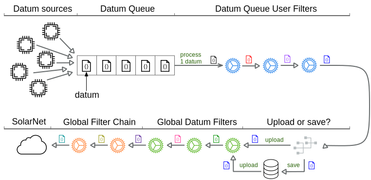

# Datum Filters

Datum Filters are services that manipulate [datum](../datum.md) generated by SolarNode plugins
before they are uploaded to SolarNet. Datum Filters vary wildly in the functionality they provide;
here are some examples of the things they can do:

* Throttle the rate at which datum are saved to SolarNet
* Remove unwanted properties from datum
* Split a datum so some properties are moved to another datum stream
* Join the properties of multiple datum streams into a single datum
* Inject properties from external services
* Derive new properties from dynamic [expressions](../expressions.md)

!!! tip "Datum Filters do not create datum"

	It is helpful to remember that Datum Filters do not **create** datum, they only
	**manipulate** datum created elsewhere, typically by datum data sources.

There are four main places where datum filters can be applied:

1. On the [Datum Queue](#datum-queue), immediately after each datum is captured
2. As a [Global Datum Filter](#global-datum-filters), just before uploading to SolarNet
3. On the [Global Datum Filter Chain](#global-datum-filter-chain), just before uploading to SolarNet
4. As a [SolarFlux Datum Filter](#solarflux-datum-filters), just before uploading to SolarFlux

## Datum Queue

All datum generated by SolarNode plugins are added to the **Datum Queue** for processing. The datum
are processed in the order they are added to the queue. Datum Filters are applied to each datum,
each filter's result passed to the next available filter until all filters have been applied.

<figure markdown>
  {width=762 loading=lazy}
  <caption>Conceptual diagram of the Datum Queue, processing datum along with filters manipulating them</caption>
</figure>

At the end of processing, the datum is either

1. uploaded to SolarNet immediately, or
2. saved locally, to be uploaded at some point in the future

Most of the time datum are uploaded to SolarNet immediately after processing. If the network is
down, or SolarNode is configured to only upload datum in batches, then datum are saved locally in
SolarNode, and a periodic job will attempt to upload them later on, in batches.

See the Setup App [Datum Queue](../setup-app/settings/datum-filters.md#datum-queue) section for
information on how to configure the Datum Queue.

!!! tip "When to configure filters on the Datum Queue, as opposed to other places?"

	The Datum Queue is a great place to configure filters that must be processed at most once per
	datum, and do not depend on what time the datum is uploaded to SolarNet.

## Global Datum Filters

Global Datum Filters are applied to datum just before posting to SolarNetwork. Once an instance is
created, it is automatically active and will be applied to datum. This differs from [User Datum
Filters](#user-datum-filters), which must be explicitly added to a service to be used, either
dircectly or indirectly with a [Datum Filter Chain](chain.md).

!!! note

	Some filters support both [Global](../setup-app/settings/datum-filters.md#global-datum-filters)
	and [User](../setup-app/settings/datum-filters.md#user-datum-filters) based filter
	configuration, and often you can achieve the same overall result in multiple ways. Global
	filters are convenient for the subset of filters that support Global configuration, but for
	complex filtering often it can be easier to configure all filters as User filters, using the
	[Global Datum Filter Chain](../setup-app/settings/datum-filters.md#global-datum-filter-chain) as
	needed.

## Global Datum Filter Chain

The Global Datum Filter Chain provides a way to apply explicit [User Datum
Filters](../setup-app/settings/datum-filters.md#user-datum-filters) to datum just before posting to
SolarNetwork.

## SolarFlux Datum Filters

TODO
