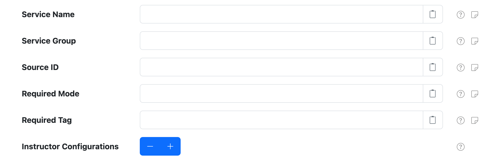
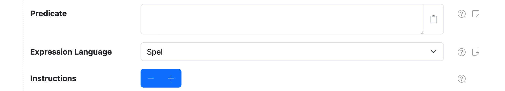
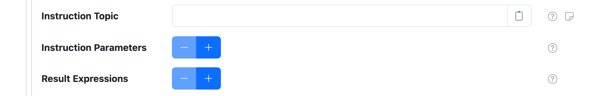
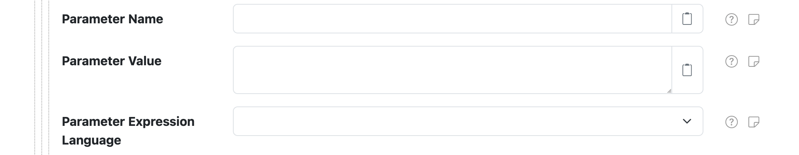
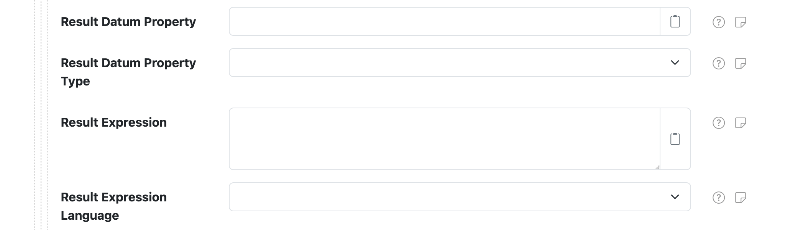
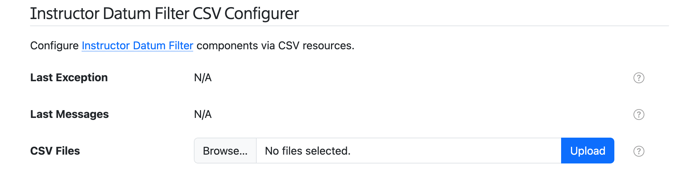
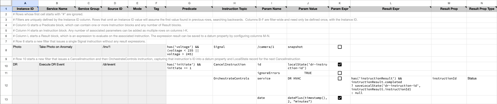
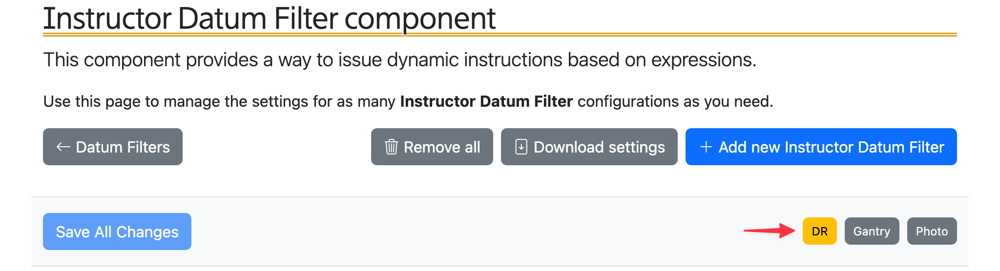
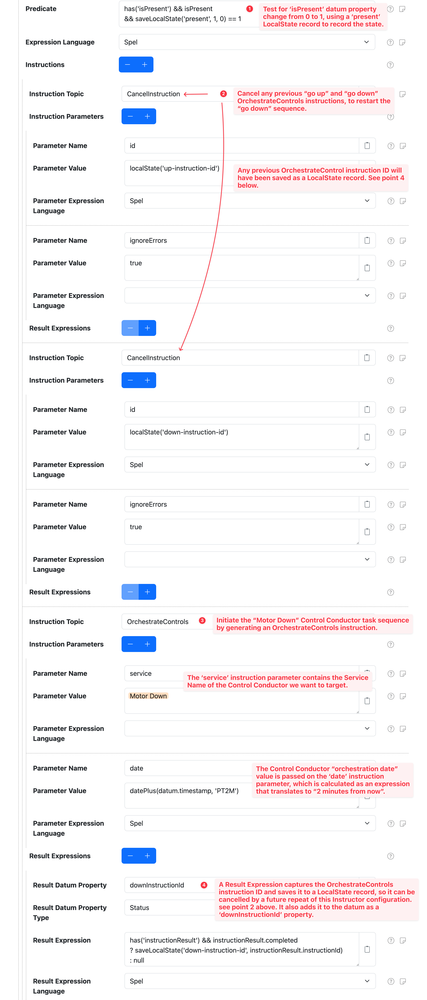
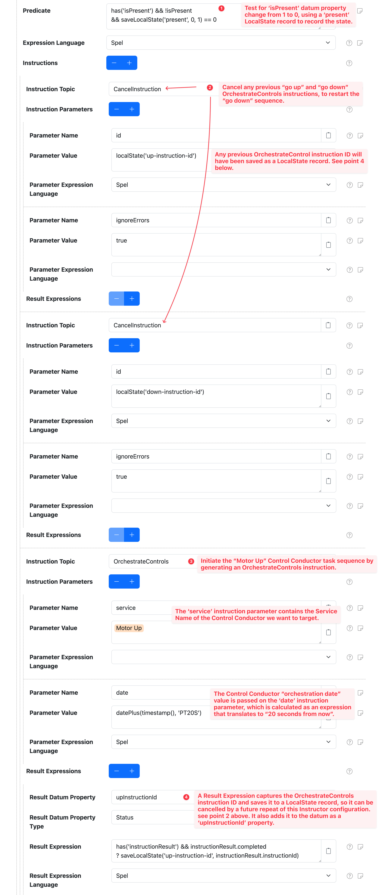

# Instructor Datum Filter

This component provides a way to issue dynamic node-local [instructions](../instructions/index.md)
based on expressions. A _predicate_ expression is evaluated to conditionally issue a set of
associated instructions with a set of dynamic parameters.

--8<-- "snippets/users/datum-filters/provided-by-standard-filter.md"

## Settings

<figure markdown>
  {width=1024 loading=lazy}
</figure>

In addition to the [Common Settings][datumfilter-common-settings], the following general settings are available:

| Setting            | Description |
|:-------------------|:------------|
| [Instructor Configurations](#instructor-settings) | A list of instructor configurations. Use the ++plus++ and ++minus++ buttons to add/remove as many configurations as you need. |

### Instructor settings

<figure markdown>
  {width=1024 loading=lazy}
</figure>

Each Instructor Configuration supports the following settings:

| Setting             | Description |
|:--------------------|:------------|
| Predicate           | The expression that must evaluate to `true` to generate the configured instructions. |
| Expression Language | The [expression language][expr] to write **Predicate** in. |
| [Instructions](#instruction-settings) | A list of instruction configurations. Use the ++plus++ and ++minus++ buttons to add/remove as many configurations as you need. |

### Instruction settings

<figure markdown>
  {width=1024 loading=lazy}
</figure>

Each Instruction Configuration supports the following settings:

| Setting                | Description |
|:-----------------------|:------------|
| Instruction Topic      | The [instruction topic](../instructions/topics/index.md) to generate. |
| [Instruction Parameters](#instruction-parameter-settings) | An optional list of instruction parameter configurations. Use the ++plus++ and ++minus++ buttons to add/remove as many configurations as you need. |
| [Result Expressions](#result-expression-settings)     | An optional list of instruction result expression configurations. Use the ++plus++ and ++minus++ buttons to add/remove as many configurations as you need. |

### Instruction Parameter settings

<figure markdown>
  {width=1024 loading=lazy}
</figure>

Each Instruction Parameter Configuration supports the following settings:

| Setting                | Description |
|:-----------------------|:------------|
| Parameter Name  | The instruction parameter name to use. |
| Parameter Value | The instruction parameter value. Can be an expression if **Parameter Expression Language** is also configured. |
| Parameter Expression Language | The expression language **Parameter Value** is written in, or omit to treat **Parameter Value** as plain text. |

### Result Expression settings

<figure markdown>
  {width=1024 loading=lazy}
</figure>

Each Result Expression Configuration supports the following settings:

| Setting                | Description |
|:-----------------------|:------------|
| Result Datum Property | A datum property name to save the expression result to. Leave empty to evaluate the expression without saving any datum property. |
| Result Datum Property Type | The datum property type to save the expression result as, if **Result Datum Property** also configured. |
| Result Expression | The expression to evaluate. |
| Result Expression Language | The expression language **Result Expression** is written in. |

## Expressions

The **Predicate** and **Parameter Value** expresions are normal [datum expressions](../expressions.md).
The **Result Expression** also includes the following additional variables:

| Variable | Type | Description |
|:---------|:-----|:------------|
| `instruction` | The [Instruction](../instructions/index.md#__tabbed_1_3) object that was issued. |
| `instructionResult` | If the instruction was successfully issued, the [Instruction Status](../instructions/index.md#__tabbed_1_4) object with the result status and any result parameters generated. |

For example, you could generate a datum property based on the success of the executed instruction
with a **Result Expression** like:

```java title="Generate a true/false datum property based on the instruction result status"
has('instructionResult') && instructionResult.completed
```

## CSV Configurer

This component provides an **Instructor Datum Filter CSV Configurer** service that appears on the
[Settings > Services][services] page. This service lets you upload an Instructor Datum Filter CSV
Configuration file to configure all Instructor Datum Filter components, without having to use the
[settings](#settings) form directly.

<figure markdown>
  {width=1024 loading=lazy}
</figure>

!!! tip "Spreadsheet jumpstart"

    You can copy the [Instructor Filter Configuration Example][sheet-example] sheet as a
    starting point. This sheet has drop-down menu validation to make it super easy to configure your
    Instructor components. Download your completed Sheet as a CSV file, then use the
	**Instructor Datum Filter CSV Configurer** form to upload the CSV file and configure SolarNode.

### CSV Configuration Format

The Instructor Datum Filter CSV Configuration uses the column structure detailed
[below](#csv-column-definition). A header row is required. Comment lines are allowed, just start the
line with a `#` character (i.e. the first cell value). The entire comment line will be ignored.

Here's an example screen shot of a configuration in a spreadsheet application. It is for two scenarios:

 1. Scenario `Photo` tests a `voltage` property is outside a range, and then issues a `Signal`
    instruction to a `/camera/1` device to take a photo.
 2. Scenario `DR` watis for an `initiate` property to equal `1`, and then issues `CancelInstruction`
    and `OrchestrateControls` instructions to handle a demand response event.

Spreadsheet applications generally allow you to export the sheet in the CSV format, which can
then be loaded into SolarNode via the CSV Configurer.

<figure markdown>
  {width=1910 loading=lazy}
</figure>

#### Instance identifiers

Individual Instructor components are defined by the first column (**Instance ID**). You can
assign any identifier you like (such as `Photo`, `DR`, and so on) or configure as a single
dash character `-` to have SolarNode assign a simple number identifier. Once an Instance ID has been
assigned on a given row, subsequent rows will continue the configuration for that instance, until
a new Instance ID is encountered.

Here's an example of how 3 custom instance IDs `DR`, `Gantry`, and `Photo` appear in the
SolarNode UI:

<figure markdown>
  {width=1024 loading=lazy}
</figure>

#### CSV column definition

The following table defines all the CSV columns used by Instructor Datum Filter CSV Configuration.
Columns **A - F** apply to the **entire Instructor Datum Filter configuration**, and only the values
of those cells from the row that defines a new Instance ID will be used to configure the instance.
Thus you can omit the values from these columns in subsequent rows used to configure the same
instance.

 * Each instance can be configured with any number of instruction rows, based on column **H**
   (Instruction Topic).
 * Each instruction can be configured with any number of parameter rows, based on columns **I-J**
   (Parameter Name and Parameter Value).
 * Each instruction can be configured with any number of result expression rows, based on columns
   **L-N** (Result Expression, Result Property, and Result Property Type).

| Col | Name | Type |  Description |
|:----|:-----|:-----|:------------|
| `A` | **Instance ID** | string | The unique identifier for a single Instructor Datum Filter component. Can specify `-` to automatically assign a simple number value, which will start at `1`. |
| `B` | **Service Name** | string | A unique filter service name, to be referenced by other components. |
| `C` | **Service Group** | string | An optional service group. |
| `D` | **Source ID** | string | An optional case-insensitive [pattern][regex] to match the input source ID(s) to filter. If omitted then datum for _all_ source ID values will be filtered, otherwise only datum with _matching_ source ID values will be filtered. |
| `E` | **Mode** | string | An optional [operational mode][opmodes] that must be active for this filter to be applied. |
| `F` | **Tag** | string | Only apply the filter on datum with the given tag. A tag may be prefixed with `!` to invert the logic so that the filter only applies to datum **without** the given tag. Multiple tags can be defined using a `,` delimiter, in which case **at least one** of the configured tags must match to apply the filter. |
| `G` | **Predicate** | string | The expression that must evaluate to `true` to generate the configured instructions.  |
| `H` | **Instruction Topic** | string |  The [instruction topic](../instructions/topics/index.md) to generate. |
| `I` | **Parameter Name** | string | The instruction parameter name to use. |
| `J` | **Parameter Value** | string | The instruction parameter value. Can be an expression if the **Parameter Expression** cell value is `true`.  |
| `K` | **Parameter Expression** | boolean | `true` to treat the **Parameter Value** cell value as an expression. |
| `L` | **Result Expression** | string | An optional expression to evaluate after the instruction has been executed. |
| `M` | **Result Property** | string | An optional datum property name to save the **Result Expression** result to. Leave empty to evaluate the expression without saving any datum property. |
| `N` | **Result Property Type** | enum | The type of datum property to use for **Result Property**. Must be one of `Instantaneous`, `Accumulating`, `Status`, or `Tag`, and can be shortened to just `i`, `a`, `s`, `t`. |

!!! note

	The **SpEL** Experssion Language is assumed for all expressions in the CSV based configuration.

### Example CSV

Here is the CSV as shown in the example configuration screen shot above (comments have been
removed for brevity):

```csv
Instance ID,Service Name,Service Group,Source ID,Mode,Tag,Predicate,Instruction Topic,Param Name,Param Value,Param Expr,Result Expr,Result Prop,Result Prop Type
Photo,Take Photo on Anomaly,,/inv/1,,,has('voltage') && (voltage < 235 || voltage > 245),Signal,/camera/1,snapshot,FALSE,,,
DR,Execute DR Event,,/dr/event,,,has('initiate') && initiate == 1,CancelInstruction,id,localState('dr-instruction-id'),TRUE,,,
,,,,,,,,ignoreErrors,true,FALSE,,,
,,,,,,,OrchestrateControls,service,DR HVAC,FALSE,"has('instructionResult') && instructionResult.completed
? saveLocalState('dr-instruction-id', instructionResult.instructionId)
: null",instructionId,Status
,,,,,,,,date,"datePlus(timestamp(), 'PT2M')",TRUE,,,
```


## Example: Vehicle Gate Control

Imagine a vehicle service garage, where vehicles enter and leave a maintenance bay in one direction.
When a vehicle enters and stops in the bay, a safety gate should close behind the vehicle, so
another vehicle cannot enter the same bay. When the vehicle later drives away and leaves the bay,
the safety gate should open behind the vehicle.

Also, when a vehicle enters the bay, the safety gate should only close if the vehicle stays in the
bay for at least **2 minutes**. Sometimes a vehicle enters a bay but does not stop, and as the gate
is a bit slow to close and re-open, the maintenance crew does not want to be forced to wait unless a
vehicle really is staying in the bay for mainenance. After a vehicle leaves the bay, the gate should
go up **20 seconds** later.

Now imagine a SolarNode is deployed on site, and connected to a sensor detects when a vehicle is
present in the bay and activates a "present" signal that SolarNode reads as a `1` value. When no
vehicle is present in the bay the sensor signal reads as a `0` value. Essentially SolarNode has a
datum stream that looks like this:

```json title="Vehicle presence sensor datum example"
{
	"sourceId": "/vehicle/presence",
	"timestamp": "2026-07-14T12:00:00Z",
	"isPresent": 1 // (1)!
}
```

1. Will be `1` when a vehicle is present, or `0` otherwise.

An Instructor Datum Filter can be configured on this datum stream, and use **Predicate** expressions
to detect changes in the `isPresent` property and issue instructions to make the gate go up or down,
as appropriate. For this example we will assume two [Control Conductor](../controls/conductor.md)
components are configured, named `Motor Down` and `Motor Up`, that have the logic necessary to make
the gate go down and up, respectively. The logic will be configured with 2 Instructor Configurations:
one for the "go down" logic and another for the "go up" logic. [LocalState](../local-state.md)
records are used to maintain state between executions of the Instructor.

=== "Go down logic"

	1. Predicate: test for a change on the `isPresent` property from `0` to `1` with the help of
	   a `present` Local State record.
	2. If the predicate is true, issue `CancelInstruction` instructions for any previous "go up"
	   and "go down" instructions. See item 4 below.
	3. Initiate the "go down" sequence by issuing a `OrchestrateControls` instruction for the
	   `Motor Down` Control Conductor component. The `date` instruction parameter is calcualted
	   to be **2 minutes in the future**.
	4. Capture the `OrchestrateControls` instruction ID and save to a `down-instruction-id`
	   Local State record. See item 2 above.

	{width=1024 loading=lazy}

=== "Go up logic"

	1. Predicate: test for a change on the `isPresent` property from `1` to `0` with the help of
	   a `present` Local State record.
	2. If the predicate is true, issue `CancelInstruction` instructions for any previous "go up"
	   and "go down" instructions. See item 4 below.
	3. Initiate the "go up" sequence by issuing a `OrchestrateControls` instruction for the
	   `Motor Down` Control Conductor component. The `date` instruction parameter is calcualted
	   to be **20 seconds in the future**.
	4. Capture the `OrchestrateControls` instruction ID and save to a `up-instruction-id`
	   Local State record. See item 2 above.

	{width=1024 loading=lazy}

--8<-- "snippets/users/datum-filters/base-filter-settings-links.md"
[expr]: ../expressions.md
[placeholders]: ../placeholders.md
[sdf]: https://github.com/SolarNetwork/solarnetwork-node/blob/develop/net.solarnetwork.node.datum.filter.standard/
[services]: ../setup-app/settings/services.md
[sheet-example]: https://docs.google.com/spreadsheets/d/1ym9wk78zqPjk5SxlWVPdVJRJ4glR-CAhOtBSdlIAUiA/edit?gid=0#gid=0
