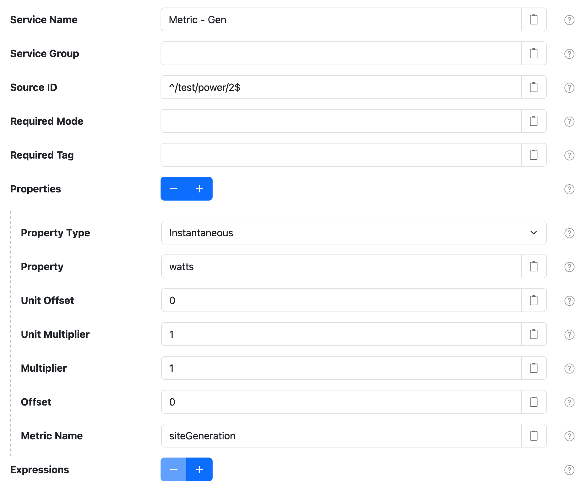
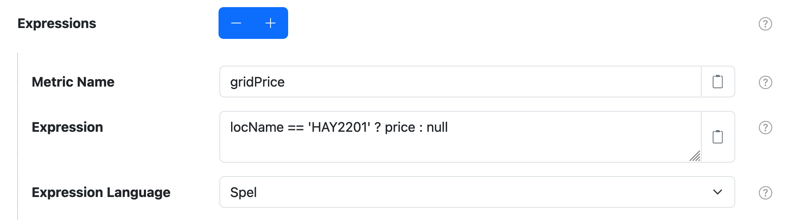

# Metric Harvester Filter

The Metric Harvester filter provides a way to capture properties from datum generated by data
sources as [metrics](../metrics.md).

This filter is provided by the [Metrics Harvester][src] plugin, which is included in the
[solarnode-app-metrics-harvester][solarnode-app-metrics-harvester] package in SolarNodeOS.

## Settings

<figure markdown>
  {width=936 loading=lazy}
</figure>

In addition to the [Common Settings][datumfilter-common-settings], the following general settings are available:

| Setting            | Description                                                       |
|:-------------------|:------------------------------------------------------------------|
| Properties         | A list of datum property configurations. See [Property settings](#property-settings) for more information. |
| Expressions        | A list of expression configurations. See [Expression settings](#property-settings) for more information. |

## Property settings

Use the **Properties** <kbd>+</kbd> and <kbd>-</kbd> buttons to add/remove property configurations.
Each property configuration contains the following settings:

| Setting            | Description                                                       |
|:-------------------|:------------------------------------------------------------------|
| Property Type      | The type of the datum property to extract. |
| Property           | The name of the datum property to extract. Only **numeric** properties are supported. |
| Unit Offset        | An offset to add to the value. This is the first transform applied. Set to `0` for no offset. |
| Unit Multiplier    | A multiplication factor to normalize the value into some other unit. This is the second transform applied, **after** the **Unit Offset**. Set to `1` to leave the input unchanged. |
| Multiplier         | A multiplication factor to normalize the value into some other unit. This is the third transform applied, **after** the **Unit Multiplier**. Set to `1` to leave the input unchanged. |
| Offset             | An offset to add to the value. This is the forth transform applied, **after** the **Multiplier**. Set to `0` for no offset. |
| Metric Name        | The metric name to assign to the value. |

### Value transform

The various **Multiplier** and **Offset** settings allow you to apply two linear equations to the
datum property values to transform a raw data value _x_ into a corresponding metric value _y_.

First the **Unit Offset** _B_ and **Unit Multiplier** _M_ are applied using the equation

```
y = (x + B) × M
```

Then the **Multiplier** _m_ and **Offset** _b_ are applied using the equation

```
y = (m × x) + b
```

Taken together, the overal equation applied is thus:

```
y = (m × ((x + B) × M)) + b
```

## Expression settings

<figure markdown>
  {width=937 loading=lazy}
</figure>

Use the **Expressions** <kbd>+</kbd> and <kbd>-</kbd> buttons to add/remove property configurations.
Each expression configuration contains the following settings:

| Setting            | Description                                                       |
|:-------------------|:------------------------------------------------------------------|
| Metric Name        | The metric name to assign to the value. |
| Expression          | The expression to evaluate. See [Expressions][expr] for more info. |
| Expression Language | The [expression language][expr] to write **Expression** in. |


--8<-- "snippets/users/datum-filters/base-filter-settings-links.md"
[solarnode-app-metrics-harvester]: https://github.com/SolarNetwork/solarnode-os-packages/tree/develop/solarnode-app-metrics-harvester/debian
[src]: https://github.com/SolarNetwork/solarnetwork-node/blob/develop/net.solarnetwork.node.metrics.harvester/README.md
