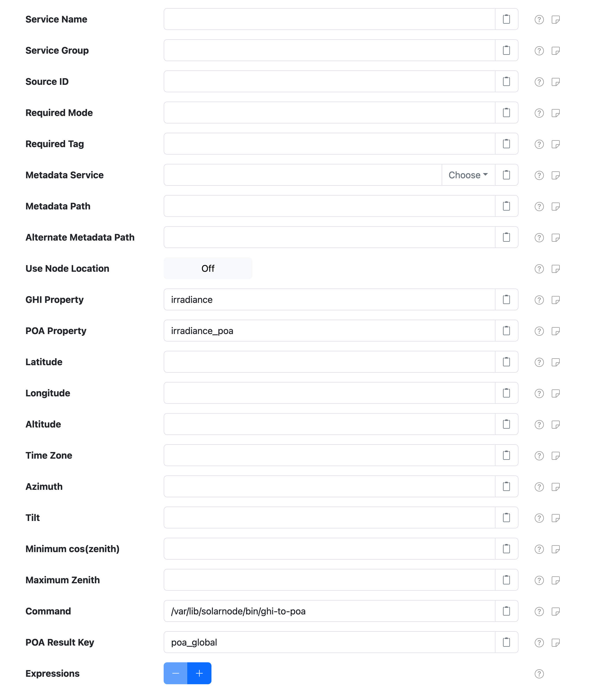

# POA Irradiance Calculator Datum Filter

The [pvlib Datum Filter][src] provides a way to inject a plane-of-array (POA) irradiance property
based on a set of PV characteristics and a global horizontal irradiance (GHI) property value. This
is useful when you have a pyranometer deployed with a PV system, but it only provides GHI
measurements and you would like to model the expected performance of the PV system taking into
consideration the PV array tilt, GPS coordinates, and so on.

This filter is provided by the [pvlib Datum Filters][pf] plugin, which is provided by the
[`solarnode-app-datumfilters-pvlib`][solarnode-app-datumfilters-pvlib]
[package](../setup-app/system/packages.md) in SolarNodeOS.

## Settings

<figure markdown>
  {width=718 loading=lazy}
</figure>

Each filter configuration contains the following overall settings:

| Setting            | Description                                                       |
|:-------------------|:------------------------------------------------------------------|
| Service Name       | A unique ID for the filter, to be referenced by other components. |
| Service Group      | An optional service group name to assign. |
| Source ID          | The source ID(s) to filter. |
| Required Mode      | If configured, an [operational mode][opmodes] that must be active for this filter to be applied. |
| Required Tag       | Only apply the filter on datum with the given tag. A tag may be prefixed with `!` to invert the logic so that the filter only applies to datum **without** the given tag. Multiple tags can be defined using a `,` delimiter, in which case **at least one** of the configured tags must match to apply the filter. |
| Metadata Service   | The **Service Name** of the Metadata Service to obtain the PV parameters from. See [Metadata Parameters](#metadata-parameters) for more information. |
| Metadata Path      | The [metadata path][meta-path] that will resolve the PV parameters from the configured **Metadata Service**. See [Metadata Parameters](#metadata-parameters) for more information. |
| Alternate Metadata Path | An alternate [metadata path][meta-path] to resolve the PV parameters from the configured **Metadata Service**. See [Metadata Parameters](#metadata-parameters) for more information. |
| Use Node Location  | If enabled, then the location configured for this node in SolarNetwork will be used in preference to the **Latitude**, **Longitude**, and **Altitude** settings configured on this filter. |
| GHI Property       | The name of the datum property to obtain the GHI irradiance value from, to use in the **POA Property** calculation. |
| POA Property       | The name of the datum property to populate with the calculated POA irradiance values. |
| Latitude           | The decimal latitude of the PV system. |
| Longitude          | The decimal longitude of the PV system. |
| Altitude           | The altitude of the PV system, in meters above sea level. |
| Time Zone          | The identifier of the time zone of the PV system, for example `Pacific/Auckland`. If not specified then the system default zone will be used. |
| Azimuth            | The angle of the PV array in degrees clockwise from true north that the PV system is facing. |
| Tilt               | The angle of the PV array in degrees from horizontal, from `0` (facing directly upwards) to `90` (facing the horizon). |
| Minimum cos(zenith) | The minimum value of `cos(zenith)` to allow when calculating the global clearness index. |
| Maximum Zenith     | The maximum zenith value to allow in DNI calculation. |
| Command            | The external command to run, where the parameters and GHI irradiance will be passed as arguments and the calculated POA irradiance is returned. |
| POA Result Key     | The command result key to extract for the calculated POA irradiance value. |
| Expressions        |  A list of expression configurations that are evaluated to derive datum property values from the **Command** output. See [Expressions](#expressions) below. |

## Metadata Parameters

This filter can look up the PV characteristics from SolarNetwork [metadata][metadata]. If either
**Metadata Path** or **Alternate Metadata Path** are configured, then the filter will look for a
metadata object with properties as shown below, first from the datum metadata associated with the
source ID of the datum being filtered and then from any configured **Metadata Service**.

For example, a **Metadata Path** of `/pm/pv-characteristics` would work with metadata like
this:

```json
{
  "pm": {
    "pv-characteristics": {
      "lat":            41.18015,
      "lon":            -73.8328,
      "alt":            10,
      "zone":           "America/New_York",
      "pvArrayTilt":    7,
      "pvArrayAzimuth": 205,
      "minCosZenith":   3,
      "maxZenith":      83
    }
  }
}
```

The filter merges all possible PV characteristics from the settings on the filter itself and
metadata, in the following order, with **later sources overriding** earlier sources:

 1. Filter settings
 2. Metdata from the configured **Metadata Service**
 3. Datum metadata associated with the source ID of the datum being filtered
 4. **Latitude, longitude, and altitude** from the location configured for the node in SolarNetwork,
    if **Use Node Location** is enabled

The supported metadata parameters are:

| Metadata Key | Description |
|:-------------|:------------|
| `lat`        | Decimal latitude of the PV system |
| `lon`        | Decimal longitude of the PV system |
| `alt`        | Altitude of the PV system, in meters above sea level |
| `zone`       | Time zone identifier of the PV system, for example `Pacific/Auckland` |
| `pvArrayTilt`    | PV array tilt angle value, in degrees from horizontal |
| `pvArrayAzimuth` | PV array angle value, in degrees clockwise from north |
| `minCosZenith`   | Minimum value of `cos(zenith)` to allow when calculating global clearness index |
| `maxZenith`      | Maximum zenith value to allow in DNI calculation |


## Expressions

Any number of [expressions][expr] can be configured on the **Expression** list. Expressions can
reference datum properties as usually, and additionally any properties returned by the configured
command. For example, the default command returns many properties, like these:

```json
{
  "date": "2024-11-18T10:24:47",
  "zone": "Pacific/Auckland",
  "ghi": 805.0,
  "dni": 844.5952562517782,
  "dhi": 151.71952235515488,
  "zenith": 39.3322587975266,
  "azimuth": 74.67509718383894,
  "min_cos_zenith": 0.065,
  "max_zenith": 87,
  "poa_global": 799.951169881113,
  "poa_direct": 648.6170024103126,
  "poa_diffuse": 151.3341674708004,
  "poa_sky_diffuse": 150.9512589662823,
  "poa_ground_diffuse": 0.38290850451810454
}
```

Properties like `poa_global`, `poa_direct`, and so on can be used in expressions, for example you
could round the `poa_global` value to at most 3 digits with:

```
roundDown(poa_global, 3)
```

--8<-- "snippets/users/datum-filters/base-filter-settings-links.md"
[expr]: ../expressions.md
[metadata]: https://github.com/SolarNetwork/solarnetwork/wiki/SolarNet-API-global-objects#metadata
[meta-path]: https://github.com/SolarNetwork/solarnetwork/wiki/SolarNet-API-global-objects#metadata-filter-key-paths
[pf]: https://github.com/SolarNetwork/solarnetwork-node/blob/develop/net.solarnetwork.node.datum.filter.pvlib/
[pvlib]: https://pvlib-python.readthedocs.io/
[solarnode-app-datumfilters-pvlib]: https://github.com/SolarNetwork/solarnetwork/wiki/SolarNodeOS#solarnode-app-datumfilters-pvlib
[src]: https://github.com/SolarNetwork/solarnetwork-node/blob/develop/net.solarnetwork.node.datum.filter.pvlib/README.md
