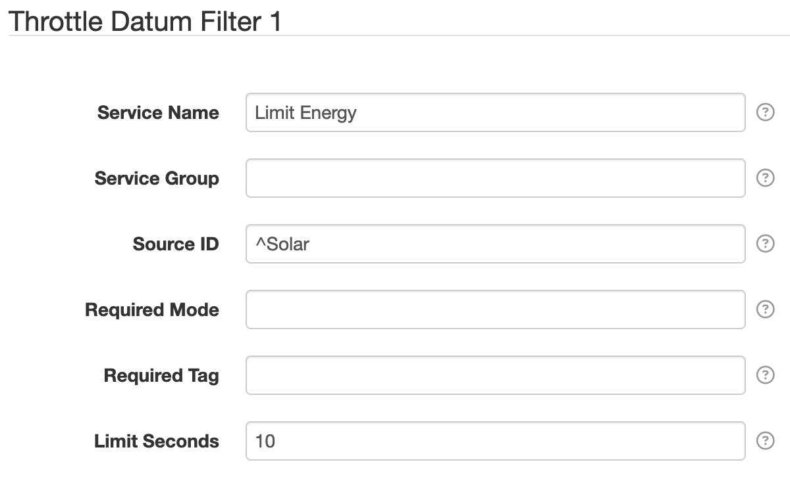

# Throttle Datum Filter

The [Throttle Datum Filter][src] provides a way to throttle **entire datum** over time. This
can be useful if you need a plugin to collect data at a high frequency for use internally by
SolarNode but don't need to save such high resolution of data in SolarNetwork. For example, a plugin
that monitors a device and responds quickly to changes in the data might be configured to sample
data every second, but you only want to capture that data once per minute in SolarNetwork.

The general idea for filtering datum is to configure rules that define which datum **sources** you
want to filter, along with **time limit** to throttle matching datum by. Any datum matching the
sources that are captured faster than the time limit will be discarded.

!!! tip "Discard mode"

	The time limit can be set to `-1` to represent _infinity_. The effect of this is that all
	matching datum will always be discarded.

This filter is provided by the [Standard Datum Filters][sdf] plugin.

## Settings

<figure markdown>
  {width=600 loading=lazy}
</figure>

In addition to the [Common Settings][datumfilter-common-settings], the following general settings are available:

| Setting            | Description |
|:-------------------|:------------|
| Limit Seconds      | A throttle limit, in seconds, to apply to matching datum. The throttle limit is applied to datum by source ID. The filter will check how long has elapsed since a datum with the same source ID was processed. If the elapsed time is less than the configured limit, the datum will be discarded. If the limit is set to `-1` then the limit is _infinite_ and all matching datum will always be discarded. |

--8<-- "snippets/users/datum-filters/base-filter-settings-links.md"
[placeholders]: ../placeholders.md
[sdf]: https://github.com/SolarNetwork/solarnetwork-node/blob/develop/net.solarnetwork.node.datum.filter.standard/
[src]: https://github.com/SolarNetwork/solarnetwork-node/blob/develop/net.solarnetwork.node.datum.filter.standard/README-Throttle.md
