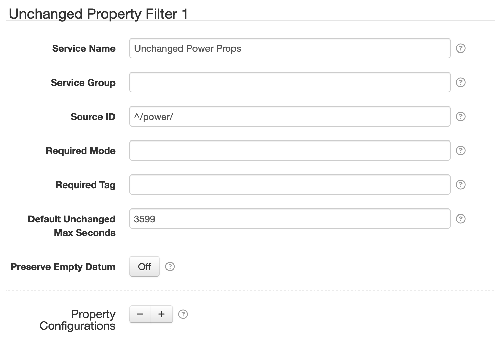

# Unchanged Property Filter

The [Unchanged Property Filter][src] provides a way to discard **individual datum properties** that
have not changed within a datum stream.

This filter is provided by the [Standard Datum Filters][sdf] plugin.

!!! tip

	See the [Unchanged Datum Filter](./unchanged.md) for a filter that can discard entire unchanging
	_datum_ (at the source ID level).

## Settings

<figure markdown>
  {width=724 loading=lazy}
</figure>

Each filter configuration contains the following overall settings:

| Setting            | Description |
|:-------------------|:------------|
| Service Name       | A unique ID for the filter, to be referenced by other components. |
| Service Group      | An optional service group name to assign. |
| Source ID          | A [regular expression][regex] to match the input source ID(s) to filter. |
| Required Mode      | If configured, an [operational mode](https://github.com/SolarNetwork/solarnetwork/wiki/SolarNode-Operational-Modes) that must be active for this filter to be applied. |
| Required Tag       | Only apply the filter on datum with the given tag. A tag may be prefixed with `!` to invert the logic so that the filter only applies to datum **without** the given tag. Multiple tags can be defined using a `,` delimiter, in which case **at least one** of the configured tags must match to apply the filter. |
| Default Unchanged Max Seconds | When greater than `0` then the maximum number of seconds to discard unchanged properties within a single datum stream (source ID). |
| Property Configurations | A list of [property settings](#property-settings). |

## Settings notes

 * **Source ID** — This is a case-insensitive [regular expression][regex] to match against
   datum source ID values. If omitted then datum for _all_ source ID values will be filtered,
   otherwise only datum with _matching_ source ID values will be filtered.
 * **Default Unchanged Max Seconds** — Use this setting to ensure a property is included
   occasionally, even if the property value have not changed. Having at least one value per
   hour in a datum stream is recommended. This time period is always relative to the last
   unfiltered property within a given datum stream seen by the filter.

## Property Settings

<figure markdown>
  {width=675 loading=lazy}
</figure>

Use the <kbd>+</kbd> and <kbd>-</kbd> buttons to add/remove Property configurations.

Each property source mapping configuration contains the following settings:

| Setting   | Description |
|:----------|:------------|
| Property           | A regular expression [pattern][regex] to match against datum property names. All matching properties will be filtered. |
| Unchanged Max Seconds | When greater than `0` then the maximum number of seconds to discard unchanged properties within a single datum stream (source ID). This can be used to override the filter-wide **Default Unchanged Max Seconds** setting, or left blank to use the default value. |

[opmodes]: ../op-modes.md
[placeholders]: ../placeholders.md
[regex]: https://docs.oracle.com/en/java/javase/11/docs/api/java.base/java/util/regex/Pattern.html
[sdf]: https://github.com/SolarNetwork/solarnetwork-node/blob/develop/net.solarnetwork.node.datum.filter.standard/
[src]: https://github.com/SolarNetwork/solarnetwork-node/blob/develop/net.solarnetwork.node.datum.filter.standard/README-UnchangedProperty.md
