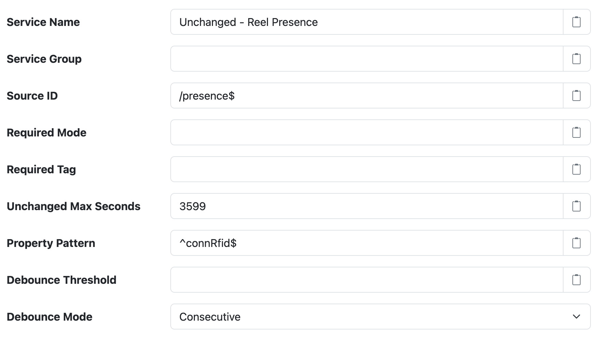

# Unchanged Datum Filter

The [Unchanged Datum Filter][src] provides a way to discard **entire datum** that have not changed
within a datum stream.

!!! tip

	See the [Unchanged Property Filter](./unchanged-property.md) for a filter that can discard
	individual unchanging _properties_ within a datum stream.

--8<-- "snippets/users/datum-filters/provided-by-standard-filter.md"

## Settings

<figure markdown>
  {width=876 loading=lazy}
</figure>

In addition to the [Common Settings][datumfilter-common-settings], the following general settings are available:

| Setting            | Description |
|:-------------------|:------------|
| Unchanged Max Seconds | When greater than `0` then the maximum number of seconds to refrain from publishing an unchanged datum within a single datum stream. Use this setting to ensure a datum is included occasionally, even if the datum properties have not changed. Having at least one value per hour in a datum stream is recommended. This time period is always relative to the last unfiltered property within a given datum stream seen by the filter. |
| Property Pattern | A property name [pattern][regex] that limits the properties monitored for changes. Only property names that match this expression will be considered when determining if a datum differs from the previous datum within the datum stream. |
| Debounce Threshold | When greater than `0` then the minimum number of milliseconds a changed datum must remain unchanged before it is published. See [Debounce](#debounce) for more details. |
| Debounce Mode | How time is counted towards the **Debounce Threshold**, either **Consecutive** or **Integrator**. See [Debounce modes](#debounce-modes) for more details. |

## Debounce

The **Debounce Threshold** setting can be used to ignore brief changes from a flaky input, such as a
status value that occasionally flips to a different value and then quickly back again. When
configured, a changed datum is only published once the monitored properties have remained at their
changed values for at least the debounce threshold. Changes that revert before the threshold elapses
are discarded.

For example, with a **Debounce Threshold** of 5 seconds and a datum sampled every second, where `A`
and `B` are values of a monitored `status` property:

```
time (s):  0  1  2  3  4  5  6  7  8  9  10 11
status:    A  B  B  A  B  B  B  B  B  B  B  B
output:    A  ·  ·  ·  ·  ·  ·  ·  ·  B  ·  ·
```

The `B` values at 1–2s revert to `A` at 3s, so they are discarded. The `B` value seen at 4s is
published at 9s, which is the first datum after it has remained unchanged for 5 seconds.

Some things to keep in mind when using a debounce threshold:

 * The filter only evaluates datum as they are captured, so it is designed for datum streams
   sampled on a regular schedule. A stable change is published on the first datum captured after
   the threshold has elapsed, so the published datum can be delayed by up to the threshold plus
   one sampling period from the actual change.
 * If **Unchanged Max Seconds** elapses while a change is not yet stable, the datum is published
   with its monitored properties set to their last published (stable) values. Other properties
   are published as captured.
 * Configure a **Property Pattern** that matches only the status-like properties you want to
   debounce. Without a pattern all properties are monitored, so continuously changing values like
   power readings would never be stable. In that case only the last stable datum values are
   published, once per **Unchanged Max Seconds**.

### Debounce modes

The **Debounce Mode** setting determines how time is counted towards the **Debounce Threshold**:

| Mode | Description |
|:-----|:------------|
| Consecutive | A changed value must be seen continuously for the entire threshold. Seeing the previously published value again abandons the change. This is the default mode. |
| Integrator | Time at a changed value counts towards the threshold, and time back at the previously published value counts against it. The change is published once the net time reaches the threshold, and abandoned if the net time drops below zero. |

Both modes publish a change that is not interrupted at the same time. They differ when a change
is interrupted by the previously published value. Using the same example as before, the
**Integrator** mode publishes `B` one second earlier, because the `B` values at 1–2s still count
after the `A` value at 3s takes one second away:

```
time (s):     0  1  2  3  4  5  6  7  8  9  10 11
status:       A  B  B  A  B  B  B  B  B  B  B  B
Consecutive:  A  ·  ·  ·  ·  ·  ·  ·  ·  B  ·  ·
Integrator:   A  ·  ·  ·  ·  ·  ·  ·  B  ·  ·  ·
```

The **Integrator** mode suits signals that are _mostly_, but not always, at their true value. An
example is a presence sensor detecting a parked vehicle, which occasionally misses a read. The
**Consecutive** mode would need an unbroken run of reads lasting the entire threshold, which becomes
very unlikely as the threshold grows. The **Integrator** mode only needs the signal to be at the
changed value more than half the time. When using this mode:

 * The weaker the signal (the closer it is to its true value only half the time) the longer the
   threshold should be.
 * Choose a threshold longer than the longest expected interruption, such as a burst of missed
   reads while a vehicle is parked.

--8<-- "snippets/users/datum-filters/base-filter-settings-links.md"
[placeholders]: ../placeholders.md
[sdf]: https://github.com/SolarNetwork/solarnetwork-node/blob/develop/net.solarnetwork.node.datum.filter.standard/
[src]: https://github.com/SolarNetwork/solarnetwork-node/blob/develop/net.solarnetwork.node.datum.filter.standard/README-Unchanged.md
