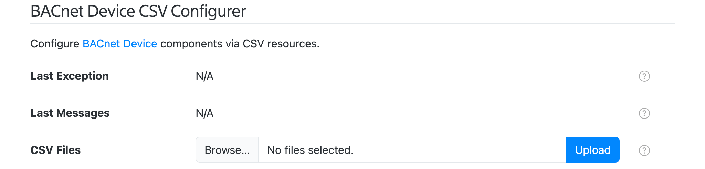
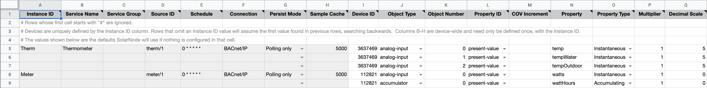
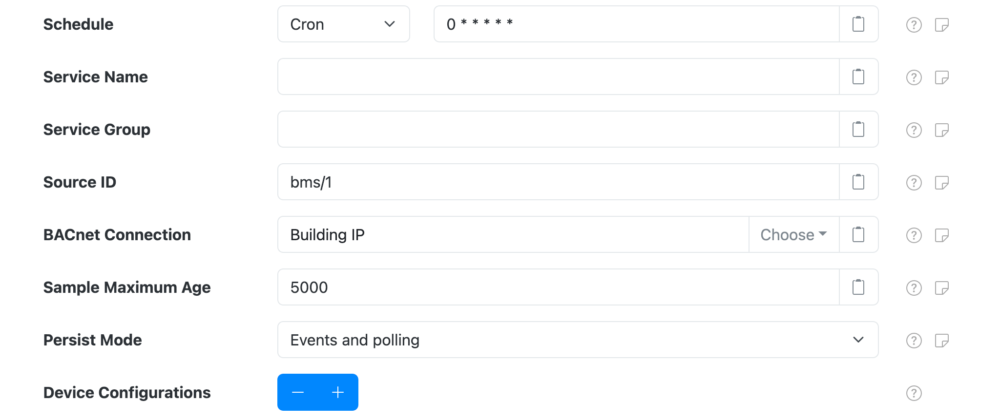
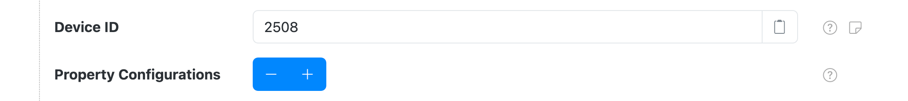
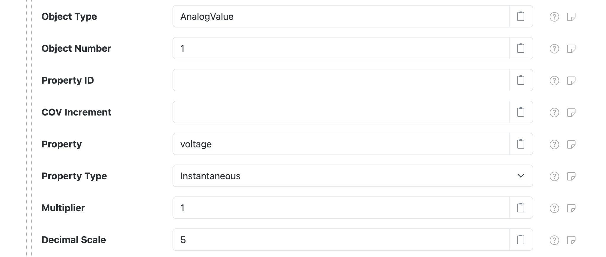

# BACnet Device

This project provides SolarNode plugin that can collect arbitrary data from BACnet enabled devices.
This is an advanced plugin that requires knowledge of BACnet and the BACnet configuration of the
devices you want to collect data from.

This component is included in the [solarnode-app-bacnet][pkg] package in SolarNodeOS.
You can install this package on the [System > Packages][packages] page in SolarNode.

## Use

Once installed, a new **BACnet Device** component will appear on the [Settings > Components][components]
page on your SolarNode. Click on the **Manage** button to configure components.

<figure markdown>
  {width=1024 loading=lazy}
</figure>

This datum source can persist datum based on a schedule and also based on BACnet change-of-value
(COV) events, if the BACnet device you're collecting data from supports COV subscriptions. The
[Persist Mode](#settings) device setting configures this. Regardless of when datum are persisted,
transient datum will be generated for each COV event and other plugins can do things with those. For
example, those datum could be posted to [SolarFlux][solarflux] for real-time monitoring.

!!! tip

	Although this component is named _BACnet Device Datum Source_, a single component instance _can_
	be configured to read data from _any number_ of physical BACnet devices. The term _BACnet
	Device_ (upper case `D`) in this guide refers to this SolarNode component, while _BACnet device_
	(lower case `d`) refers to a BACnet hardware/softare device this component will read data from.


## CSV Configurer

SolarNode supports configuring BACnet Device components using a simple comma-separated-values (CSV)
file, which spreadsheet applications can easily generate. A **BACnet Device CSV Configurer** form
will appear on the [Settings > Services][services] page. This form lets you upload a BACnet CSV
Configuration file to configure all BACnet Device components at once, without having to use the
[settings](#settings) form.

<figure markdown>
  {width=1024 loading=lazy}
</figure>

!!! tip "Spreadsheet jumpstart"

    You can copy the [BACNet Device Configuration Example][sheet-example] sheet as a
    starting point. This sheet has drop-down menu validation to make it super easy to configure your
    BACnet integration. Download your completed Sheet as a CSV file, then use the **BACnet Device CSV Configurer**
    form to upload the CSV file and configure SolarNode.

### BACnet CSV Configuration Format

The BACnet CSV Configuration uses the column structure detailed [below](#csv-column-definition),
with each row representing an individual datum property to read from the BACnet device. A header row
is required. Comment lines are allowed, just start the line with a `#` character (i.e. the first
cell value). The entire comment line will be ignored.

Here's an example screen shot of a configuration in a spreadsheet application. It is for two devices:

 1. Device `Therm` with 3 datum properties: `temp`, `tempWater`, and `tempOutdoor`
 2. Device `Meter` with 2 datum properties: `watts` and `wattHours`

Spreadsheet applications typically allow you to export the sheet in the CSV format, which can
then be loaded into SolarNode via the CSV Configurer.

<figure markdown>
  {width=1704 loading=lazy}
</figure>

#### Instance identifiers

Individual BACnet Device components are defined by the first column (**Instance ID**). You can
assign any identifier you like (such as `Meter`, `Inverter`, and so on) or configure as a single
dash character `-` to have SolarNode assign a simple number identifier. Once an Instance ID has been
assigned on a given row, subsequent rows will use that value if the corresponding cell value is left
empty.

Here's an example of how 2 custom instance IDs `Meter` and `Therm` appear in the SolarNode UI:

<figure markdown>
  {width=1024 loading=lazy}
</figure>

#### CSV column definition

The following table defines all the CSV columns used by BACnet Device CSV Configuration. Columns
**A - H** apply to the **entire BACnet Device configuration**, and only the values from the row that
defines a new Instance ID will be used to configure the device. Thus you can omit the values from
these columns when defining more than one property for a given instance.

Columns **I - Q** define the mapping of BACnet object properties to datum properties: each row
defines an individual datum property.


| Col | Name | Type | Default | Description |
|:----|:-----|:-----|:--------|:------------|
| `A` | **Instance ID** | string |  | The unique identifier for a single BACnet Device component. Can specify `-` to automatically assign a simple number value, which will start at `1`. |
| `B` | **Service Name** | string |  | An optional service name to assign to the component. |
| `C` | **Service Group** | string |  | An optional service group to assign to the component. |
| `D` | **Source ID** | string |  | The SolarNetwork datum source ID to use for the datum stream generated by this device configuration. |
| `E` | **Schedule** | string | `0 * * * * *` | The schedule at which to poll the BACnet device for data. Can be either a [cron][sn-cron-syntax] value or a millisecond frequency. |
| `F` | **Connection** | string |  | The **Service Name** of the [BACnet Connection][bacnet-conn] to use. |
| `G` | **Persist mode** | string | `Polling only` | Controls when to persist datum. One of `Events only`, `Events and polling`, or `Polling only`, or shortened to `EventOnly`, `EventAndPoll`, or `PollOnly`. |
| `H` | **Sample Cache** | integer | `5000` | A maximum time to cache captured BACnet data, in milliseconds. |
| `I` | **Device ID** | integer |  | The BACnet device ID to collect data from. |
| `J` | **Object Type** | string |  | The BACnet object type to collect data from. Can be specified as a name, like `analog-input` or `AnalogInput`, or the associated integer code, like `0`. |
| `K` | **Object Number** | integer |  | The BACnet object type instance number to collect data from. |
| `L` | **Property ID** | string | `present-value` | The BACnet object property identifier to collect data from. Can be specified as a name, like `present-value` or `PresentValue`, or the associated integer code, like `85`. |
| `M` | **COV Increment** | decimal |  | An optional change-of-value (COV) event threshold to request when subscribing to COV events, essentially filtering the COV events unless the property value has changed by at least this amount. |
| `N` | **Property** | string |  | The datum property name to use. Property names represent what the associated data value is, and SolarNetwork has many [standardized names][prop-names] that you should consider using. |
| `O` | **Property Type** | enum | `Instantaneous` |  The [type][prop-types] of datum property to use. Must be one of `Instantaneous`, `Accumulating`, `Status`, or `Tag`, and can be shortened to just `i`, `a`, `s`, or `t`. |
| `P` | **Multiplier** | decimal | `1` | For numeric data types, a multiplier to apply to the BACnet value to normalize it into a standard unit. |
| `Q` | **Decimal Scale** | integer | `5` | For numeric data types, a maximum number of decimal places to round decimal numbers to, or `-1` to not do any rounding. |

### Example CSV

Here is the CSV as shown in the example configuration screen shot above (comments have been removed
for brevity):

```csv
Instance ID,Service Name,Service Group,Source ID,Schedule,Connection,Persist Mode,Sample Cache,Device ID,Object Type,Object Number,Property ID,COV Increment,Property,Property Type,Multiplier,Decimal Scale
Therm,Thermometer,,therm/1,0 * * * * *,BACnet/IP,Polling only,5000,3637469,analog-input,0,present-value,,temp,Instantaneous,1,5
,,,,,,,,3637469,analog-input,1,present-value,,tempWater,Instantaneous,1,5
,,,,,,,,3637469,analog-input,2,present-value,,tempOutdoor,Instantaneous,1,5
Meter,,,meter/1,0 * * * * *,BACnet/IP,Polling only,5000,112821,analog-input,0,present-value,,watts,Instantaneous,1,0
,,,,,,,,112821,accumulator,0,present-value,,wattHours,Accumulating,1,0
```


## Settings

<figure markdown>
  {width=1024 loading=lazy}
</figure>

Each BACnet Device component collects data for a single source ID, and contains the following
overall settings:

| Setting               | Description |
|:----------------------|:------------|
| Schedule              | A [cron schedule][sn-cron-syntax] that determines when data is collected, or millisecond frequency. |
| Service Name          | A unique name to identify this data source with. |
| Service Group         | A group name to associate this data source with. |
| Source ID             | The SolarNetwork unique source ID to assign to datum collected by this component. This value uniquely identifies the data collected from this device, by this node, on SolarNetwork. Each configured device should use a different value. |
| BACnet Connection     | The **Service Name** of the [BACnet Connection][bacnet-conn] to use. |
| Sample Maximum Age    | A minimum time to cache captured Modbus data, in milliseconds. SolarNode will cache the data collected from the device for at least this amount of time before refreshing data from the device again. Some devices do not refresh their values more than a fixed interval, so this setting can be used to avoid reading data unnecessarily. This setting also helps in highly dynamic configurations where other plugins request the current values from this datum source frequently. |
| Persist Mode          | Controls when to persist datum. _Event_ modes relate to change-of-value subscription updates published by the associated BACnet devices. _Polling_ modes relate to the schedule configured on this component. |
| Device Configurations | A list of BACnet device-specific settings. Any number of device configurations can be added, to collect data from any number of BACnet devices. |

### Device settings

You must configure settings for each BACnet device you want to collect data from. Every BACnet
device within a BACnet network is identified by a unique **device ID**. You can configure as many
device settings as you like, using the ++plus++ and ++minus++ buttons to add/remove
configurations.

<figure markdown>
  {width=1024 loading=lazy}
</figure>

Each device configuration contains the following settings:

| Setting   | Description |
|:----------|:------------|
| Device ID | The BACnet device ID to collect data from. |
| Property Configurations | A list of BACnet object property-specific settings. Any number of property configurations can be added, to collect data from any number of object properties on the associated BACnet device. |

### Property settings

BACnet devices organize their data into _objects_ that have _properties_, and SolarNode will map
BACnet object property values into datum property values. You must configure settings for each datum
property you want to collect. You can configure as many property settings as you like, using the
++plus++ and ++minus++ buttons to add/remove configurations.

<figure markdown>
  {width=1024 loading=lazy}
</figure>

Each property configuration contains the following settings:

| Setting         | Default | Description |
|:----------------|:--------|:------------|
| Object Type     |  | The BACnet object type to collect data from. Can be specified as a name, like `analog-input` or `AnalogInput`, or the associated integer code, like `0`. |
| Object Number   |  | The BACnet object type instance number to collect data from. |
| Property ID     | `present-value` | The BACnet object property identifier to collect data from. Can be specified as a name, like `present-value` or `PresentValue`, or the associated integer code, like `85`. |
| COV Increment   |  | An optional decimal change-of-value (COV) event threshold to request when subscribing to COV events, essentially filtering the COV events unless the property value has changed by at least this amount. This value only affects the change-of-value (COV) event subscription, and has no impact on the polling schedule configured. This can be used to limit the number of COV events generated by highly-dynamic BACnet property values, so events are only generated if the value changes by at least this amount. |
| Property        |  | The name of the datum property to save the BACnet value as. Property names represent what the associated data value is, and SolarNetwork has many [standardized names][prop-names] that you should consider using. |
| Property Type   | `Instantaneous` | The [type][prop-types] of datum property to use. |
| Multiplier      | `1` | For numeric data types, a multiplier to apply to the BACnet property value to normalize it into a standard unit. The property values stored in SolarNetwork should be normalized into standard base units if possible. For example if a power meter reports power in kilowattts then a unit multiplier of `1000` can be used to convert the values into watts. |
| Decimal Scale   | `5` | For numeric data types, a maximum number of decimal places to round decimal numbers to, or `-1` to not do any rounding. Setting to `0` rounds decimals to whole numbers. |

!!! tip "BACnet object and property types"

	BACnet defines a comprehensive enumeration of possible **Object Type** and **Property ID** values.
	See the Lookup tab on the [example CSV configurer sheet][sheet-example] for a complete listing.

[bacnet-conn]: ../io/bacnet.md
[components]: ../setup-app/settings/components.md
[packages]: ../setup-app/system/packages.md
[pkg]: https://github.com/SolarNetwork/solarnode-os-packages/tree/develop/solarnode-app-bacnet/debian
[prop-names]: https://github.com/SolarNetwork/solarnetwork/wiki/SolarNet-API-global-objects#standard-property-names
[prop-types]: https://github.com/SolarNetwork/solarnetwork/wiki/SolarNet-API-global-objects#datum-property-classifications
[services]: ../setup-app/settings/services.md
[sheet-example]: https://docs.google.com/spreadsheets/d/1ICBNOPqQoFtay0oU7Tyu-F45dSstpORhKW89EJobg2Q
[sn-cron-syntax]: https://github.com/SolarNetwork/solarnetwork/wiki/SolarNode-Cron-Job-Syntax
[solarflux]: ../solarflux.md
