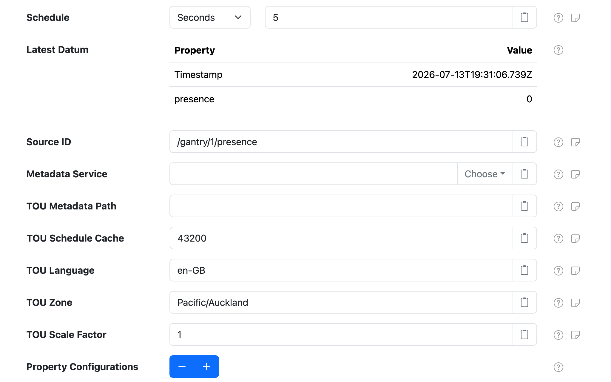
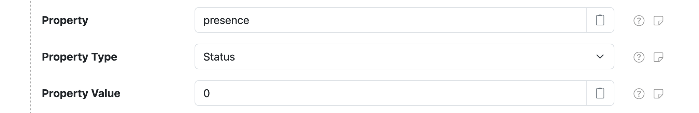

# Fixed Data

SolarNode can generate datum from static configuration or time-of-use (TOU) schedules with the
**Fixed Data** component. This can be used to provide a stream of datum to trigger [filters][filters],
to simulate a physical device for testing, or generate a stream of data from a TOU schedule.

This datum source is provided by the [Fixed Datum Source][src] plugin, which is included in the
[solarnode-app-fixed][pkg] package in SolarNodeOS. You can install this package on the [System >
Packages][packages] page in SolarNode.


## Use

Once installed, a **Fixed Data** component will appear on the [Settings > Components][components]
page on your SolarNode. Click on the **Manage** button to configure components. You will need to add
one configuration for each datum stream you want to generate.

<figure markdown>
  {width=866 loading=lazy}
</figure>

## Settings

<figure markdown>
  {width=1024 loading=lazy}
</figure>

Each component supports the following overall settings:

| Setting            | Description |
|:-------------------|:------------|
| Schedule           | A [cron schedule][sn-cron-syntax] that determines when data is collected, or millisecond frequency. |
| Source ID          | The SolarNetwork unique source ID to assign to datum collected from this component. |
| Metadata Service   | The **Service Name** of the Metadata Service to obtain the tariff schedule from. See [Time Of Use](#time-of-use-properties) for more information. |
| TOU Metadata Path  | The metadata path that will resolve the tariff schedule from the configured **Metadata Service**. |
| TOU Schedule Cache | The amount of seconds to cache the tariff schedule obtained from the configured **Metadata Service**. |
| TOU Language       | An IETF BCP 47 language tag to parse the tariff data with. If not configured then the default system language will be assumed.
| TOU Zone           | The identifier of the time zone used by the TOU schedule, for example `Pacific/Auckland`. Defaults to the system time zone. |
| TOU Scale Factor   | A multiplication factor to apply to the resolved TOU schedule rates. |
| [Property Configurations](#property-settings) | Any number of static datum property configurations to include in the generated datum. |

### Property settings

Any number of property configurations can be added to generate arbitrary datum property values.

<figure markdown>
  {width=1024 loading=lazy}
</figure>

Each **Property Configuration** contains the following settings:

| Setting            | Description |
|:-------------------|:------------|
| Property           | The datum property name to populate. |
| Property Type      | The datum property type to use. |
| Property Value.    | The datum property value to use. For `Instantaneous` and `Accumulating` **Property Type** configurations the value must be a number. |

## Time Of Use properties

This component can generate datum properties from a time-of-use (TOU) [tariff
schedule](../tariff-schedules.md) defined in [metadata](../metadata.md). You must configure the
**Metadata Service** and **TOU Metadata Path** settings to enable this feature. Once configured, the
component will resolve tariff rates each time it generates datum and populate **all resolved** rates
as instantaneous datum properties, named after the rate names.

For example, imagine a tariff schedule like the following encoded in [node metadata](../metadata.md#node-metadata-service)

```json
{
  "pm": {
    "tariffs": {
      "schedule": [
		["Month","Day","Weekday","Time","pricePerKwh","dailyFixed"],
		["Jan-Dec",,"Mon-Fri","0-8","10.48","1.50"],
		["Jan-Dec",,"Mon-Fri","8-24","11.00","1.50"],
		["Jan-Dec",,"Sat-Sun","0-8","9.19","0.95"],
		["Jan-Dec",,"Sat-Sun","8-24","11.21","0.95"]
	  ]
    }
  }
}
```

Configuring the **Metadata Service** setting as `Node Metadata Service` and **TOU Metadata Path** as
`/pm/tariffs/schedule` would result in `pricePerKwh` and `dailyFixed` instantaneous properties being
added to the datum stream.

[components]: ../setup-app/settings/components.md
[filters]: ../datum-filters/index.md
[packages]: ../setup-app/system/packages.md
[pkg]: https://github.com/SolarNetwork/solarnode-os-packages/tree/develop/solarnode-app-fixed/debian
[sn-cron-syntax]: https://github.com/SolarNetwork/solarnetwork/wiki/SolarNode-Cron-Job-Syntax
[src]: https://github.com/SolarNetwork/solarnetwork-node/tree/develop/net.solarnetwork.node.datum.fixed
