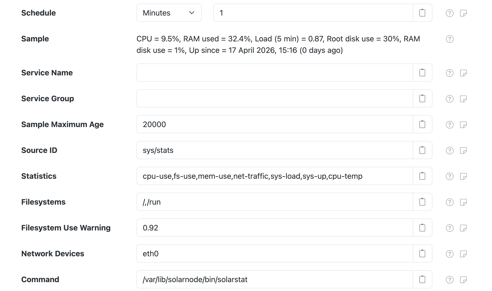

# OS Statistics

SolarNode can collect operating system metrics such as uptime and CPU temperature.

This components is included in the [solarnode-app-osstat][pkg] package in SolarNodeOS.
You can install this package on the [System > Packages][packages] page in SolarNode.

## Use

Once installed, a new **OS Statistics** component will appear on the [Settings > Components][components]
page on your SolarNode. Click on the **Manage** button to configure components.

<figure markdown>
  {width=1024 loading=lazy}
</figure>

## Settings

<figure markdown>
  {width=1024 loading=lazy}
</figure>

Each configuration contains the following overall settings:

| Setting            | Description                                                       |
|--------------------|-------------------------------------------------------------------|
| Schedule           | A cron schedule that determines when data is collected.           |
| Service Name       | A unique name to identify this data source with.                  |
| Service Group      | A group name to associate this data source with.                  |
| Sample Maximum Age | A minimum time to cache captured Modbus data, in milliseconds.    |
| Source ID          | The SolarNetwork source ID to assign to captured datum. This value unique identifies the data collected from this device, by this node, on SolarNetwork. Each configured device should use a different value. |
| Statistics         | A list of statistic types to collect. See [Statistic types](#statistic-types) for the most commonly supported types.  |
| Filesystems        | A list of filesystem paths to collect statistics from.            |
| Network Devices    | A list of network device names to collect statistics from.        |
| Command            | The external command to execute that provides the statistic data. |

## Node metadata

This plugin will publish some OS information as node metadata, under the `os` property
metadata key. The metadata is:

| Key          | Description          |
|--------------|----------------------|
| `os.arch`    | The OS architecture. |
| `os.name`    | The OS name.         |
| `os.version` | The OS version.      |

For example:

```json
{
	"pm": {
		"os": {
			"name": "Linux",
			"arch": "arm",
			"version": "4.14.34-v7+"
		}
	}
}
```


## Example datum

Here's an example datum collected by this plugin:

```json
{
	"created": "2018-08-13 18:25:21.014Z",
	"nodeId": 344,
	"sourceId": "OS Stats",
	"localDate": "2018-08-14",
	"localTime": "06:25",
	"cpu_idle": 98.27,
	"cpu_user": 1.59,
	"cpu_system": 0.13,
	"fs_size_/": 1887322112,
	"fs_used_/": 793722880,
	"fs_used_percent_/": 45,
	"fs_size_/run": 512094208,
	"fs_used_/run": 15802368,
	"fs_used_percent_/run": 4,
	"sys_load_1min": 0.35,
	"sys_load_5min": 0.14,
	"sys_load_15min": 0.11,
	"ram_avail": 743899136,
	"ram_total": 1024188416,
	"ram_used_percent": 27.4,
	"sys_up": 2923.77,
	"net_bytes_in_eth0": 528719,
	"net_bytes_out_eth0": 459475,
	"net_packets_in_eth0": 2312,
	"net_packets_out_eth0": 1848
}
```

## Statistic types

The external helper command must support the following statistic types and return data in
the following formats. The output must always include a header row before any data rows.
Extra columns are allowed; they will simply be ignored.

### `cpu-temp`

The CPU temperature, in degrees celsius. This is not available on all systems, but is
fairly common. It is implemented as a [custom statistic](#custom-statistic-types) on
platforms that do support it.

| Column | Property | Description |
|--------|----------|-------------|
| i/cpu_temp | `cpu_temp` | The CPU temperature, in degrees celsius. |

An example output looks like:

```
i/cpu_temp
45.277
```

### `cpu-use`

Average CPU utilization information, inspired by `sysstat`. Any number of rows of data may
be returned, but only the last row of data may be used.

| Column | Property | Description |
|--------|----------|-------------|
| user | `cpu_user` | Percentage of CPU time in user programs, from 0-100. |
| system | `cpu_system` | Percentage of CPU time in the kernel, from 0-100. |
| idle | `cpu_idle` | Percentage of idle CPU time, from 0-100. |

An example output looks like:

```
user,system,idle
0.03,0.03,99.93
```

### `fs-use`

Filesystem utilization information. Each row represents a single mount point. Each
property has the mount point appended to the end. For example the root mount point `/`
would have a percentage used property named `fs_used_percent_/`.

| Column | Property | Description |
|--------|----------|-------------|
| mount | | Used in other property names. |
| size-kb | `fs_size_{mount}` | Size of filesystem, in kilobytes. Property stored as bytes. |
| used-kb | `fs_used_{mount}` | Allocated use of filesystem, in kilobytes. Property stored as bytes. |
| used-percent | `fs_used_percent_{mount}` | Percentage of filesystem used, from 0-100. |

An example output looks like:

```
mount,size-kb,used-kb,used-percent
/dev,2003748,0,0
/run,403224,12268,4
/,19880876,12383500,66
/boot,233191,36370,17
```

### `mem-use`

RAM utilization information.

| Column | Property | Description |
|--------|----------|-------------|
| total-kb | `ram_total` | Amount of RAM installed in the system, in kilobytes. Property stored as bytes. |
| avail-kb | `ram_avail` | Amount of unused RAM avaialble, in kilobytes. Property stored as bytes. |
| | `ram_used_percent` | Percentage of RAM used, from 0-100. Derived from `ram_total` and `ram_avail`. |

An example output looks like:

```
total-kb,avail-kb
33554432,9505456
```

### ` net-traffic`

Network use information. Each row represents a single network device. Each
property has the device name appended to the end. For example the WiFi device
`wlan0` would have a bytes out property named `net_bytes_out_wlan0`.

| Column | Property | Description |
|--------|----------|-------------|
| name | | Used in other property names. |
| bytes-in | `net_bytes_in_{name}` | Count of bytes receivied. |
| bytes-out | `net_bytes_out_{name}` | Count of bytes sent. |
| packets-in | `net_packets_out_{name}` | Count of packets received. |
| packets-out | `net_packets_out_{name}` | Count of packets sent. |

```
device,bytes-in,bytes-out,packets-in,packets-out
wlan0,9161,5970,86,38
lo,1242,1242,12,12
eth0,9348,10031,80,81
usb0,0,0,0,0
```

### `sys-load`

System load information.

| Column | Property | Description |
|--------|----------|-------------|
| 1min | `sys_load_1min` | Average load over past minute. |
| 5min | `sys_load_5min` | Average load over past 5 minutes. |
| 15min | `sys_load_15min` | Average load over past 15 minutes. |

An example output looks like:

```
1min,5min,15min
0.09,0.10,0.07
```

### `sys-up`

System uptime information.

| Column | Property | Description |
|--------|----------|-------------|
| up-sec | `sys_up` | Number of seconds the system has been running. |

An example output looks like:

```
up-sec
26483.63
```

## Custom statistic types

This plugin supports custom statistic collection via arbitrary statistic
names. The configured **Command** must support the statistic names, of course, and they must return
CSV formatted data, including a header row. All returned columns will be populated as _status_ datum
properties. To populate _instantaneous_ or _accumulating_ properties, the column names should be
prefixed with `i/` and `a/`, respectively. The actual property name used on the datum will be
stripped of this prefix. For example, if the **Command** supports a `cpu-temp` statistic that should
populate an instantaneous property `cpu_temp` the output should be formatted like this:

```
i/cpu_temp
30.1
```

[components]: ../setup-app/settings/components.md
[packages]: ../setup-app/system/packages.md
[pkg]: https://github.com/SolarNetwork/solarnode-os-packages/tree/develop/solarnode-app-sunspec/debian
