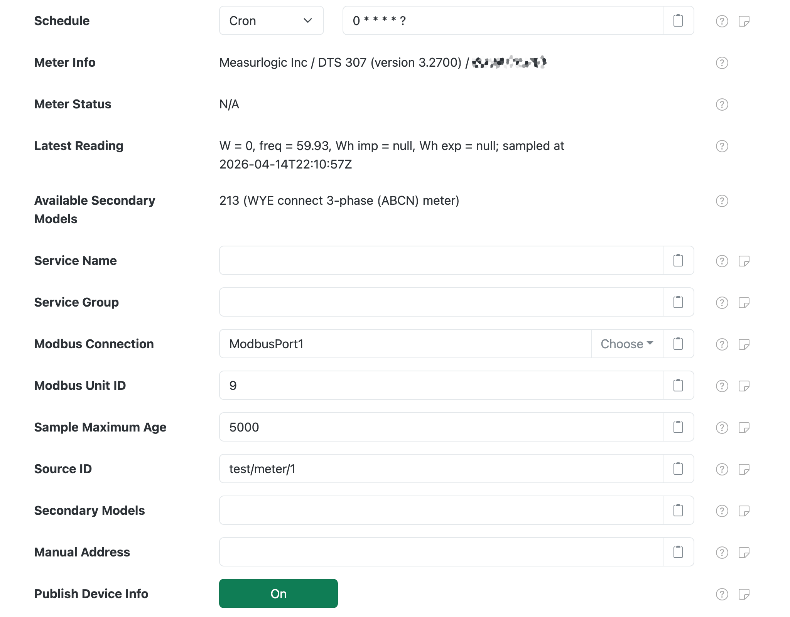
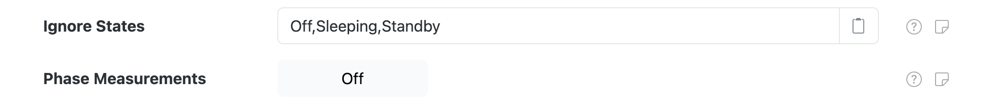
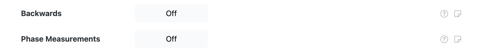

# SunSpec Modbus

SolarNode provides several components that support reading from [SunSpec][sunspec] Modbus-compatible
devices. SunSpec is an open standard for energy-related devices that allows SolarNode to collect
datum consistently from any SunSpec-compliant device, regardless of the manufacturer, with minimual
configuration.

SolarNode splits its SunSpec support into several logical components:

 * [SunSpec Meteorological](#sunspec-meteorological) - for meteorological (e.g. weather) devices
 * [SunSpec Inverter](#sunspec-inverter) - for solar power inverters
 * [SunSpec Meter](#sunspec-meter) - for power/energy meters
 * [SunSpec Positional](#sunspec-positional) - for positional (e.g. GPS) devices

All SunSpec components are included in the [solarnode-app-sunspec][pkg] package in SolarNodeOS.
You can install this package on the [System > Packages][packages] page in SolarNode.

## SunSpec common settings

<figure markdown>
  {width=1024 loading=lazy}
</figure>

Each configuration contains the following overall settings:

| Setting            | Description |
|:-------------------|:------------|
| Schedule           | A [cron schedule][sn-cron-syntax] that determines when data is collected, or millisecond frequency. |
| Device Info        | General information about the device, such as the manufacturer and model name. |
| Device Status      | General status information about the operational mode of the device. |
| Latest Reading     | A brief listing of datum property values from the last datum acquired from the device. |
| Available Secondary Models | Any additional SunSpec model numbers the device supports. These can be used to collect additional properties from some devices. Often these provide more granular information than the primary model, for example string-level details in inverter or battery systems. |
| Service Name       | A unique name to identify this data source with. |
| Service Group      | A group name to associate this data source with. |
| Modbus Connection  | The **Service Name** of the [Modbus connection][modbus-conn] to use. You must configure that component with the proper connection settings for your Modbus network, configure a unique service name on that component, and then enter that same service name here. |
| Modbus Unit ID     | The ID of the Modbus device to collect data from, from 1 - 255. |
| Sample Maximum Age | A minimum time to cache captured Modbus data, in milliseconds. SolarNode will cache the data collected from the device for at least this amount of time before refreshing data from the device again. Some devices do not refresh their values more than a fixed interval, so this setting can be used to avoid reading data unnecessarily. This setting also helps in highly dynamic configurations where other plugins request the current values from this datum source frequently. |
| Source ID          | The SolarNetwork unique source ID to assign to datum collected from this device. This value uniquely identifies the data collected from this device, by this node, on SolarNetwork. Each configured device should use a different value. |
| Secondary Models | A comma-delimited list of additional SunSpec model numbers to collect properties for. See the **Available Secondary Models** setting for a list of discovered model numbers. |
| Manual Address      | The Modbus **0-based** register where the SunSpec information starts. Leave unspecified or `-1` to automatically discover the address. Typically only necessary with devices that do not adhere to the SunSpec standard fully. Can be specified in hex like `0x1000`. |
| Publish Device Info | If enabled, then publish device info such as the device model and serial number as source metadata under the `deviceInfo` property metadata key. |

## SunSpec phase measurements

Some components support a **Phase Measurements** toggle, where SolarNode will try to collect
additional phase-specific data properties from the device. These properties will be named after a
base property, like `current`, with an additional phase suffix added, like `current_a` for phase A
current or `voltage_ab` for A-B line-line voltage. For example:

 * `current_a`, `current_b`, `current_c`
 * `voltage_a`, `voltage_b`, `voltage_c`
 * `voltage_ab`, `voltage_bc`, `voltage_ca`

## SunSpec Inverter

Once installed, a **SunSpec Inverter** component will appear on the [Settings > Components][components]
page on your SolarNode. Click on the **Manage** button to configure devices. You will need to add
one configuration for each device you want to collect data from.

<figure markdown>
  {width=1024 loading=lazy}
</figure>

Each inverter configuration contains the following settings, in addition to the [common settings](#sunspec-common-settings) listed above.

| Setting            | Description |
|:-------------------|:------------|
| Ignore States      | A list of inverter operating states to skip collecting data while in. Some inverters shut down at night, and may not report valid values for various readings like the total lifetime energy exported. Use this setting to avoid collecting data when the inverter is in one of the configured states. Valid states are: `Off`, `Sleeping`, `Starting`, `Mppt`, `Throttled`, `ShuttingDown`, `Fault`, `Standby`. |
| Phase Measurements | Toggle to collect additional phase-specific measurement properties. See [SunSpec phase measurements](#sunspec-meter-phase-measurements) for more details. |

### SunSpec Inverter secondary model support

The following additional SunSpec models have additional support in SolarNode and can be captured
into the datum generated by this component.

#### Model 160 - Multiple MPPT Inverter Extension

This model exposes individual DC-level inverter module information (i.e. strings). If enabled,
then additional datum properties, with names all suffixed by `_ID` where `ID` is the module ID,
will be collected for each available module (if supported by the inverter):

| Property | Classification | Description |
|:------------|:---------------|:------------|
| `dcVoltage` | `i`            | PV DC input voltage, in volts. |
| `dcPower`   | `i`            | PV DC input power, in watts. |
| `wattHours` | `a`            | PV DC input energy, in watt-hours. |
| `temp`      | `i`            | PV module temperature, in degrees celsius. |
| `opState`   | `s`            | PV module SunSpec operating state code. |
| `events`    | `s`            | PV module SunSpec event bitmask. |

## SunSpec Meter

Once installed, a **SunSpec Power Meter** component will appear on the [Settings > Components][components]
page on your SolarNode. Click on the **Manage** button to configure devices. You will need to add
one configuration for each device you want to collect data from.

<figure markdown>
  {width=1024 loading=lazy}
</figure>

Each meter configuration contains the following settings, in addition to the [common settings](#sunspec-common-settings) listed above.

| Setting            | Description |
|:-------------------|:------------|
| Backwards          | Toggle to treat energy delivered as `wattHoursReverse` instead of `wattHours`. Normally this plugin maps the energy _imported_ value to the `wattHours`	datum property and energy _exported_ to `wattHoursReverse`. Enable this to instead map energy _imported_ to `wattHoursReverse` and energy _exported_ to `wattHours`. |
| Phase Measurements | Toggle to collect additional phase-specific measurement properties. See [SunSpec phase measurements](#sunspec-meter-phase-measurements) for more details. |

## SunSpec Meteorological

Once installed, a **SunSpec Meteorological** component will appear on the [Settings >
Components][components] page on your SolarNode. Click on the **Manage** button to configure devices.
You will need to add one configuration for each device you want to collect data from.

Each meteorological configuration contains only the [common settings](#sunspec-common-settings)
listed above. The **Secondary Models** setting will default to **302, 303, 308** however, as those
are the most common meteorological SunSpec models supported by SolarNode.

## SunSpec Positional

Once installed, a **SunSpec Positional** component will appear on the [Settings >
Components][components] page on your SolarNode. Click on the **Manage** button to configure devices.
You will need to add one configuration for each device you want to collect data from.

Each positional configuration contains only the [common settings](#sunspec-common-settings) listed
above. The **Secondary Models** setting will default to **304** however, as that is the most common
positional SunSpec model supported by SolarNode.

[components]: ../setup-app/settings/components.md
[modbus-conn]: ../io/modbus.md
[packages]: ../setup-app/system/packages.md
[pkg]: https://github.com/SolarNetwork/solarnode-os-packages/tree/develop/solarnode-app-sunspec/debian
[sn-cron-syntax]: https://github.com/SolarNetwork/solarnetwork/wiki/SolarNode-Cron-Job-Syntax
[sunspec]: https://sunspec.org/
