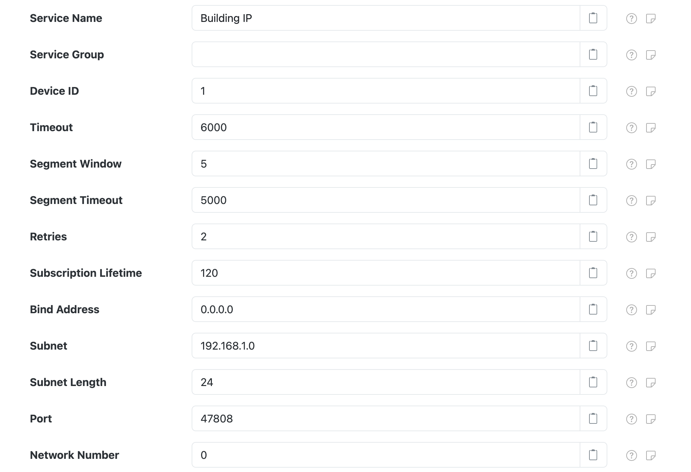

# BACnet

SolarNode supports BACnet integration through IP networks.

This component is included in the [solarnode-app-io-bacnet-bacnet4j][pkg] package in SolarNodeOS.
You can install this package on the [System > Packages][packages] page in SolarNode.

## Use

Once installed a **BACnet/IP connection** components will appear on the [Settings >
Components][components] page on your SolarNode. Click on the **Manage** button to configure
networks. You will need to add one configuration for each BACnet network you want to collect data
from.

<figure markdown>
  {width=1024 loading=lazy}
</figure>

## SolarNodeOS port considerations

By default SolarNodeOS has a built-in firewall enabled that will not allow access to arbitrary IP
ports. If using BACnet/IP, the port the BACnet network runs on (the standard port is `47808`) must
be opened in the [SolarNodeOS firewall][firewall]. To open port `47808`, you'd add the following
lines to the firewall configuration:

```
# Allow BACnet
add rule ip filter INPUT udp dport 47808 accept
```


## Settings

The BACnet/IP connection allows you to connect to a BACnet device on a specific IP address (or hostname)
and port number using the UDP protocol.

<figure markdown>
  {width=1024 loading=lazy}
</figure>

Each configuration contains the following overall settings:

| Setting               | Description |
|:----------------------|:------------|
| Service Name          | An optional unique name to identify this component with. :warning: This is the value you will need to configure on _other_ SolarNode components to make use of this connection. |
| Service Group         | An optional group name to associate this component with. |
| Device ID             | The BACnet device identifier to use for this component. :warning: SolarNode will present itself to the BACnet network with this ID, so it should not conflict with any existing device IDs from other BACnet devices on the network. |
| Timeout               | A timeout to use when communicating with BACnet devices, in milliseconds. |
| Segment Window        | The BACnet network segment window. |
| Segment Timeout       | The BACnet network segment timeout, in milliseconds. |
| Retries               | The network operation retry count. |
| Bind Address          | The local IP address of the network interface to bind to, or `0.0.0.0` for all available interfaces. |
| Subnet                | The IP subnet address, for broadcast messages. |
| Subnet Length         | The IP subnet network prefix length, for example `24` or `16`. |
| Port                  | The IP port to use. The default BACnet port is `47808`. |
| Network Number        | The BACnet network number to use. |

[components]: ../setup-app/settings/components.md
[firewall]: ../sysadmin/networking.md#firewall
[packages]: ../setup-app/system/packages.md
[pkg]: https://github.com/SolarNetwork/solarnode-os-packages/tree/develop/solarnode-app-sunspec/debian
