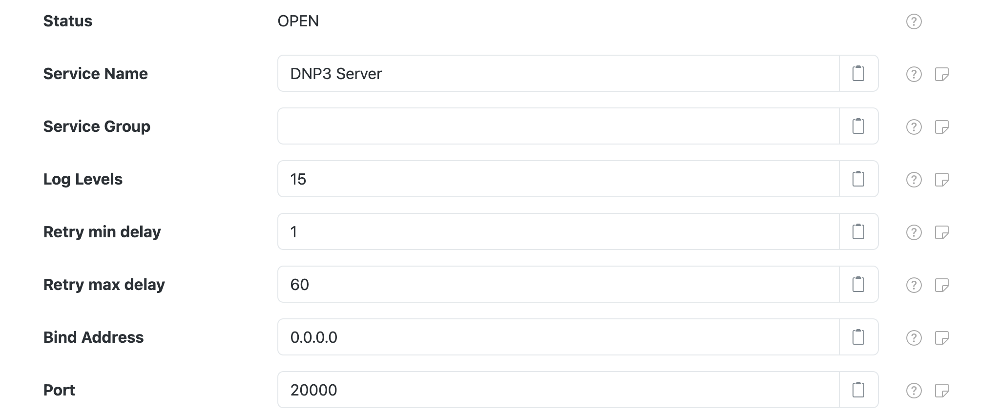

# DNP3 Server Connection

The **DNP3 TCP server** component provides a TCP based DNP3 client that can be used for DNP3
applications to use. This can be used by the [DNP3 Outstation][dnp3-outstation] component.

This component is included in the [solarnode-app-dnp3][pkg] package in SolarNodeOS.
You can install this package on the [System > Packages][packages] page in SolarNode.

## Use

Once installed, a new **DNP3 TCP server** component will appear on the [Settings > Components][components]
page on your SolarNode. Click on the **Manage** button to configure components.

<figure markdown>
  {width=1024 loading=lazy}
</figure>


## SolarNodeOS port considerations

By default SolarNodeOS has a built-in firewall enabled that will not allow access to arbitrary IP
ports. Whatever **Port** value configured in the server settings must
be opened in the [SolarNodeOS firewall][firewall]. To open port `20000`, you'd add the following
lines to the firewall configuration:

```
# Allows DNP3 server
add rule ip filter INPUT tcp dport 20000 counter accept
```


## Settings

<figure markdown>
  {width=1024 loading=lazy}
</figure>

Each TCP server configuration contains the following settings:

| Setting         | Description                                      |
|-----------------|--------------------------------------------------|
| Service Name    | A unique name to identify this component with. |
| Service Group   | A group name to associate this component with. |
| Log Levels      | A bitmask combination of OpenDNP3 [log levels][log-levels]. |
| Retry min delay | The minimum length of time, in seconds, to delay between network operation retry attempts. |
| Retry max delay | The maximum length of time, in seconds, to delay between network operation retry attempts. |
| Bind address    | The IP address to bind to, such as `127.0.0.1` for localhost or `0.0.0.0` for all available addresses. |
| Port            | The port to listen on. |

[components]: ../setup-app/settings/components.md
[dnp3-outstation]: dnp3-outstation.md
[firewall]: ../sysadmin/networking.md#firewall
[log-levels]: https://github.com/automatak/dnp3/blob/2efcf2e5f477869165f2cb40d731d41fb961b51b/java/bindings/src/main/java/com/automatak/dnp3/LogLevels.java#L23-L27
[packages]: ../setup-app/system/packages.md
[pkg]: https://github.com/SolarNetwork/solarnode-os-packages/tree/develop/solarnode-app-dnp3/debian
