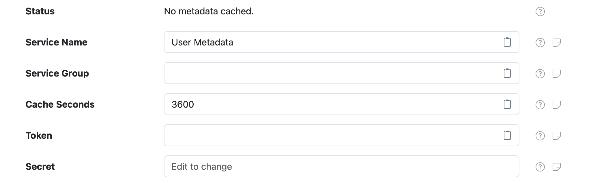
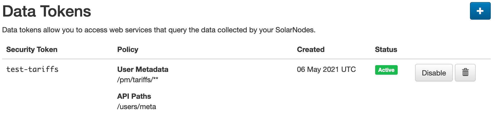
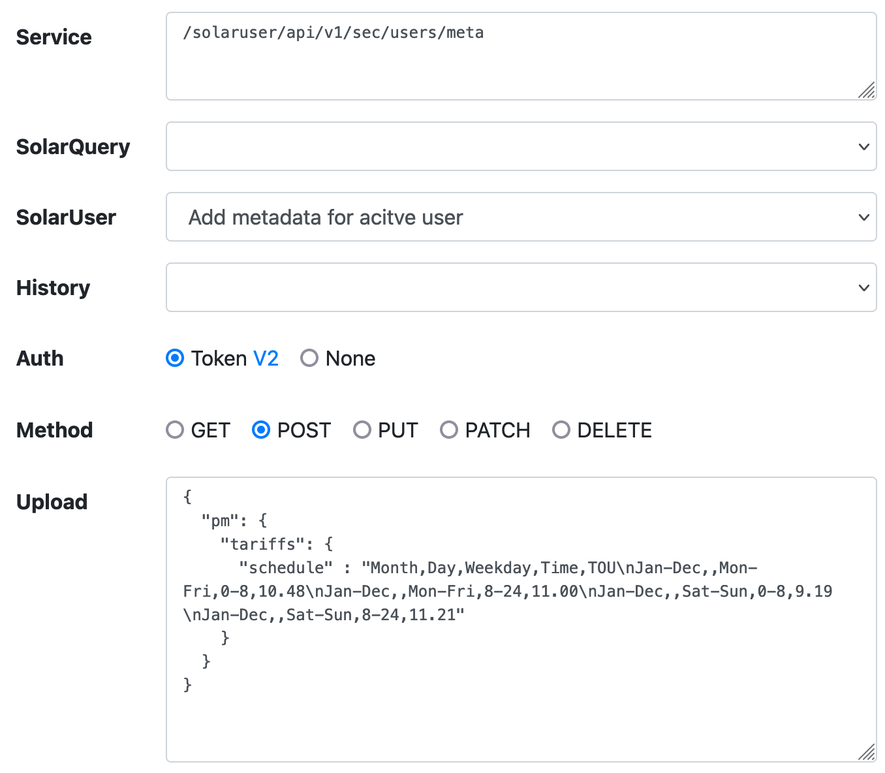
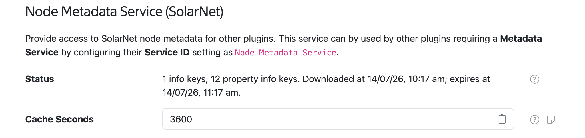
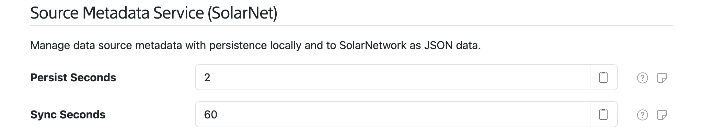

# Metadata

SolarNode supports a flexible JSON metadata format that various components make use of in a variety
of ways. The metadata is stored in the SolarNetwork cloud and available through the SolarNetwork API
and also within SolarNode. There are three main places metadata can be configured:

| Location | Description |
|:---------|:------------|
| [User account](#user-metadata-service) | Account-wide metadata that can be used by any component on any node with appropriate security token credentials configured. |
| [Node](#node-metadata-service) | Node-specific metadata that can be used and updated by the node it is associated with, without any additional authentication. |
| [Source (datum stream)](#source-metadata-service) | Source ID-specific datum stream metadata (and thus also node-specific) that can be used and updated by the node associated with the stream, without any additional authentication. |

## Metadata structure

| Property | Type | Description |
|:---------|:-----|:------------|
| `m`      | Map&lt;String, Object> | An arbitrary single-level object data structure. Traditionally this is meant to be used as a single-level key/value pair style object. |
| `pm`     | Map&lt;String, Map&lt;String, Object>> | An arbitrary multi-level object of objects data structure. Traditionally this is meant to be used as an arbitrary tree of key/value pairs and values. |
| `t`      | String[] | An array of strings to be treated as a set of _tags_. Duplicate values are discarded. |

Here is an example of node metadata. The metadata is both read by and published from the node, as explained in the

```json title="Node metadata example"
{
	"m": {
		"ssh-public-key": "ssh-ed25519 AAAAC3Nza...7MD SolarNode" // (1)!
	},
	"pm": {
		"os": { // (2)!
			"arch": "aarch64",
			"name": "Mac OS X",
			"version": "15.7.4"
		},
		"cpd": {
			"schedule": [ // (3)!
				["Month","Day","Weekday","Time","cpdPeriodActive"],
				["Jan-Apr,Oct-Dec",,,,0],
				["May-Sep",,,,1]
			]
		},
		"setup": {
			"s3-version": "0000000000000010101" // (4)!
		},
		"power-manager": {
			"prod": {
				"parameters": { // (5)!
					"MIN_MARGIN": 0.14,
					"IE_MAX_RATE": 10,
					"IE_MIN_RATE": 1,
					"EXP_INPUT_MAX": 4,
					"EXP_INPUT_MIN": 0,
					"USE_GRID_PRICE": 0.150,
					"LOW_PRICE_IMPORT": 0.01,
					"HIGH_DEMAND_THRESHOLD": 10,
					"LOW_BATTERY_THRESHOLD": 0.25,
					"CHARGED_BATTERY_THRESHOLD": 0.75
				}
			}
		},
		"pv-characteristics": { // (6)!
			"alt": 10,
			"lat": 41.1801547,
			"lon": -73.83277369999999,
			"zone": "America/New_York",
			"maxZenith": 83,
			"panelArea": 2242.25,
			"pvArrayTilt": 7,
			"minCosZenith": 3,
			"pvArrayAzimuth": 205,
			"degradationRate": 0.0063,
			"panelEfficiency": 0.192,
			"performanceRatio": 0.84,
			"transpositionModel": "perez-driesse",
			"nameplateAcMaxPower": 333300,
			"panelArrayTiltFactor": 1,
			"pvArrayCommissionDate": "2021-12-22"
		}
	}
}
```

1. SSH public key published by SolarNode itself.
2. General OS metadata published by the [OS Statistics](./datum-sources/os-stats.md) component.
3. A tariff schedule that can be used, for example, by the [Fixed Data](./datum-sources/fixed.md) and [Tariff Filter](./datum-filters/tariff.md) components.
4. Version published by the [S3 Setup](https://github.com/SolarNetwork/solarnetwork-node/tree/develop/net.solarnetwork.node.setup.s3) plugin.
5. Parameters used in node expressions to implement dynamic load management.
6. Parameters used by the [POAI Calculator](./datum-filters/pvlib.md) component.


## Metadata paths

When working with metadata, you will invariably need to specify a specific part of the metadata for
a component to work with. This is done using a **metadata path** syntax that works like a URL path.
The path starts with `/` and each path component represents an object in the metadata hierarchy
structure. When viewing the metadata as JSON, objects are written using curly braces: `#!json { }`.
The JSON object properties represent components in the metadata path synax.

Using the [example metadata JSON](#metadata-structure) in the previous section, here are some example
metadata paths:

| Path | Referenced value |
|:-----|:-----------------|
| `/m/ssh-public-key` | The node's publish SSH key. |
| `/pm/os/arch` | The node's CPU architecture, as published by the [OS Statistics](./datum-sources/os-stats.md) component. |
| `/pm/cpd/schedule` | An array of arrays, representing a tariff schedule. This could be used by the [Tariff Filter](./datum-filters/tariff.md), for example. |
| `/pm/pv-characteristics` | A parameters object. This could be used by the [POAI Calculator](./datum-filters/pvlib.md), for example. |

## User Metadata Service

SolarNode provides support for accessing user metadata with the **User Metadata Service** component.
You can configure any number of these components from the [Settings > Components](../users/setup-app/settings/components.md)
page, where it appears like this:

<figure markdown>
  {width=870 loading=lazy}
</figure>

### User Metadata Service settings

<figure markdown>
  {width=697 loading=lazy}
</figure>

Each component supports the following settings:

| Setting            | Description |
|:-------------------|:------------|
| Service Name       | A unique ID for the service, to be referenced by other components. |
| Service Group      | An optional service group name to assign. |
| Cache Seconds      | The number of seconds to cache the metadata after fetching from SolarNetwork, before fetching it again when metadata is requested. |
| Token              | A SolarNetwork security token. See [User Metadata security token](#user-metadata-security-token) for more info. |
| Secret             | The SolarNetwork security token secret. |

### User Metadata security token

You must configure a SolarNetwork [security token][auth-tokens] to use the User Metadata Service. We
recommend that you create a **Data** security token with a security policy that includes an **API
Path** of just `/users/meta` and a **User Metadata Path** of something granular to restrict the
metadata SolarNode has access to. For example, a policy User Metadata Path of `/pm/tariffs/**` would
restrict SolarNode's access to just the metadata under the `/pm/tariffs` metadata path.

<figure markdown>
  {width=697 loading=lazy}
</figure>

The [SolarNetwork API Explorer][api-explorer] can be used to add the necessary tariff schedule
metadata to your account. For example:

<figure markdown>
  {width=678 loading=lazy}
</figure>


## Node Metadata Service

SolarNode provides support for accessing node metadata with the **Node Metadata Service** service name.
This component is automatically available, and can be configured on the [Settings >
Services](../users/setup-app/settings/services.md) page, where it appears as **Node Metadata Service
(SolarNet)**.

### Node Metadata Service settings

<figure markdown>
  {width=1024 loading=lazy}
</figure>

The service supports the following settings:

| Setting            | Description |
|:-------------------|:------------|
| Cache Seconds      | The number of seconds to cache the metadata after fetching from SolarNetwork, before fetching it again when metadata is requested. |

## Source Metadata Service

All [Datum Sources](./datum-sources/index.md) support publishing source-level metadata, and [datum
expressions](./expressions.md#datum-stream-metadata-functions) can access this as well. This service
can be configured on the [Settings > Services](../users/setup-app/settings/services.md) page, where
it appears as **Source Metadata Service (SolarNet)**.

### Source Metadata Service settings

<figure markdown>
  {width=1024 loading=lazy}
</figure>

The service supports the following settings:

| Setting            | Description |
|:-------------------|:------------|
| Persist Seconds    | A minimum number of seconds between metadata updates to wait before persisting locally. This helps minimize disk writes. |
| Sync Seconds       | A minimum number of seconds between metadata updates to wait before persisting to SolarNetwork. This helps minimize network traffic. |

### Clearing the Source Metadata cache

Source metadata can be cleared by sending a [`DatumSourceMetadataClearCache`](./instructions/topics/datum-source-metadata-clear-cache.md)
instruction to the node.

[api-explorer]: https://go.solarnetwork.net/dev/api/
[auth-tokens]: https://data.solarnetwork.net/solaruser/u/sec/auth-tokens
[sn-cli-nodes-meta]: https://solarnetwork.github.io/sn-cli/commands/nodes/meta/
