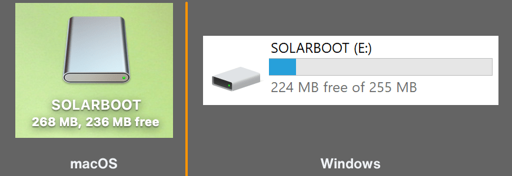

# Networking

SolarNode will attempt to automatically configure networking access from a local DHCP server. For
many deployments the local network router is the DHCP server. SolarNode will identify itself with
the name `solarnode`, so in many cases you can reach the SolarNode setup app at <http://solarnode/>.

## Finding SolarNode's network address

To find what network address SolarNode is using, you have a few options:

### Consult your network router

Your local network router is very likely to have a record of SolarNode's network connection. Log
into the router's management UI and look for a device named `solarnode`.

### Connect a keyboard and screen

If your SolarNode supports connecting a keyboard and screen, you can log into the SolarNode command line
console and run `#!sh ip -br addr` to print out a brief summary of the current networking configuration:

```
$ ip -br addr

lo               UNKNOWN        127.0.0.1/8 ::1/128
eth0             UP             192.168.0.254/24 fe80::e65f:1ff:fed1:893c/64
wlan0            DOWN
```

In the previous output, SolarNode has an ethernet device `eth0` with a network address `192.168.0.254`
and a WiFi device `wlan0` that is not connected. You could reach that SolarNode at
`http://192.168.0.254/`.

!!! tip

	You can get more details by running `#!sh ip addr` (without the `-br` argument).

## WiFi

If your device will use WiFi for network access, you will need to configure the network name and credentials to use.
You can do that by creating a `wpa_supplicant.conf` file on the SolarNodeOS media (typically an SD card). For Raspberry Pi media, you can mount the SD card on your computer and it will mount the appropriate drive for you.

{width=435}

Once mounted use your favorite text editor to create a `wpa_supplicant.conf` file with content like
this:

```
country=nz
network={
    ssid="wifi network name here"
    psk="wifi password here"
}
```

Change the `country=nz` to match your own country code.

## Ethernet static IP address

By default SolarNode relies on a DHCP server to supply it with a dynamic IP address.
To configure a static IP address, edit the `/etc/systemd/network/10-eth.network` file
and configure it along these lines:

```
[Network]
DNS=1.1.1.1
DNS=8.8.8.8

[Address]
Address=10.1.10.9/24

[Route]
Gateway=10.1.10.1
```

## Ethernet internet sharing

For devices with two ethernet ports, you can connect one port to a wide-area network (with access to
the internet) and the other to a local-area network, and provide the local-area network with access
to the internet with SolarNode acting as the router (gateway) to the wide-area network.

For this guide we assume that the wide-area network (WAN) interface is `eth0` and the local-area
network (LAN) is `eth1`.  The WAN interface can be configured as DHCP (the default) or with a static
IP as outlined above.

You can choose to use static IP addressing or DHCP for the LAN, as outlined in the subsequent
sections.

### IP forwarding firewall changes

The SolarNode [firewall](sysadmin/networking.md#firewall) must be configured to allow LAN devices
access to the WAN. Edit the `/etc/nftables.conf` file to change this line:

```
add rule ip filter FORWARD counter reject
```

to this:

```
add rule ip filter FORWARD counter accept
```

Then reload the firewall settings with:

```sh
sudo systemctl reload nftables
```

### LAN static IP addressing

If you prefer to use static IP addresses for the LAN devices, or cannot use DHCP for any reason, you
can configure all LAN devices with static IP addresses within the subnet of your LAN. For this guide
we will use `192.168.100.1/24` for SolarNode's IP address and network mask, but you could use any
available network range. Create a `/etc/systemd/network/11-eth.network` file with the following:

=== "SolarNodeOS 12"

	```
	[Match]
	Name=eth1

	[Network]
	IPForward=yes
	IPMasquerade=both

	[Address]
	Address=192.168.100.1/24
	```

To reload the network settings run:

```
sudo systemctl restart systemd-networkd
```

### LAN DHCP addressing

Instead of using static IP addresses on the LAN devices, you SolarNode can operate a DHCP server for
the LAN. For this example the DHCP server will dynamically assign IP addresses to LAN devices,
starting at `192.168.100.100`. Create a `/etc/systemd/network/11-eth.network` file with the
following:

=== "SolarNodeOS 12"

	```
	[Match]
	Name=eth1

	[Network]
	IPForward=yes
	IPMasquerade=both
	DHCPServer=yes

	[Address]
	Address=192.168.100.1/24

	[DHCPServer]
	PoolOffset=100
	```

	More options are available, see [here](https://www.freedesktop.org/software/systemd/man/252/systemd.network.html#%5BDHCPServer%5D%20Section%20Options).

#### DHCP reserved IP addresses

If you would like consistent IP addresses assigned to LAN devices while using DHCP, you can
configure specific IP addresses based on the device MAC addresses. Just add
`[DHCPServerStaticLease]` sections to the network configuration, one for each device you want to
assign a specific IP address to. For example:

=== "SolarNodeOS 12"

	```
	[Match]
	Name=eth1

	[Network]
	IPForward=yes
	IPMasquerade=both
	DHCPServer=yes

	[Address]
	Address=192.168.100.1/24

	[DHCPServer]
	PoolOffset=100

	[DHCPServerStaticLease]
	MACAddress=00:01:c0:0b:06:08
	Address=192.168.100.10
	```

## DNS server

You can configure SolarNode as a DNS server for the local network. This can be useful when sharing a
wide-area network connection with a local network. First you must allow DNS queries through the
firewall, so edit the `/etc/nftables.conf` file to add the following, just before the `# Allow DHCP`
line:

```
# Allow DNS queries
add rule ip filter INPUT udp dport 53 counter accept
```

Reload the firewall configuration with

```sh
sudo systemctl reload nftables
```

Then edit the `/etc/systemd/resolved.conf` file to add a `DNSStubListenerExtra`
line for SolarNode's LAN address, for example:

```
DNSStubListenerExtra=192.168.100.1
```

Then reload the configuration with:

```sh
sudo systemctl restart systemd-resolved
```

For more details on the `resolved.conf` file see [here](https://www.freedesktop.org/software/systemd/man/252/resolved.conf.html).
