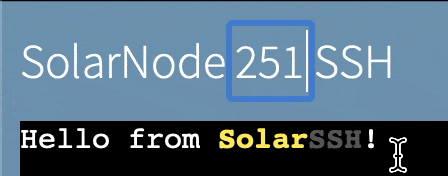
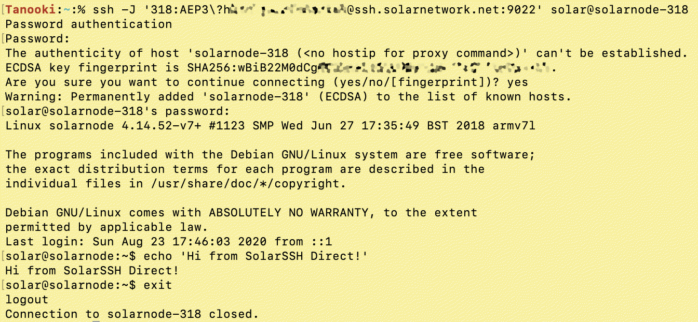
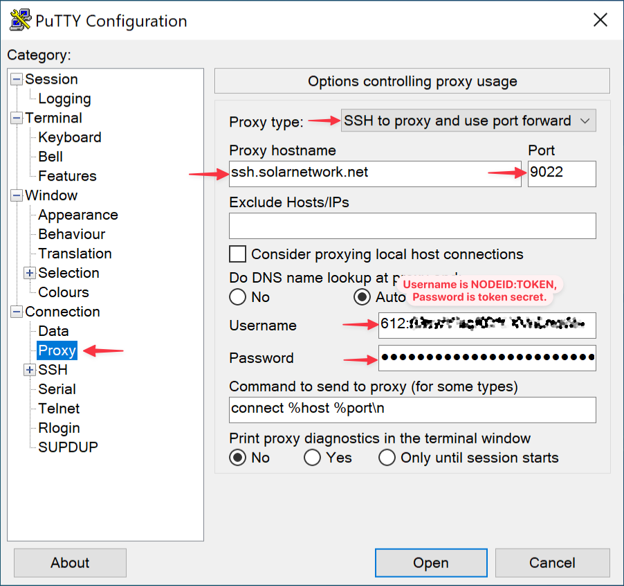
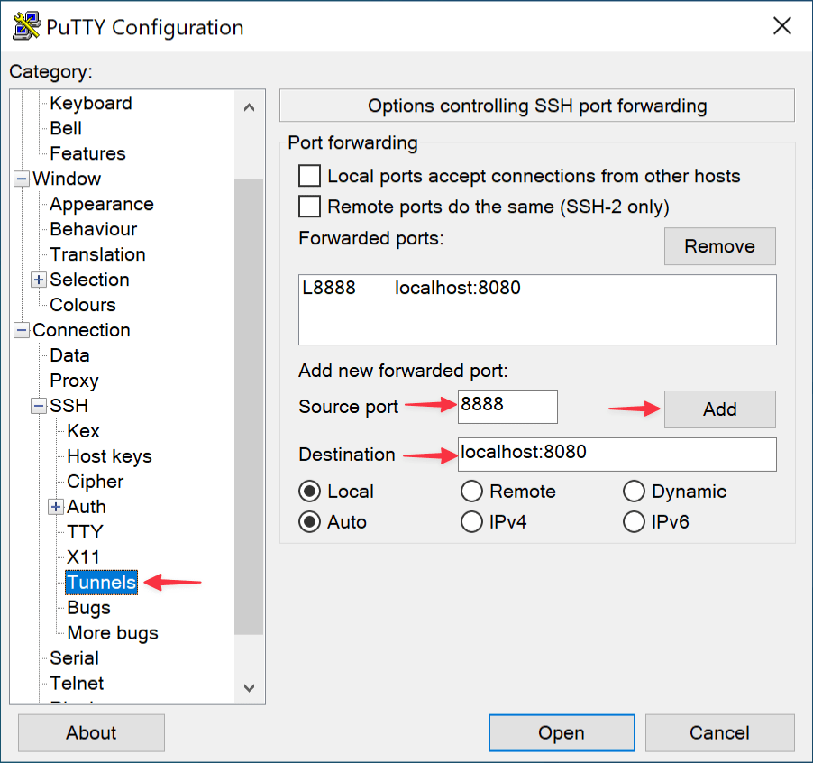
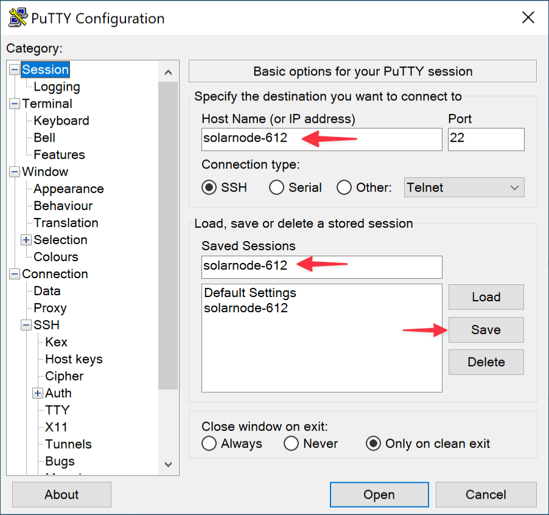
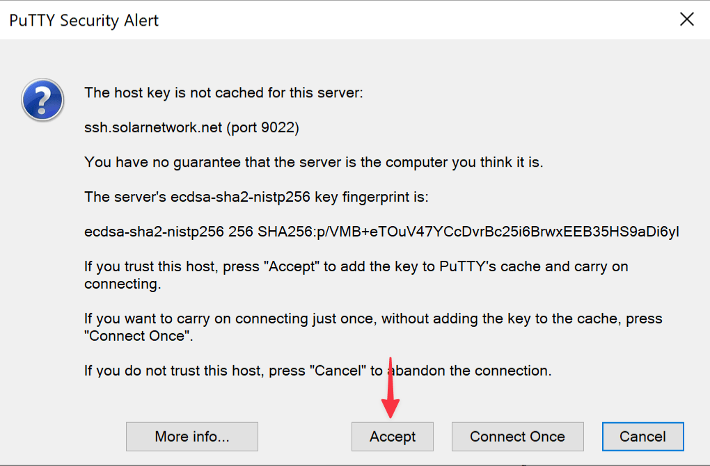
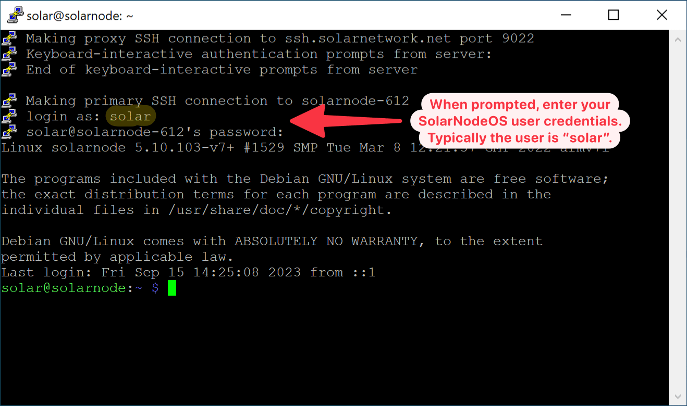

# Remote Access

SolarSSH is SolarNetwork's method of connecting to SolarNode devices over the internet even when
those devices are not directly reachable due to network firewalls or routing rules. It uses the
Secure Shell Protocol ([SSH][ssh]) to ensure your connection is private and secure.

SolarSSH does not maintain permanently open SSH connections to SolarNode devices. Instead the
connections are established on demand, when you need them. This allows you to connect to a SolarNode
when you need to perform maintenance, but not require SolarNode maintain an open SSH connection to
SolarSSH.

In order to use SolarSSH, you will need a [User Security Token](security-tokens.md) to use for
authentication.

## Browser Connection

You can use SolarSSH [right in your browser][solarssh-web] to connect to any of your nodes.

<figure markdown>
  {width=965 loading=lazy}
  <figcaption markdown>The SolarSSH browser app</figcaption>
</figure>

### Choose your node ID

Click on the node ID in the page title to change what node you want to connect to.

<figure markdown>
  {width=224 loading=lazy}
  <figcaption markdown>Changing the SolarSSH node ID</figcaption>
</figure>

!!! tip "Bookmark a SolarSSH page for your node ID"

	You can append a `?nodeId=X` to the SolarSSH browser URL
	<https://go.solarnetwork.net/solarssh/>, where `X` is a node ID, to make the app start with that
	node ID directly. For example to start with node 123, you could bookmark the URL
	<https://go.solarnetwork.net/solarssh/?nodeId=123>.

### Provide your credentials

Fill in [User Security Token](security-tokens.md) credentials for authentication. The node ID you are
connecting to must be owned by the same account as the security token.

### Connect

Click the **Connect** button to initiate the SolarSSH connection process. You will be presented with
a dialog form to provide your SolarNodeOS [system account
credentials](sysadmin/index.md#system-user-account). This is only necessary if you want to connect
to the SolarNodeOS system command line. If you only need to access the SolarNode [Setup
App](setup-app/index.md), you can click the **Skip** button to skip this step. Otherwise, click the
**Login** button to log into the system command line.

<figure markdown>
  {width=515 loading=lazy}
  <figcaption markdown>SolarNodeOS system account credentials form</figcaption>
</figure>

SolarSSH will then establish the connection to your node. If you provided SolarNodeOS system account
credentials previously and clicked the **Login** button, you will end up with a system
command prompt, like this:

<figure markdown>
  {width=965 loading=lazy}
  <figcaption markdown>SolarSSH logged-in system command prompt</figcaption>
</figure>

### Remote Setup App

Once connected, you can access the remote node's Setup App by clicking the **Setup** button in the
top-right corner of the window. This will open a new browser tab for the Setup App.

<figure markdown>
  {width=972 loading=lazy}
  <figcaption markdown>Accessing the SolarNode Setup App through a SolarSSH web connection</figcaption>
</figure>

## Direct connection

SolarSSH also supports a "direct" connection mode, that allows you to connect using standard [ssh
client][ssh-clients] applications. This is a more advanced (and flexible) way of connecting to
your nodes, and even allows you to access other network services on the same network as the node
and provides full SSH integration including port forwarding, `scp`, and `sftp` support.

Direct SolarSSH connections require using a SSH client that supports the [SSH "jump" host][ssh-jump]
feature. The "jump" server hosted by SolarNetwork Foundation is available at
`ssh.solarnetwork.net:9022`.

The "jump" connection user is formed by combining a node ID with a **user** security token,
separated by a `:` character. The general form of a SolarSSH direct connection "jump" host thus
looks like this:

```
NODE:TOKEN@ssh.solarnetwork.net:9022
```

where `NODE` is a SolarNode ID and `TOKEN` is a SolarNetwork user security token.

The actual SolarNode user can be any OS user (typically `solar`) and the hostname can be anything.
A good practice for the hostname is to use one derived from the SolarNode ID, e.g. `solarnode-123`.

Using OpenSSH a complete connection command to log in as a `solar` user looks like this, passing
the "jump" host via a `-J` argument:

```
ssh -J 'NODE:TOKEN@ssh.solarnetwork.net:9022' solar@solarnode-NODE
```

!!! warning

	SolarNetwork security tokens often contain characters that must be
	escaped with a `\` character for your shell to interpret them correctly. For example, a token
	like `9gPa9S;Ux1X3kK)YN6&g` might need to have the `;)&` characters escaped like
	`9gPa9S\;Ux1X3kK\)YN6\&g`.

You will be first prompted to enter a password, which must be the token secret. You might then
be prompted for the SolarNode OS user's password. Here's an example screen shot:


<figure markdown>
  {width=672 loading=lazy}
  <figcaption markdown>Accessing the SolarNode system command line through a SolarSSH direct connection</figcaption>
</figure>

### Shell shortcut function

If you find yourself using SolarSSH connections frequently, a handy `bash` or `zsh` shell function
can help make the connection process easier to remember. Here's an example that give you a
`solarssh` command that accepts a SolarNode ID argument, followed by any optional SSH arguments:

```sh
function solarssh () {
  local node_id="$1"
  if [ -z "$node_id" ]; then
    echo 'Must provide node ID , e.g. 123'
  else
    shift
    echo "Enter SN token secret when first prompted for password. Enter node $node_id password second."
    ssh -o StrictHostKeyChecking=no -o UserKnownHostsFile=/dev/null -o LogLevel=ERROR \
      -J "$node_id"'SN_TOKEN_HERE@ssh.solarnetwork.net:9022' $@ solar@solarnode-$node_id
  fi
}
```

Just replace `SN_TOKEN_HERE` with a user security token. After integrating this into your shell's
configuration (e.g. `~/.bashrc` or `~/.zshrc`) then you could connect to node `123` like:

```sh
solarssh 123
```

## PuTTY

[PuTTY][putty] is a popular tool for Windows that supports SolarSSH connections. To connect to a
SolarNode using PuTTY, you must:

 1. Configure a SSH connection proxy to `ssh.solarnetwork.net:9022` using a username like
    `NODE_ID:TOKEN_ID` and the corresponding token secret as the password.
 2. Optionally configure a tunnel to `localhost:8080` to access the SolarNode Setup App
 3. Configure the session to connect to `solarnode-NODE_ID` on port `22`

### PuTTY SSH proxy connection configuration

Open the **Connection > Proxy** configuration category in PuTTY, and configure the following settings:

| Setting | Value |
|:--------|:------|
| **Proxy type** | _SSH to proxy and use port forwarding_ |
| **Proxy hostname** | `ssh.solarnetwork.net` |
| **Port** | `9022` |
| **Username** | The desired node ID, followed by a `:`, followed by a user security token ID, that is: `NODE_ID:TOKEN_ID` |
| **Password** | The user security token secret. |

<figure markdown>
  {width=451 loading=lazy}
  <figcaption markdown>Confiruing PuTTY connection proxy settings</figcaption>
</figure>

### PuTTY SSH tunnel configuration

To access the SolarNode Setup App, you can configure PuTTY to foward a port on your local machine to
`localhost:8080` on the node. Once the SSH connection is established, you can open a browser to
`http://localhost:PORT` to access the SolarNode Setup App. You can use any available local port, for
example if you used port `8888` then you would open a browser to `http://localhost:8888` to access
the SolarNode Setup App.

Open the **Connection > SSH > Tunnels** configuration category in PuTTY, and configure the following settings:

| Setting | Value |
|:--------|:------|
| **Source port** | A free port on your machine, for example `8888`. |
| **Destination** | `localhost:8080` |
| **Add** | You must click the **Add** button to add this tunnel. You can then add other tunnels as needed. |

<figure markdown>
  {width=451 loading=lazy}
  <figcaption markdown>Confiruing PuTTY connection SSH tunnel settings</figcaption>
</figure>

### PuTTY session configuration

Finally under the **Session** configuration category in PuTTY, configure the Host Name and Port to
connect to SolarNode. You can also provide a session name and click the **Save** button to save all
the settings you have configured, making it easy to load them in the future.

| Setting | Value |
|:--------|:------|
| **Host Name** | Does not actually matter, but a name like `solarnode-NODE_ID` is helpful, where `NODE_ID` is the ID of the node you are connecting to. |
| **Port** | `22` |

<figure markdown>
  {width=451 loading=lazy}
  <figcaption markdown>Confiruing PuTTY session settings</figcaption>
</figure>

### PuTTY open connection

On the **Session** configuration category, click the **Open** button to establish the SolarSSH
connection. You might be prompted to confirm the identity of the `ssh.solarnetwork.net` server
first. Click the **Accept** button if this is the case.

<figure markdown>
  {width=510 loading=lazy}
  <figcaption markdown>PuTTY host verification alert</figcaption>
</figure>

PuTTY will connect to SolarSSH and after a short while prompt you for the SolarNodeOS user you would
like to connect to SolarNode with. Typically you would use the `solar` account, so you would type
`solar` followed by ++enter++. You will then be prompted for that account's password, so type that
in and type ++enter++ again. You will then be presented with the SolarNodeOS shell prompt.

<figure markdown>
  {width=659 loading=lazy}
  <figcaption markdown>PuTTY node login</figcaption>
</figure>

Assuming you configured a SSH tunnel on port `8888` to `localhost:8080`, you can now open
<http://localhost:8888> to access the SolarNode Setup App.

<figure markdown>
  {width=783 loading=lazy}
  <figcaption markdown>Once connected to SolarSSH, access the SolarNode Setup App in your browser.</figcaption>
</figure>


[putty]: https://www.putty.org/
[ssh]: https://en.wikipedia.org/wiki/Secure_Shell
[sec-tokens]: https://data.solarnetwork.net/solaruser/u/sec/auth-tokens
[ssh-clients]: https://en.wikipedia.org/wiki/Comparison_of_SSH_clients
[ssh-jump]: https://en.wikibooks.org/wiki/OpenSSH/Cookbook/Proxies_and_Jump_Hosts#Passing_Through_One_or_More_Gateways_Using_ProxyJump
[solarssh-web]: https://go.solarnetwork.net/solarssh/
[solarssh-web-node]: https://go.solarnetwork.net/solarssh/?nodeId=123
