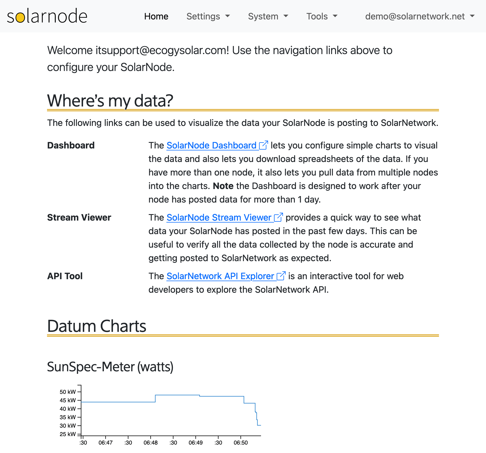
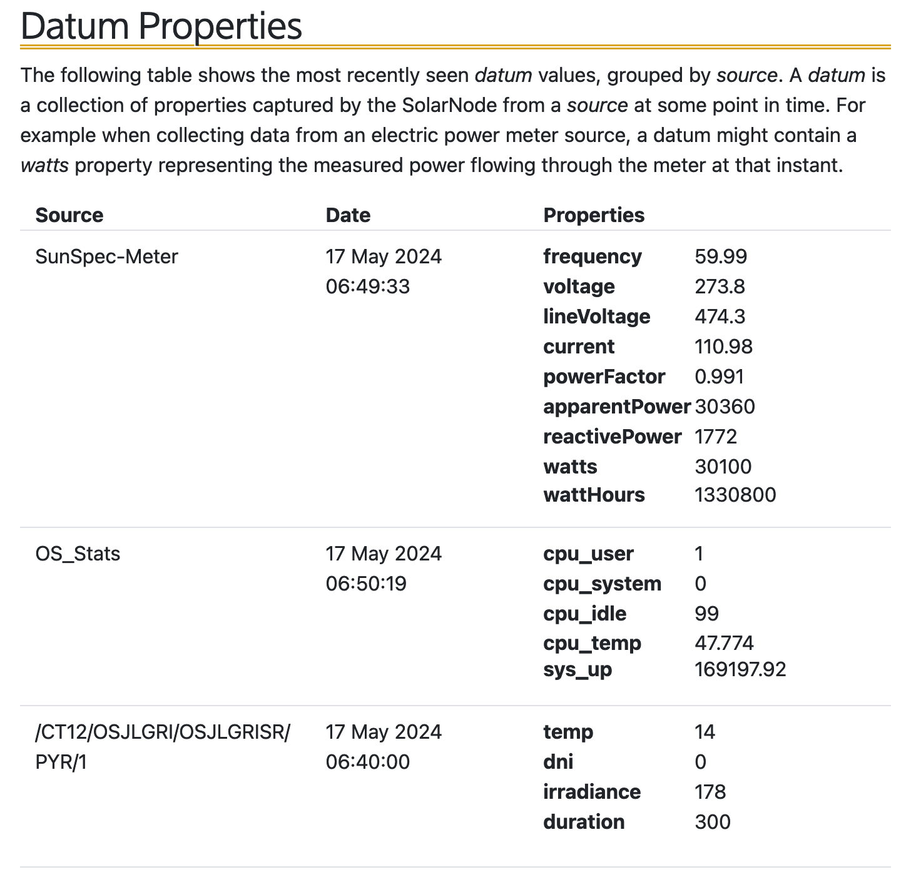

# Home

The Home page provides you with some links to resources and shows live datum-collecting
activity.

<figure markdown>
  {width=863}
  <caption>The SolarNode home page</caption>
</figure>

As datum are collected on the node, they will appear in the **Datum Properties**
section:

<figure markdown>
  {width=728}
</figure>
