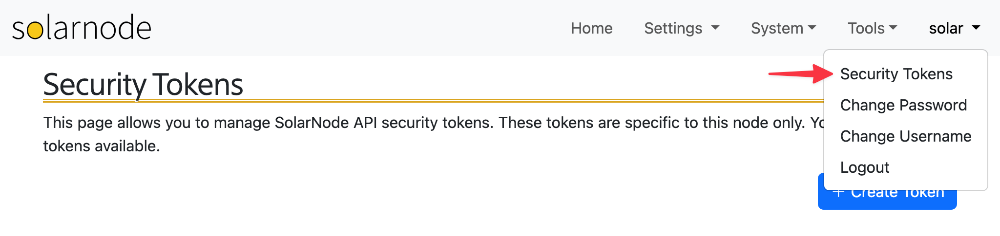
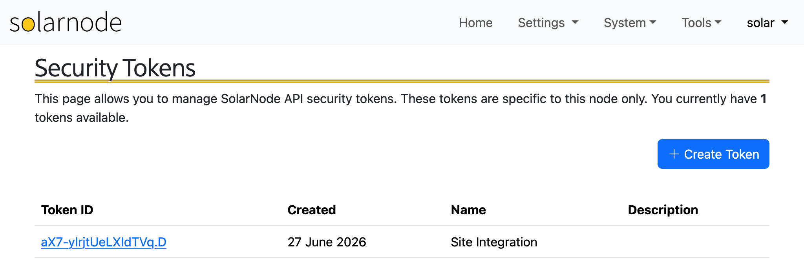
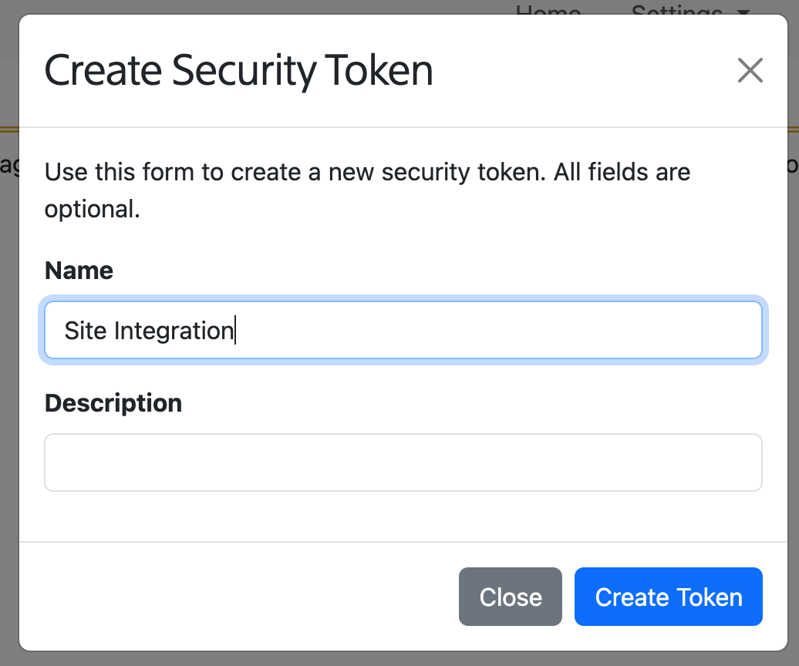
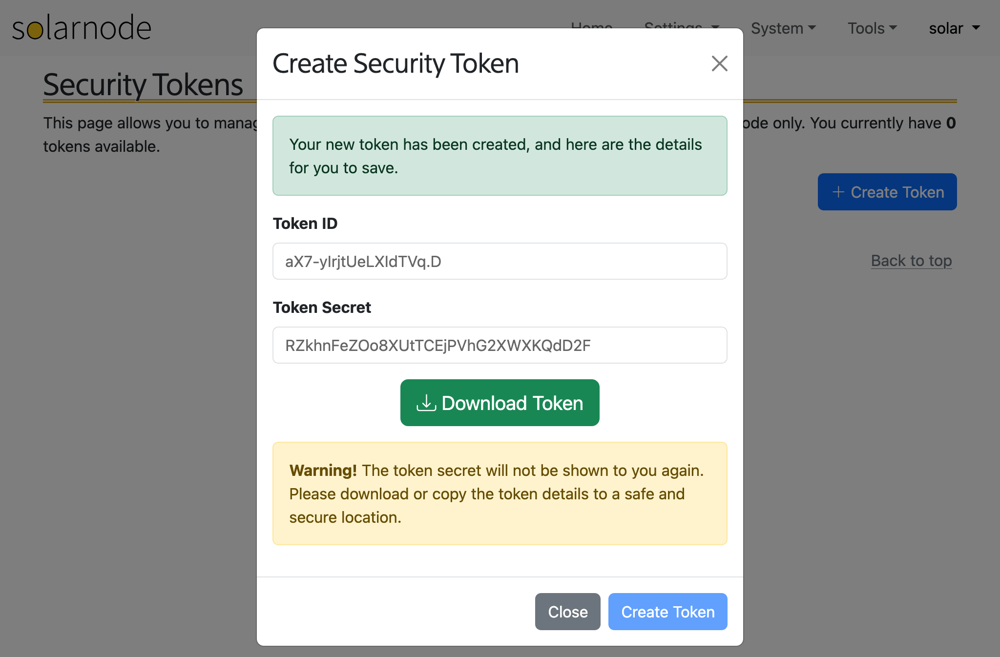

# Security Tokens

SolarNode _local_ security tokens are used in some places like the [SolarNode REST
API](../../developers/integrations/rest/index.md). They can be managed by opening the profile menu
on the top-right of the SolarNode UI (once you are logged in) and selecting the **Security Tokens**
item.

<figure markdown>
  {width=1024}
</figure>

!!! warning

	The security tokens created within SolarNode are **specific to that node only** and can not be
	used with the SolarNetwork API. Similarly, [SolarNetwork API tokens](../security-tokens.md) can
	not be used as SolarNode local tokens.

The page will list any tokens you have created, and you can delete any token by clicking on its ID.

<figure markdown>
  {width=1024}
</figure>

## Create token

Click the **Create Token** button to create a new token. You can provide a name and description
if you like.

<figure markdown>
  {width=518}
</figure>

Once created, you will be shown the token ID and secret values, along with the option to download
the credentials as a CSV file. You will not be shown the token secret again, so be sure to keep
it in a safe place.

<figure markdown>
  {width=1024}
</figure>
