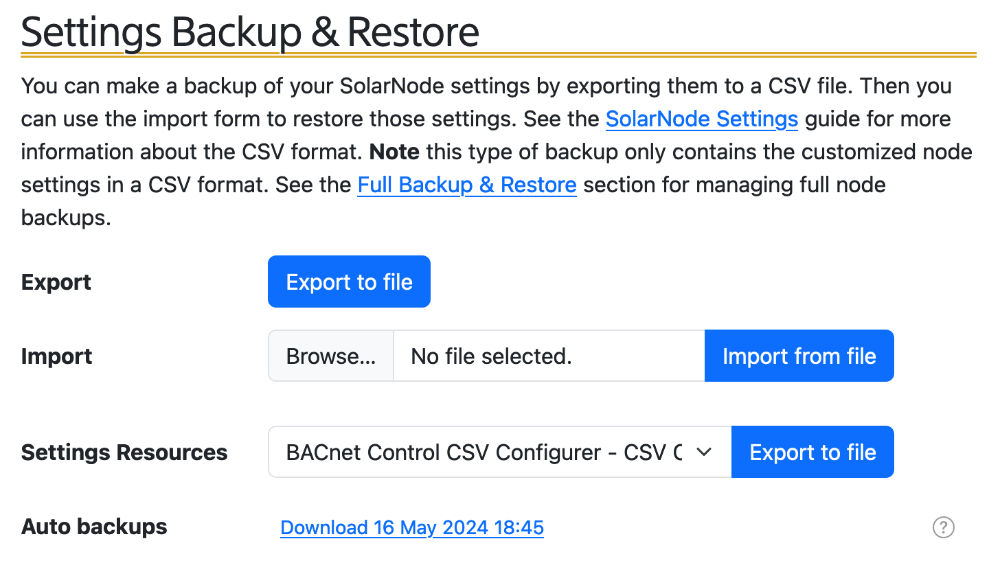
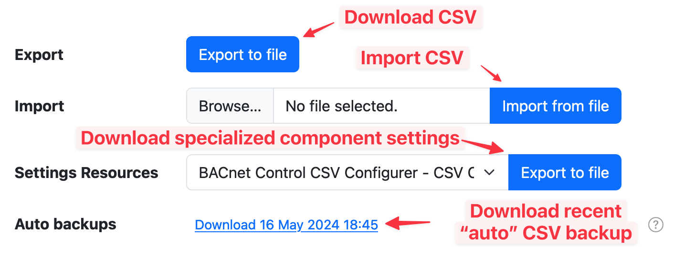
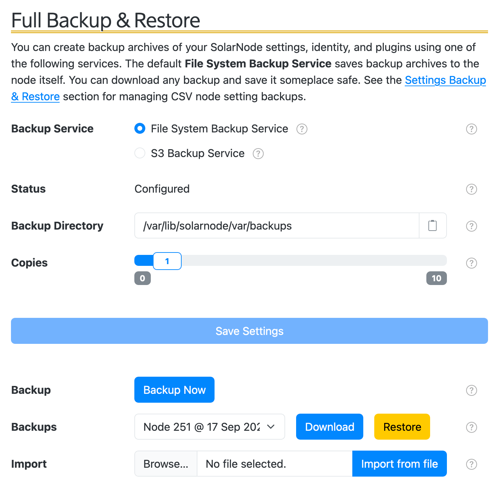
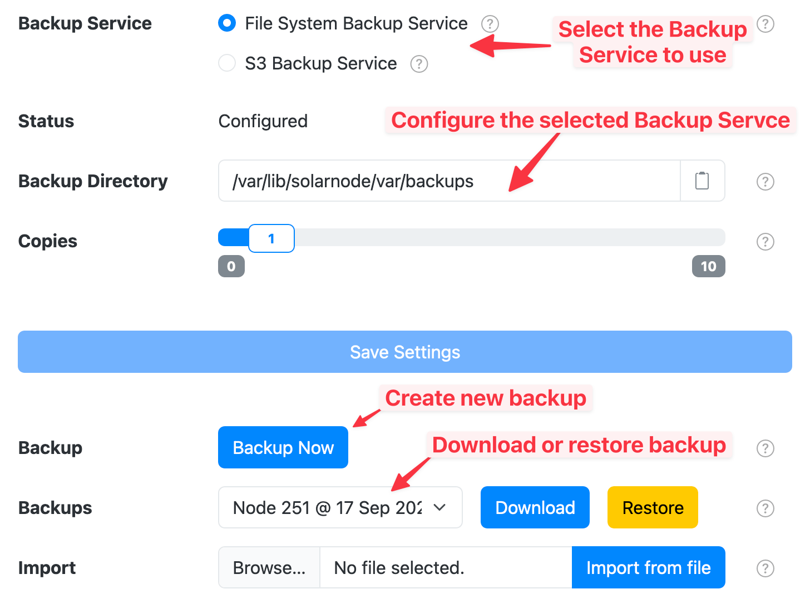
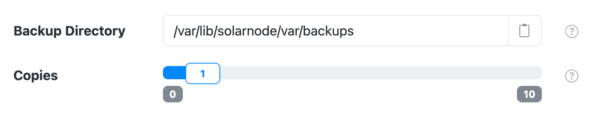
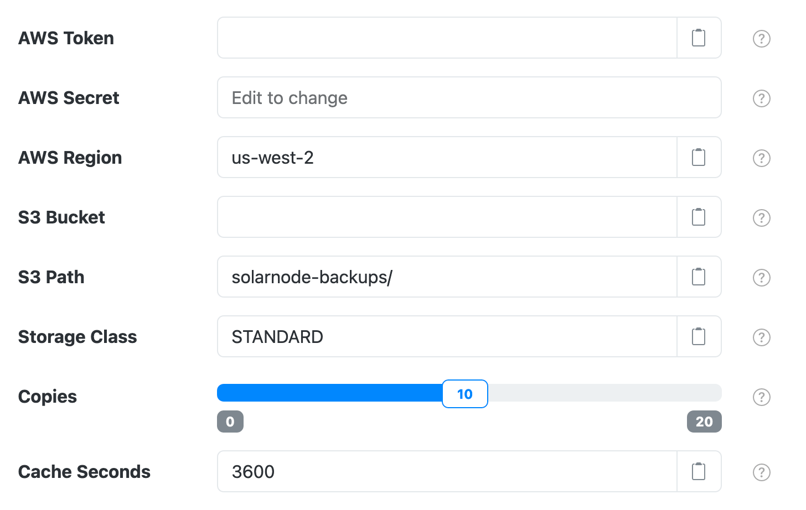

# Backups

This page allows you to backup and restore the configuration of your SolarNode.

## Settings Backup & Restore

The Settings Backup & Restore section provides a way to manage [Settings Files][settings-file]
and Settings Resources, both of which are backups for the configured settings in SolarNode.

!!! warning

    Settings Files and Settings Resources do **not** include the node's certificate, login
	credentials, or custom plugins. See the [Full Backup & Restore](#full-backup-restore) section
	for managing "full" backups that _do_ include those items.

<figure markdown>
  {width=728}
</figure>

The **Export** button allows you to download a [Settings File][settings-file] with the currently active configuration.

The **Import** button allows you to upload a previously-downloaded [Settings File][settings-file].

The **Settings Resource** menu allows you to download specialized settings files, offered by some components in SolarNode.
For example the [Modbus Device Datum Source][modbus-device-plugin] plugin offers a specialized CSV file format to make configuring those
components easier.

The **Auto backups** area will have a list of links, each of which will let you download a
[Settings File][settings-file] that SolarNode automatically created. Each link shows you
the date the settings backup was created.

<figure markdown>
  {width=728}
</figure>

## Full Backup & Restore

The Full Backup & Restore section lets you manage SolarNode "full" backups. Each full backup contains a snapshot
of the settings you have configured, the node's certificate, login credentials, custom plugins, and more.

<figure markdown>
  {width=728}
</figure>

The **Backup Service** shows a list of the available [Backup Services](#backup-services). Each service
has its own settings that must be configured for the service to operate. After changing any of the
selected service's settings, click the **Save Settings** button to save those changes.

The **Backup** button allows you to create a new backup.

The **Backups** menu allows you to download or restore any available backup.

The **Import** button allows you to upload a previously downloaded backup file.

<figure markdown>
  {width=728}
</figure>

## Backup Services

SolarNode supports configurable Backup Service plugins to manage the storage of backup resources.

### File System Backup Service

The File System Backup Service is the default Backup Service provided by SolarNode. It saves
the backup onto the node itself. In order to be able to restore your settings if the node is damaged
or lost, you must download a copy of a backup using the **Download** button, and save the file
to a safe place.

!!! warning

    If you do not download a copy of a backup, you run the risk of losing your settings and
    node certificate, making it impossible to restore the node in the event of a catastrophic
    hardware failure.

<figure markdown>
  {width=728}
</figure>

The configurable settings of the File System Backup Service are:

| Setting | Description |
|:--------|:------------|
| Backup Directory | The folder (on the node) where the backups will be saved. |
| Copies | The number of backup copies to keep, before deleting the oldest backup. |

### S3 Backup Service

The S3 Backup Service creates cloud-based backups in [AWS S3][s3] (or any compatible provider). You
must configure the credentials and S3 location details to use before any backups can be created.

<figure markdown>
  {width=728}
</figure>

!!! note

    The S3 Backup Service requires the [S3 Backup Service Plugin][s3-backup-plugin].

The configurable settings of the S3 Backup Service are:

| Setting | Description |
|:--------|:------------|
| AWS Token | The AWS access token to authenticate with. |
| AWS Secret | The AWS access token secret to authenticate with. |
| AWS Region | The name of the Amazon region to use, for example `us-west-2`. |
| S3 Bucket | The name of the S3 bucket to use. |
| S3 Path | An optional root path to use for all backup data (typically a folder location). |
| Storage Class | A supported storage class, such as STANDARD (the default), `STANDARD_IA`, `INTELLIGENT_TIERING`, `REDUCED_REDUNDANCY`, and so on. |
| Copies | The number of backup copies to keep, before deleting the oldest backup. |
| Cache Seconds | The amount of time to cache backup metadata such as the list of available backups, in seconds. |

[modbus-device-plugin]: https://github.com/SolarNetwork/solarnetwork-node/tree/develop/net.solarnetwork.node.datum.modbus#csv-configurer
[settings-file]: ../../settings.md
[s3]: https://aws.amazon.com/s3/
[s3-backup-plugin]: https://github.com/SolarNetwork/solarnetwork-node/tree/develop/net.solarnetwork.node.backup.s3
