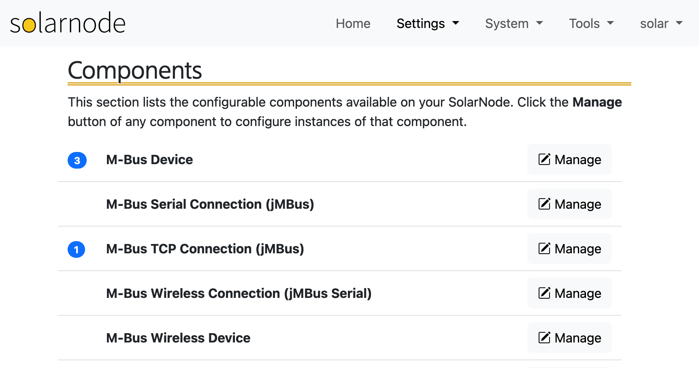
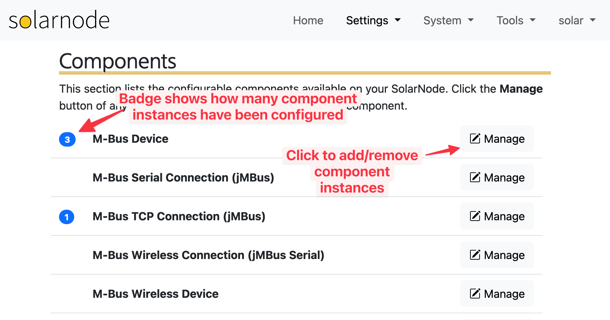
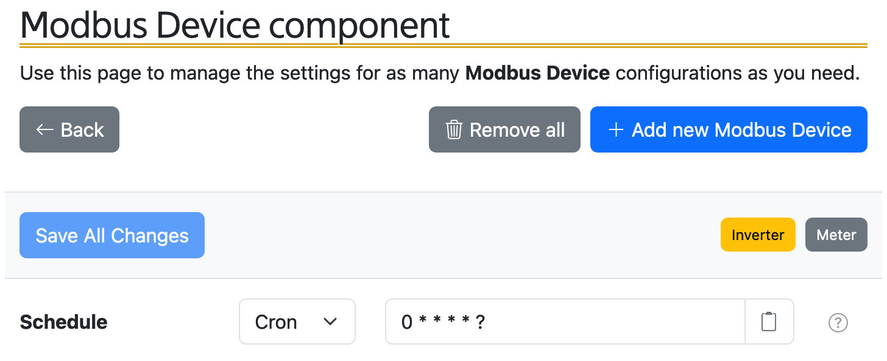
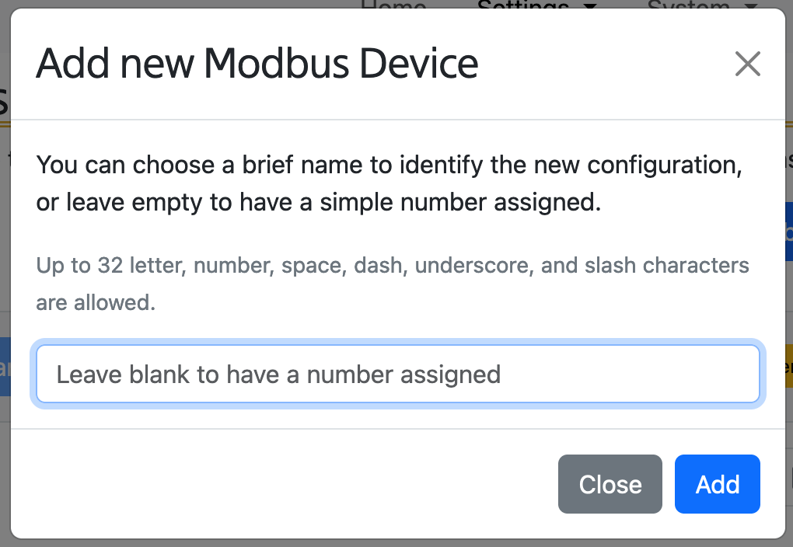
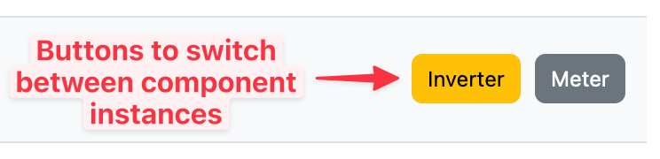
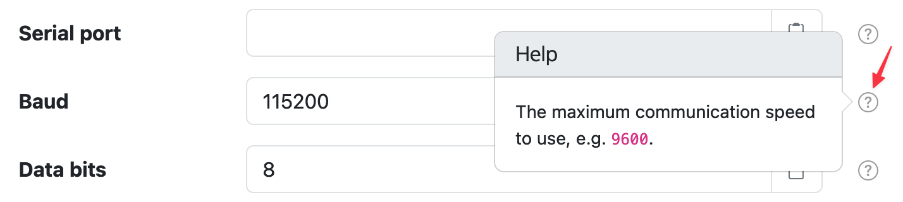
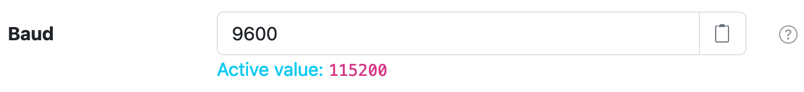
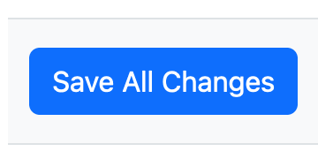
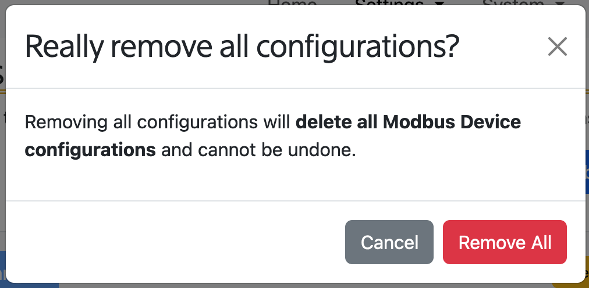

# Components

The Components page lists all the configurable _multi-instance components_ available on
your SolarNode. _Multi-instance_ means you can configure any number of a given component,
each with their own settings.

For example imagine you want to collect data from a power meter, solar inverter, and weather
station, all of which use the Modbus protocol. To do that you would configure three _instances_ of
the Modbus Device component, one for each device.

<figure markdown>
  {width=863}
</figure>

Use the **Manage** button for any listed compoennt to [add or remove instances](#manage-component)
of that component.

An **instance count badge** appears next to any component with at least one instance configured.

<figure markdown>
  {width=863}
</figure>

## Manage Component

The component management page is shown when you click the **Manage** button for a multi-instance
component. Each component instance's settings are independent, allowing you to integrate with
multiple copies of a device or service.

For example if you connected a Modbus power meter and a Modbus solar inverter to a node, you would
create two Modbus Device component instances, and configure them with settings appropriate for each
device.

<figure markdown>
  {width=728}
  <caption>The component management screen allows you to add, update, and remove component instances.</caption>
</figure>

## Add new instance

Add new component instances by clicking the **Add new _X_** button in the top-right, where **_X_**
is the name of the component you are managing. You will be given the opportunity to assign a unique
identifier to the new component instance:

<figure markdown>
  {width=510}
  <caption>When creating a new component instance you can provide a short name to identify it with.</caption>
</figure>

When you add more than one component instance, the identifiers appear as clickable buttons that allow
you to switch between the setting forms for each component.

<figure markdown>
  {width=372}
  <caption>Component instance buttons let you switch between each component instance.</caption>
</figure>

## Saving changes

Each setting will include a :fontawesome-regular-circle-question: button that will show you a
brief description of that setting.

<figure markdown>
  {width=714}
  <caption>Click :fontawesome-regular-circle-question: for brief setting information.</caption>
</figure>

After making any change, an **Active value** label will appear, showing the currently active value
for that setting.

<figure markdown>
  {width=692}
</figure>

After making changes to any component instance's settings, click the **Save All Changes** button in the top-left
to commit those changes.

<figure markdown>
  {width=180}
</figure>

!!! tip "Save All Changes works across all component instances"

	You can safely switch between and make changes on multiple component instance settings
	before clicking the **Save All Changes** button: your changes across _all_ instances
	will be saved.

## Remove or reset instances

At the bottom of each component instance are buttons that let you **delete** or **reset** that component
intance.

<figure markdown>
  {width=352}
  <caption>Buttons to delete or reset component instance.</caption>
</figure>

The **Delete** button will remove that component instance from appearing, however _the settings associated
with that instance are preserved_. If you re-add an instance _with the same identifier_ then the previous
settings will be restored. You can think of the Delete button as disabling the component, giving you the
option to "undo" the deletion if you like.

The **Restore** button will reset the component to its factory defaults, removing any settings you have
customized on that instance. The instance remains visible and you can re-configure the settings as
needed.

## Remove all instances

The **Remove all** button in the top-right of the page allows you to remove all component instances,
including any customized settings on those instances.

!!! warning

    The **Remove all** action will **delete** all your customized settings for **all** the component
	instances you are managing. When finished it will be as if you never configured this
	component before.

<figure markdown>
  {width=350}
  <caption>Remove all instances with the "Remove all" button.</caption>
</figure>

You will be asked to confirm removing all instances:

<figure markdown>
  {width=506}
  <caption>Confirming the "Remove all" action.</caption>
</figure>
