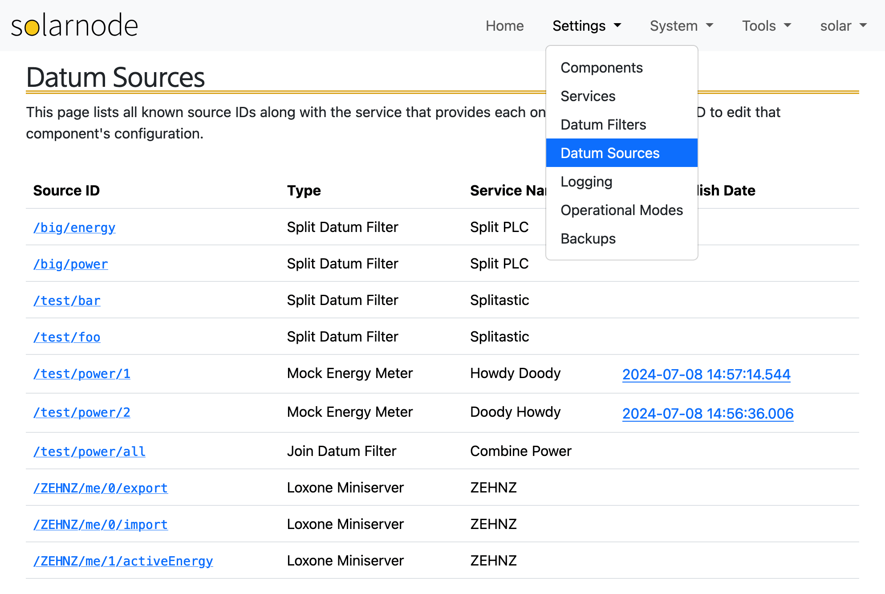
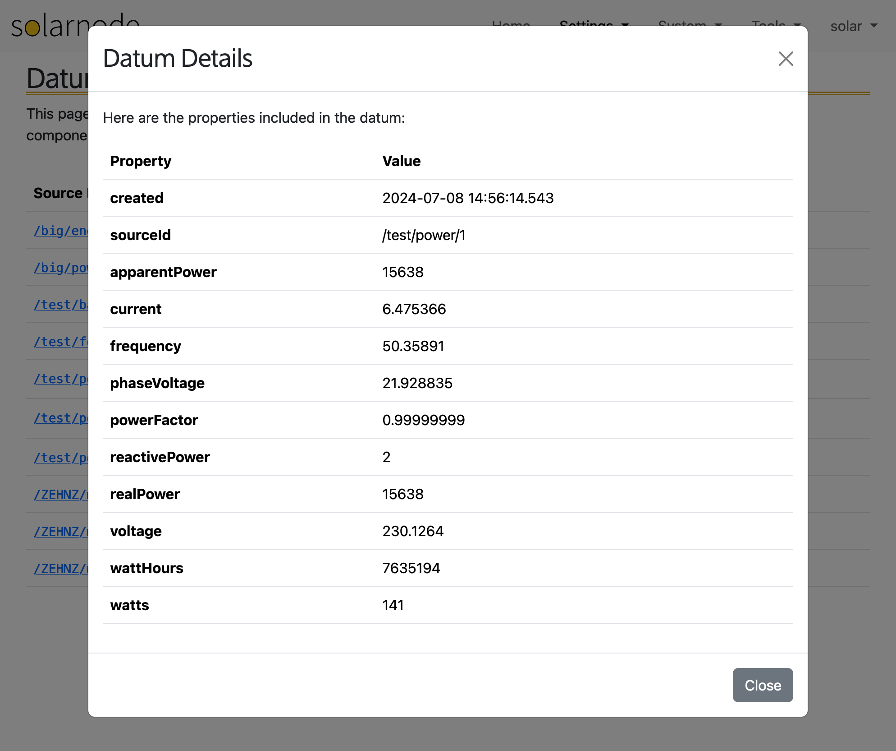

# Datum Sources

The Datum Sources page presents a list of all the [datum](../../datum.md) source IDs collected by
the Datum Source components configured in SolarNode, with links to the settings for the component
that provides each source ID.

{width=994}

The page will also update in real time as datum are collected in SolarNode, and add a link in the
**Publish Date** column to an overview of the properties included in the datum:

{width=994}
