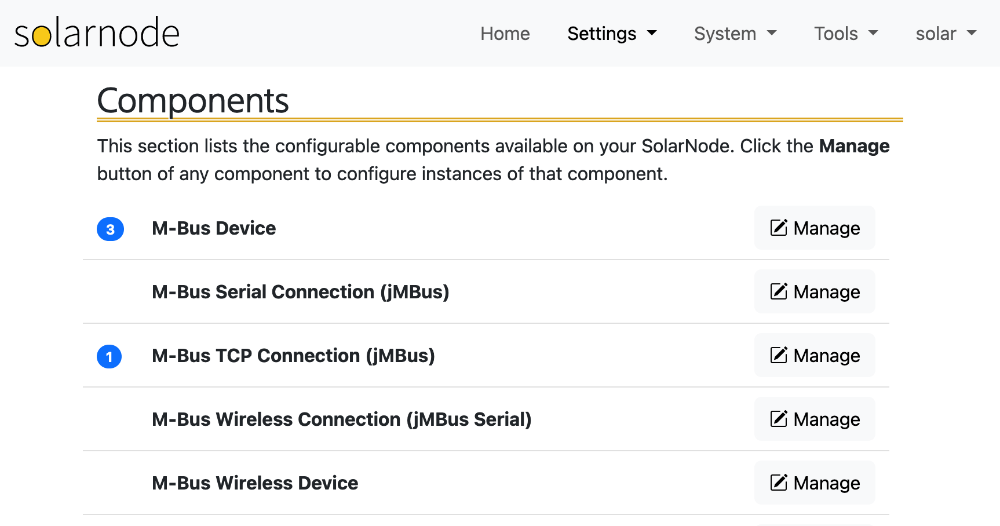

# Settings

The Settings section in SolarNode Setup is where you can configure all available SolarNode settings.

<figure markdown>
  {width=863}
</figure>

The section is divided into the following pages:

* [Components](components.md)
* [Services](services.md)
* [Datum Filters](datum-filters.md)
* [Logging](logging.md)
* [Operational Modes](op-modes.md)
* [Backups](backups.md)
