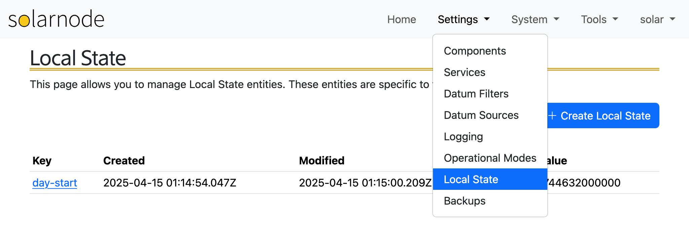

# Local State

SolarNode provides a persistent "state" database for use by plugins and
[expressions](../../expressions.md#local-state-functions). The **Settings > Local State** page lets
you manage this database. The term "local" refers to the fact that the persisted state database is
specific (_local_) to each node, and not published to the SolarNetwork cloud.

See the [Local State information](../../local-state.md) page for general information about
Local State entities.

<figure markdown>
{width="1024" loading=lazy}
</figure>

## Managing Local State

Click the **+ Create Local State** button to create a new local state entity, or click on the **Key** value of
any existing state entity to edit it. An edit dialog will be shown where you can enter the details.

<figure markdown>
{width="1024" loading=lazy}
</figure>

To **delete** a Local State entity, click on its link to open the edit dialog, then click the **Delete** button.

## CSV Backups

The Local State data is automatically backed up on a configurable schedule. You can adjust the schedule under
**Settings > Services > Local State Local Backup**. Use the [CSV Backup & Restore](./backups.md#csv-backup--restore) form to
download the current Local State database, or one of the automatic backups, as a CSV file.

<figure markdown>
{width="956" loading=lazy}
</figure>

