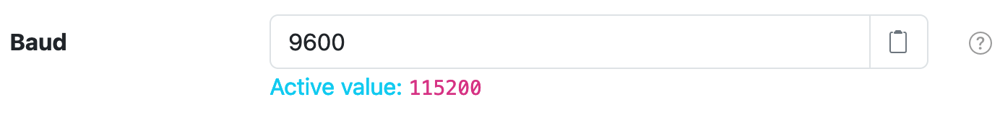

# Services

Configurable services that are not [Components](components.md) appear on the Services page.

<figure markdown>
  {width=863}
</figure>

Each setting will include a :fontawesome-regular-circle-question: button that will show you a
brief description of that setting.

<figure markdown>
  {width=714}
  <caption>Click :fontawesome-regular-circle-question: for brief setting information.</caption>
</figure>

After making any change, an **Active value** label will appear, showing the currently active value
for that setting.

<figure markdown>
  {width=692}
</figure>

In order to save your changes, you must click the **Save All Changes** button at the top of the page.

<figure markdown>
  {width=708}
</figure>
