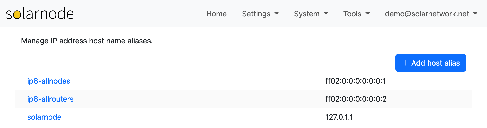

# Host Aliases

The Host Aliases page allows you to manage local DNS host name IP address mappings, or _aliases_.
This can be useful if you would like to assign a friendly name to a local device, so you can use
the friendly name in settings.

{width=1024}

For example you might have a TCP/IP Modbus meter you want to integrate with. You could give the
meter's IP address a friendly name like `my-meter` and then configure a Modbus TCP/IP connection
using that name, rather than its IP address. If the meter's IP address changes later on, then you
just need to update the host alias.

## Add a host alias

To add a new host alias, click the **Add host alias** button. You will be prompted to provide the
name and the IP address for the new alias.

## Remove a host alias

Click on any host alias name and you will be prompted to remove that alias.

## Update a host alias

To change the IP address for an existing alias, remove that alias and then add it again with
the new IP address.
