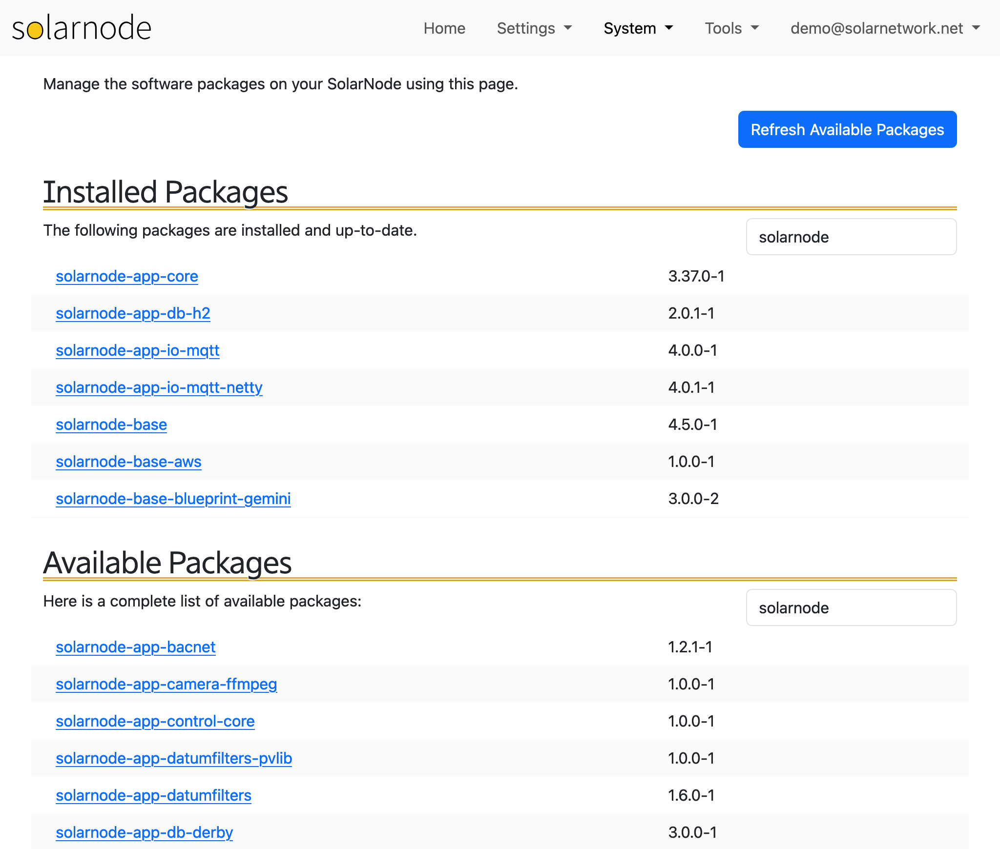

# Packages

The Packages page lets you add, update, and remove system packages from SolarNodeOS. In particular
there are many SolarNode specific pacakges that provide plugins. See
[SolarNodeOS](https://github.com/SolarNetwork/solarnetwork/wiki/SolarNodeOS) for more information,
including a listing of the available SolarNode specific packages.

{width=1024}

!!! tip

	You can also use [command line tools](../../sysadmin/packages.md) to manage system packages.

## Refresh available packages

SolarNode maintains a local cache of the available packages database. Over time new packages
or updated package versions can be released, but SolarNode will not be aware of them until
its local cache is refreshed. Click the **Refresh Available Packages** button to do that.

## Package Updates

The Package Updates section shows you any installed system packages that have a newer version
available, and thus could be upgraded. You can click the **Upgrade All** button to upgrade all
upgradable packages at once.

### Upgrade an installed package

Click on any upgradable package name and you will be asked if you would like to upgrade that
package.

## Installed Packages

The Installed Packages section shows you all the system packages currently installed. You can
filter which packages are shown using the search field in the upper-right. By default only
packages matching "solarnode" are shown.

### Remove an installed package

Click on any installed package name and you will be asked if you would like to remove that package.

!!! warning

	Be careful about removing core SolarNode packages: you might remove SolarNode itself!

## Available Packages

The Available Packages section shows you all the available system packages _not_ currently
installed. You can filter which packages are shown using the search field in the upper-right. By
default only packages matching "solarnode" are shown.

### Install an available package

Click on any available package name and you will be asked if you would like to install that package.
