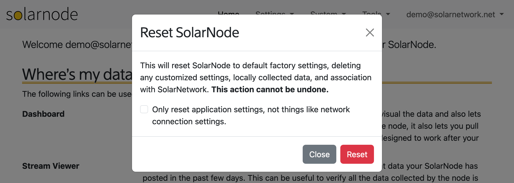

# Reset

When you select the **System > Reset SolarNode** menu item, you will be prompted if you would like
to reset the SolarNode application to "factory defaults".

{width=1024}

Resetting the SolarNode application removes all settings and the association with SolarNetwork,
restoring SolarNode to its initial, clean state. You might want to do this, for example, if
you want to give your SolarNode to someone else to use.
