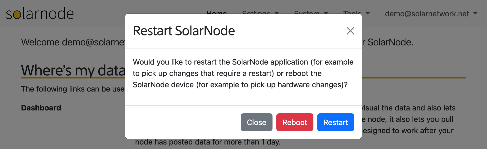

# Restart

When you select the **System > Restart SolarNode** menu item, you will be prompted if you would like
to restart the SolarNode application or reboot the SolarNode device.

{width=1024}

## Restart SolarNode application

Choose **Restart** to restart the SolarNode application. For example after you install, upgrade,
or remove a [package](packages.md) it is usually necessary to restart SolarNode for the changes
to appear.

## Reboot SolarNode device

Choose **Reboot** to reboot the entire SolarNode device. This might be necessary after installing,
upgrading, or removing hardware or device drivers. This also has the effect of restarting the
SolarNode application.
