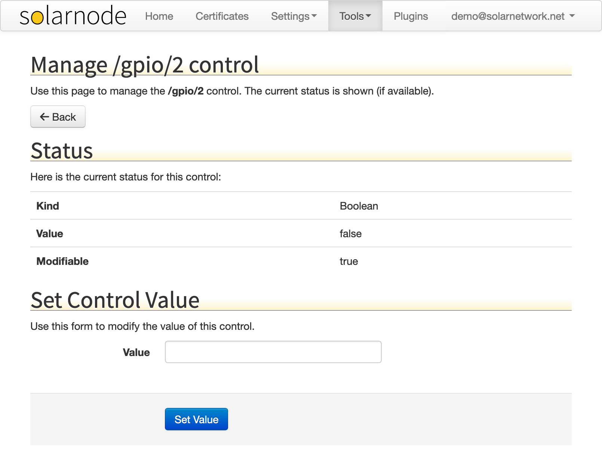

# Controls

The Controls page allows you to manipulate any [control](../../controls/index.md) configured in SolarNode.
The page lists all the available controls. Click the **Manage** button to view and update a control's value.

<figure markdown>
  {width=1024 loading=lazy}
</figure>

## Manage control

After you click the **Manage** button for a specific control, you will be shown details about that
control, including its current value. Use the **Set control value** form to update the control's
value.

<figure markdown>
  {width=1024 loading=lazy}
</figure>
