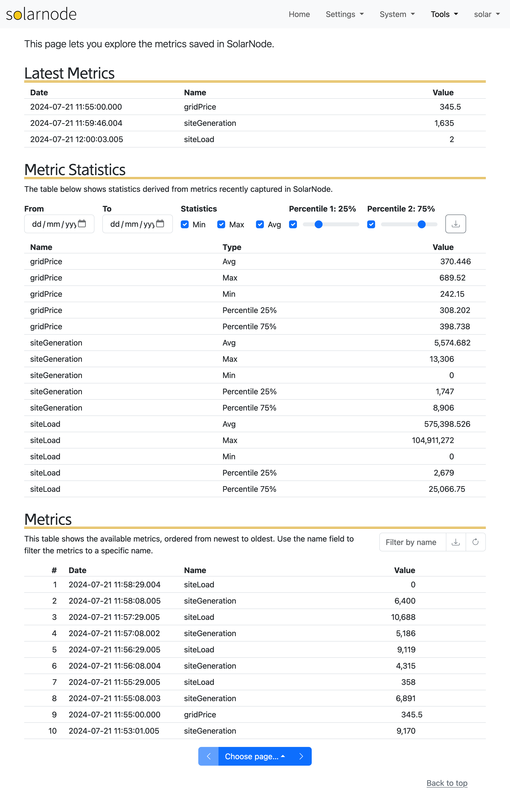

SolarNode includes a Metrics page where you can monitor the [metrics](../../metrics.md) collected.

{width=1082}

!!! note

	In SolarNodeOS the [solarnode-app-metrics-harvester][solarnode-app-metrics-harvester]
	package provides a [filter](../../datum-filters/metric-harvester.md) to collect metrics from datum,
	and the [solarnode-app-metrics-db-jdbc][solarnode-app-metrics-db-jdbc]package provides
	database storage for the collected metrics.

The **Latest Metrics** section shows the most-recently collected metric per metric name. This section
will update in real time as metrics are collected.

The **Metrics** section shows all the metrics collected, ordered by time from newest to oldest. You
can filter the shown metrics by name, and use the pagination links at the bottom to navigate through
all the avilable metrics.

[solarnode-app-metrics-db-jdbc]: https://github.com/SolarNetwork/solarnode-os-packages/tree/develop/solarnode-app-metrics-db-jdbc/debian
[solarnode-app-metrics-harvester]: https://github.com/SolarNetwork/solarnode-os-packages/tree/develop/solarnode-app-metrics-harvester/debian
